# Phase-3 HNSW / ERNG Graph Path Diagrams

These diagrams are generated from the actual `*_graph_path_examples_hnsw_erng.json` trace files. Solid arrows are the chosen route; dotted arrows are nearby candidate centroids checked at that step.

## CIFAR

### CIFAR Trace 1: `airplane_train_29944_org.png` attack `original`

- Path: `/home/saketh/json/clean_best_json_fullratio_20260528/cifar/cifar/images/Data Processed/cifar/airplane/airplane_pool/airplane_train_29944_org.png`
- Threshold: `0.106488`
- HNSW final centroid: `C0271`; duplicate decision: direct=`True`, graph=`True`
- ERNG final centroid: `C0271`; duplicate decision: direct=`True`, graph=`True`

#### HNSW Diagram


#### ERNG Diagram

```mermaid
flowchart TD
  Q(["Query image variant"])
  Q -->|probe 1: C0005| E_P0_C0005_0
  E_P0_C0005_0["C0005\nd=2.217242"]
  E_P0_C0005_0_n0["C0332\nd=1.921669"]
  E_P0_C0005_0 -. checked .-> E_P0_C0005_0_n0
  E_P0_C0005_0_n1["C0420\nd=1.962756"]
  E_P0_C0005_0 -. checked .-> E_P0_C0005_0_n1
  E_P0_C0005_0_n2["C0296\nd=2.096125"]
  E_P0_C0005_0 -. checked .-> E_P0_C0005_0_n2
  E_P0_C0005_0_n3["C0411\nd=2.116433"]
  E_P0_C0005_0 -. checked .-> E_P0_C0005_0_n3
  E_P0_C0005_0_n4["C0301\nd=2.142067"]
  E_P0_C0005_0 -. checked .-> E_P0_C0005_0_n4
  E_P0_C0332_1["C0332\nd=1.921669"]
  E_P0_C0332_1_n0["C0378\nd=0.90509"]
  E_P0_C0332_1 -. checked .-> E_P0_C0332_1_n0
  E_P0_C0332_1_n1["C0383\nd=0.968163"]
  E_P0_C0332_1 -. checked .-> E_P0_C0332_1_n1
  E_P0_C0332_1_n2["C0197\nd=1.255217"]
  E_P0_C0332_1 -. checked .-> E_P0_C0332_1_n2
  E_P0_C0332_1_n3["C0048\nd=1.292476"]
  E_P0_C0332_1 -. checked .-> E_P0_C0332_1_n3
  E_P0_C0332_1_n4["C0133\nd=1.461961"]
  E_P0_C0332_1 -. checked .-> E_P0_C0332_1_n4
  E_P0_C0378_2["C0378\nd=0.90509"]
  E_P0_C0378_2_n0["C0271\nd=0.211204"]
  E_P0_C0378_2 -. checked .-> E_P0_C0378_2_n0
  E_P0_C0378_2_n1["C0481\nd=0.240685"]
  E_P0_C0378_2 -. checked .-> E_P0_C0378_2_n1
  E_P0_C0378_2_n2["C0025\nd=0.33601"]
  E_P0_C0378_2 -. checked .-> E_P0_C0378_2_n2
  E_P0_C0378_2_n3["C0055\nd=0.513776"]
  E_P0_C0378_2 -. checked .-> E_P0_C0378_2_n3
  E_P0_C0378_2_n4["C0184\nd=0.587031"]
  E_P0_C0378_2 -. checked .-> E_P0_C0378_2_n4
  E_P0_C0271_3["C0271\nd=0.211204"]
  E_P0_C0271_3_n0["C0481\nd=0.240685"]
  E_P0_C0271_3 -. checked .-> E_P0_C0271_3_n0
  E_P0_C0271_3_n1["C0025\nd=0.33601"]
  E_P0_C0271_3 -. checked .-> E_P0_C0271_3_n1
  E_P0_C0271_3_n2["C0376\nd=0.364744"]
  E_P0_C0271_3 -. checked .-> E_P0_C0271_3_n2
  E_P0_C0271_3_n3["C0055\nd=0.513776"]
  E_P0_C0271_3 -. checked .-> E_P0_C0271_3_n3
  E_P0_C0271_3_n4["C0101\nd=0.52283"]
  E_P0_C0271_3 -. checked .-> E_P0_C0271_3_n4
  E_P0_C0005_0 ==> E_P0_C0332_1
  E_P0_C0332_1 ==> E_P0_C0378_2
  E_P0_C0378_2 ==> E_P0_C0271_3
  E_P0_C0271_3 --> SEL(["selected final C0271\nseen=234"])
  Q -->|probe 2: C0036| E_P1_C0036_0
  E_P1_C0036_0["C0036\nd=2.423698"]
  E_P1_C0036_0_n0["C0461\nd=1.806209"]
  E_P1_C0036_0 -. checked .-> E_P1_C0036_0_n0
  E_P1_C0036_0_n1["C0491\nd=2.006856"]
  E_P1_C0036_0 -. checked .-> E_P1_C0036_0_n1
  E_P1_C0036_0_n2["C0096\nd=2.038674"]
  E_P1_C0036_0 -. checked .-> E_P1_C0036_0_n2
  E_P1_C0036_0_n3["C0005\nd=2.217242"]
  E_P1_C0036_0 -. checked .-> E_P1_C0036_0_n3
  E_P1_C0036_0_n4["C0204\nd=2.425976"]
  E_P1_C0036_0 -. checked .-> E_P1_C0036_0_n4
  E_P1_C0461_1["C0461\nd=1.806209"]
  E_P1_C0461_1_n0["C0112\nd=0.933024"]
  E_P1_C0461_1 -. checked .-> E_P1_C0461_1_n0
  E_P1_C0461_1_n1["C0452\nd=1.30102"]
  E_P1_C0461_1 -. checked .-> E_P1_C0461_1_n1
  E_P1_C0461_1_n2["C0491\nd=2.006856"]
  E_P1_C0461_1 -. checked .-> E_P1_C0461_1_n2
  E_P1_C0461_1_n3["C0021\nd=2.027082"]
  E_P1_C0461_1 -. checked .-> E_P1_C0461_1_n3
  E_P1_C0461_1_n4["C0483\nd=2.128028"]
  E_P1_C0461_1 -. checked .-> E_P1_C0461_1_n4
  E_P1_C0112_2["C0112\nd=0.933024"]
  E_P1_C0112_2_n0["C0271\nd=0.211204"]
  E_P1_C0112_2 -. checked .-> E_P1_C0112_2_n0
  E_P1_C0112_2_n1["C0481\nd=0.240685"]
  E_P1_C0112_2 -. checked .-> E_P1_C0112_2_n1
  E_P1_C0112_2_n2["C0025\nd=0.33601"]
  E_P1_C0112_2 -. checked .-> E_P1_C0112_2_n2
  E_P1_C0112_2_n3["C0376\nd=0.364744"]
  E_P1_C0112_2 -. checked .-> E_P1_C0112_2_n3
  E_P1_C0112_2_n4["C0055\nd=0.513776"]
  E_P1_C0112_2 -. checked .-> E_P1_C0112_2_n4
  E_P1_C0271_3["C0271\nd=0.211204"]
  E_P1_C0271_3_n0["C0481\nd=0.240685"]
  E_P1_C0271_3 -. checked .-> E_P1_C0271_3_n0
  E_P1_C0271_3_n1["C0025\nd=0.33601"]
  E_P1_C0271_3 -. checked .-> E_P1_C0271_3_n1
  E_P1_C0271_3_n2["C0376\nd=0.364744"]
  E_P1_C0271_3 -. checked .-> E_P1_C0271_3_n2
  E_P1_C0271_3_n3["C0055\nd=0.513776"]
  E_P1_C0271_3 -. checked .-> E_P1_C0271_3_n3
  E_P1_C0271_3_n4["C0101\nd=0.52283"]
  E_P1_C0271_3 -. checked .-> E_P1_C0271_3_n4
  E_P1_C0036_0 ==> E_P1_C0461_1
  E_P1_C0461_1 ==> E_P1_C0112_2
  E_P1_C0112_2 ==> E_P1_C0271_3
  E_P1_C0271_3 --> SEL(["selected final C0271\nseen=234"])
  Q -->|probe 3: C0129| E_P2_C0129_0
  E_P2_C0129_0["C0129\nd=2.555749"]
  E_P2_C0129_0_n0["C0070\nd=1.909995"]
  E_P2_C0129_0 -. checked .-> E_P2_C0129_0_n0
  E_P2_C0129_0_n1["C0057\nd=2.16182"]
  E_P2_C0129_0 -. checked .-> E_P2_C0129_0_n1
  E_P2_C0129_0_n2["C0237\nd=2.289534"]
  E_P2_C0129_0 -. checked .-> E_P2_C0129_0_n2
  E_P2_C0129_0_n3["C0253\nd=2.379464"]
  E_P2_C0129_0 -. checked .-> E_P2_C0129_0_n3
  E_P2_C0129_0_n4["C0285\nd=2.472061"]
  E_P2_C0129_0 -. checked .-> E_P2_C0129_0_n4
  E_P2_C0070_1["C0070\nd=1.909995"]
  E_P2_C0070_1_n0["C0378\nd=0.90509"]
  E_P2_C0070_1 -. checked .-> E_P2_C0070_1_n0
  E_P2_C0070_1_n1["C0346\nd=1.362568"]
  E_P2_C0070_1 -. checked .-> E_P2_C0070_1_n1
  E_P2_C0070_1_n2["C0023\nd=1.763493"]
  E_P2_C0070_1 -. checked .-> E_P2_C0070_1_n2
  E_P2_C0070_1_n3["C0206\nd=1.790026"]
  E_P2_C0070_1 -. checked .-> E_P2_C0070_1_n3
  E_P2_C0070_1_n4["C0307\nd=1.891678"]
  E_P2_C0070_1 -. checked .-> E_P2_C0070_1_n4
  E_P2_C0378_2["C0378\nd=0.90509"]
  E_P2_C0378_2_n0["C0271\nd=0.211204"]
  E_P2_C0378_2 -. checked .-> E_P2_C0378_2_n0
  E_P2_C0378_2_n1["C0481\nd=0.240685"]
  E_P2_C0378_2 -. checked .-> E_P2_C0378_2_n1
  E_P2_C0378_2_n2["C0025\nd=0.33601"]
  E_P2_C0378_2 -. checked .-> E_P2_C0378_2_n2
  E_P2_C0378_2_n3["C0055\nd=0.513776"]
  E_P2_C0378_2 -. checked .-> E_P2_C0378_2_n3
  E_P2_C0378_2_n4["C0184\nd=0.587031"]
  E_P2_C0378_2 -. checked .-> E_P2_C0378_2_n4
  E_P2_C0271_3["C0271\nd=0.211204"]
  E_P2_C0271_3_n0["C0481\nd=0.240685"]
  E_P2_C0271_3 -. checked .-> E_P2_C0271_3_n0
  E_P2_C0271_3_n1["C0025\nd=0.33601"]
  E_P2_C0271_3 -. checked .-> E_P2_C0271_3_n1
  E_P2_C0271_3_n2["C0376\nd=0.364744"]
  E_P2_C0271_3 -. checked .-> E_P2_C0271_3_n2
  E_P2_C0271_3_n3["C0055\nd=0.513776"]
  E_P2_C0271_3 -. checked .-> E_P2_C0271_3_n3
  E_P2_C0271_3_n4["C0101\nd=0.52283"]
  E_P2_C0271_3 -. checked .-> E_P2_C0271_3_n4
  E_P2_C0129_0 ==> E_P2_C0070_1
  E_P2_C0070_1 ==> E_P2_C0378_2
  E_P2_C0378_2 ==> E_P2_C0271_3
  E_P2_C0271_3 --> SEL(["selected final C0271\nseen=234"])
  Q -->|probe 4: C0193| E_P3_C0193_0
  E_P3_C0193_0["C0193\nd=1.840835"]
  E_P3_C0193_0_n0["C0202\nd=0.719261"]
  E_P3_C0193_0 -. checked .-> E_P3_C0193_0_n0
  E_P3_C0193_0_n1["C0048\nd=1.292476"]
  E_P3_C0193_0 -. checked .-> E_P3_C0193_0_n1
  E_P3_C0193_0_n2["C0506\nd=1.474391"]
  E_P3_C0193_0 -. checked .-> E_P3_C0193_0_n2
  E_P3_C0193_0_n3["C0459\nd=1.531428"]
  E_P3_C0193_0 -. checked .-> E_P3_C0193_0_n3
  E_P3_C0193_0_n4["C0150\nd=1.675593"]
  E_P3_C0193_0 -. checked .-> E_P3_C0193_0_n4
  E_P3_C0202_1["C0202\nd=0.719261"]
  E_P3_C0202_1_n0["C0481\nd=0.240685"]
  E_P3_C0202_1 -. checked .-> E_P3_C0202_1_n0
  E_P3_C0202_1_n1["C0376\nd=0.364744"]
  E_P3_C0202_1 -. checked .-> E_P3_C0202_1_n1
  E_P3_C0202_1_n2["C0055\nd=0.513776"]
  E_P3_C0202_1 -. checked .-> E_P3_C0202_1_n2
  E_P3_C0202_1_n3["C0101\nd=0.52283"]
  E_P3_C0202_1 -. checked .-> E_P3_C0202_1_n3
  E_P3_C0202_1_n4["C0419\nd=0.586806"]
  E_P3_C0202_1 -. checked .-> E_P3_C0202_1_n4
  E_P3_C0481_2["C0481\nd=0.240685"]
  E_P3_C0481_2_n0["C0271\nd=0.211204"]
  E_P3_C0481_2 -. checked .-> E_P3_C0481_2_n0
  E_P3_C0481_2_n1["C0025\nd=0.33601"]
  E_P3_C0481_2 -. checked .-> E_P3_C0481_2_n1
  E_P3_C0481_2_n2["C0376\nd=0.364744"]
  E_P3_C0481_2 -. checked .-> E_P3_C0481_2_n2
  E_P3_C0481_2_n3["C0055\nd=0.513776"]
  E_P3_C0481_2 -. checked .-> E_P3_C0481_2_n3
  E_P3_C0481_2_n4["C0101\nd=0.52283"]
  E_P3_C0481_2 -. checked .-> E_P3_C0481_2_n4
  E_P3_C0271_3["C0271\nd=0.211204"]
  E_P3_C0271_3_n0["C0481\nd=0.240685"]
  E_P3_C0271_3 -. checked .-> E_P3_C0271_3_n0
  E_P3_C0271_3_n1["C0025\nd=0.33601"]
  E_P3_C0271_3 -. checked .-> E_P3_C0271_3_n1
  E_P3_C0271_3_n2["C0376\nd=0.364744"]
  E_P3_C0271_3 -. checked .-> E_P3_C0271_3_n2
  E_P3_C0271_3_n3["C0055\nd=0.513776"]
  E_P3_C0271_3 -. checked .-> E_P3_C0271_3_n3
  E_P3_C0271_3_n4["C0101\nd=0.52283"]
  E_P3_C0271_3 -. checked .-> E_P3_C0271_3_n4
  E_P3_C0193_0 ==> E_P3_C0202_1
  E_P3_C0202_1 ==> E_P3_C0481_2
  E_P3_C0481_2 ==> E_P3_C0271_3
  E_P3_C0271_3 --> SEL(["selected final C0271\nseen=234"])
  Q -->|probe 5: C0253| E_P4_C0253_0
  E_P4_C0253_0["C0253\nd=2.379464"]
  E_P4_C0253_0_n0["C0311\nd=1.197868"]
  E_P4_C0253_0 -. checked .-> E_P4_C0253_0_n0
  E_P4_C0253_0_n1["C0506\nd=1.474391"]
  E_P4_C0253_0 -. checked .-> E_P4_C0253_0_n1
  E_P4_C0253_0_n2["C0023\nd=1.763493"]
  E_P4_C0253_0 -. checked .-> E_P4_C0253_0_n2
  E_P4_C0253_0_n3["C0209\nd=1.767666"]
  E_P4_C0253_0 -. checked .-> E_P4_C0253_0_n3
  E_P4_C0253_0_n4["C0193\nd=1.840835"]
  E_P4_C0253_0 -. checked .-> E_P4_C0253_0_n4
  E_P4_C0311_1["C0311\nd=1.197868"]
  E_P4_C0311_1_n0["C0184\nd=0.587031"]
  E_P4_C0311_1 -. checked .-> E_P4_C0311_1_n0
  E_P4_C0311_1_n1["C0140\nd=0.616731"]
  E_P4_C0311_1 -. checked .-> E_P4_C0311_1_n1
  E_P4_C0311_1_n2["C0318\nd=0.751643"]
  E_P4_C0311_1 -. checked .-> E_P4_C0311_1_n2
  E_P4_C0311_1_n3["C0255\nd=0.784107"]
  E_P4_C0311_1 -. checked .-> E_P4_C0311_1_n3
  E_P4_C0311_1_n4["C0257\nd=0.928262"]
  E_P4_C0311_1 -. checked .-> E_P4_C0311_1_n4
  E_P4_C0184_2["C0184\nd=0.587031"]
  E_P4_C0184_2_n0["C0271\nd=0.211204"]
  E_P4_C0184_2 -. checked .-> E_P4_C0184_2_n0
  E_P4_C0184_2_n1["C0481\nd=0.240685"]
  E_P4_C0184_2 -. checked .-> E_P4_C0184_2_n1
  E_P4_C0184_2_n2["C0025\nd=0.33601"]
  E_P4_C0184_2 -. checked .-> E_P4_C0184_2_n2
  E_P4_C0184_2_n3["C0376\nd=0.364744"]
  E_P4_C0184_2 -. checked .-> E_P4_C0184_2_n3
  E_P4_C0184_2_n4["C0101\nd=0.52283"]
  E_P4_C0184_2 -. checked .-> E_P4_C0184_2_n4
  E_P4_C0271_3["C0271\nd=0.211204"]
  E_P4_C0271_3_n0["C0481\nd=0.240685"]
  E_P4_C0271_3 -. checked .-> E_P4_C0271_3_n0
  E_P4_C0271_3_n1["C0025\nd=0.33601"]
  E_P4_C0271_3 -. checked .-> E_P4_C0271_3_n1
  E_P4_C0271_3_n2["C0376\nd=0.364744"]
  E_P4_C0271_3 -. checked .-> E_P4_C0271_3_n2
  E_P4_C0271_3_n3["C0055\nd=0.513776"]
  E_P4_C0271_3 -. checked .-> E_P4_C0271_3_n3
  E_P4_C0271_3_n4["C0101\nd=0.52283"]
  E_P4_C0271_3 -. checked .-> E_P4_C0271_3_n4
  E_P4_C0253_0 ==> E_P4_C0311_1
  E_P4_C0311_1 ==> E_P4_C0184_2
  E_P4_C0184_2 ==> E_P4_C0271_3
  E_P4_C0271_3 --> SEL(["selected final C0271\nseen=234"])
  Q -->|probe 6: C0280| E_P5_C0280_0
  E_P5_C0280_0["C0280\nd=2.483611"]
  E_P5_C0280_0_n0["C0163\nd=2.065872"]
  E_P5_C0280_0 -. checked .-> E_P5_C0280_0_n0
  E_P5_C0280_0_n1["C0110\nd=2.242833"]
  E_P5_C0280_0 -. checked .-> E_P5_C0280_0_n1
  E_P5_C0280_0_n2["C0229\nd=2.362315"]
  E_P5_C0280_0 -. checked .-> E_P5_C0280_0_n2
  E_P5_C0280_0_n3["C0004\nd=2.424538"]
  E_P5_C0280_0 -. checked .-> E_P5_C0280_0_n3
  E_P5_C0280_0_n4["C0169\nd=2.436966"]
  E_P5_C0280_0 -. checked .-> E_P5_C0280_0_n4
  E_P5_C0163_1["C0163\nd=2.065872"]
  E_P5_C0163_1_n0["C0075\nd=1.207089"]
  E_P5_C0163_1 -. checked .-> E_P5_C0163_1_n0
  E_P5_C0163_1_n1["C0324\nd=1.387166"]
  E_P5_C0163_1 -. checked .-> E_P5_C0163_1_n1
  E_P5_C0163_1_n2["C0459\nd=1.531428"]
  E_P5_C0163_1 -. checked .-> E_P5_C0163_1_n2
  E_P5_C0163_1_n3["C0028\nd=1.550315"]
  E_P5_C0163_1 -. checked .-> E_P5_C0163_1_n3
  E_P5_C0163_1_n4["C0439\nd=1.728039"]
  E_P5_C0163_1 -. checked .-> E_P5_C0163_1_n4
  E_P5_C0075_2["C0075\nd=1.207089"]
  E_P5_C0075_2_n0["C0101\nd=0.52283"]
  E_P5_C0075_2 -. checked .-> E_P5_C0075_2_n0
  E_P5_C0075_2_n1["C0184\nd=0.587031"]
  E_P5_C0075_2 -. checked .-> E_P5_C0075_2_n1
  E_P5_C0075_2_n2["C0427\nd=0.698869"]
  E_P5_C0075_2 -. checked .-> E_P5_C0075_2_n2
  E_P5_C0075_2_n3["C0389\nd=0.960097"]
  E_P5_C0075_2 -. checked .-> E_P5_C0075_2_n3
  E_P5_C0075_2_n4["C0135\nd=1.005082"]
  E_P5_C0075_2 -. checked .-> E_P5_C0075_2_n4
  E_P5_C0101_3["C0101\nd=0.52283"]
  E_P5_C0101_3_n0["C0271\nd=0.211204"]
  E_P5_C0101_3 -. checked .-> E_P5_C0101_3_n0
  E_P5_C0101_3_n1["C0481\nd=0.240685"]
  E_P5_C0101_3 -. checked .-> E_P5_C0101_3_n1
  E_P5_C0101_3_n2["C0025\nd=0.33601"]
  E_P5_C0101_3 -. checked .-> E_P5_C0101_3_n2
  E_P5_C0101_3_n3["C0376\nd=0.364744"]
  E_P5_C0101_3 -. checked .-> E_P5_C0101_3_n3
  E_P5_C0101_3_n4["C0419\nd=0.586806"]
  E_P5_C0101_3 -. checked .-> E_P5_C0101_3_n4
  E_P5_C0271_4["C0271\nd=0.211204"]
  E_P5_C0271_4_n0["C0481\nd=0.240685"]
  E_P5_C0271_4 -. checked .-> E_P5_C0271_4_n0
  E_P5_C0271_4_n1["C0025\nd=0.33601"]
  E_P5_C0271_4 -. checked .-> E_P5_C0271_4_n1
  E_P5_C0271_4_n2["C0376\nd=0.364744"]
  E_P5_C0271_4 -. checked .-> E_P5_C0271_4_n2
  E_P5_C0271_4_n3["C0055\nd=0.513776"]
  E_P5_C0271_4 -. checked .-> E_P5_C0271_4_n3
  E_P5_C0271_4_n4["C0101\nd=0.52283"]
  E_P5_C0271_4 -. checked .-> E_P5_C0271_4_n4
  E_P5_C0280_0 ==> E_P5_C0163_1
  E_P5_C0163_1 ==> E_P5_C0075_2
  E_P5_C0075_2 ==> E_P5_C0101_3
  E_P5_C0101_3 ==> E_P5_C0271_4
  E_P5_C0271_4 --> SEL(["selected final C0271\nseen=234"])
  Q -->|probe 7: C0297| E_P6_C0297_0
  E_P6_C0297_0["C0297\nd=1.253365"]
  E_P6_C0297_0_n0["C0427\nd=0.698869"]
  E_P6_C0297_0 -. checked .-> E_P6_C0297_0_n0
  E_P6_C0297_0_n1["C0202\nd=0.719261"]
  E_P6_C0297_0 -. checked .-> E_P6_C0297_0_n1
  E_P6_C0297_0_n2["C0255\nd=0.784107"]
  E_P6_C0297_0 -. checked .-> E_P6_C0297_0_n2
  E_P6_C0297_0_n3["C0009\nd=0.806507"]
  E_P6_C0297_0 -. checked .-> E_P6_C0297_0_n3
  E_P6_C0297_0_n4["C0397\nd=0.82286"]
  E_P6_C0297_0 -. checked .-> E_P6_C0297_0_n4
  E_P6_C0427_1["C0427\nd=0.698869"]
  E_P6_C0427_1_n0["C0271\nd=0.211204"]
  E_P6_C0427_1 -. checked .-> E_P6_C0427_1_n0
  E_P6_C0427_1_n1["C0481\nd=0.240685"]
  E_P6_C0427_1 -. checked .-> E_P6_C0427_1_n1
  E_P6_C0427_1_n2["C0025\nd=0.33601"]
  E_P6_C0427_1 -. checked .-> E_P6_C0427_1_n2
  E_P6_C0427_1_n3["C0376\nd=0.364744"]
  E_P6_C0427_1 -. checked .-> E_P6_C0427_1_n3
  E_P6_C0427_1_n4["C0055\nd=0.513776"]
  E_P6_C0427_1 -. checked .-> E_P6_C0427_1_n4
  E_P6_C0271_2["C0271\nd=0.211204"]
  E_P6_C0271_2_n0["C0481\nd=0.240685"]
  E_P6_C0271_2 -. checked .-> E_P6_C0271_2_n0
  E_P6_C0271_2_n1["C0025\nd=0.33601"]
  E_P6_C0271_2 -. checked .-> E_P6_C0271_2_n1
  E_P6_C0271_2_n2["C0376\nd=0.364744"]
  E_P6_C0271_2 -. checked .-> E_P6_C0271_2_n2
  E_P6_C0271_2_n3["C0055\nd=0.513776"]
  E_P6_C0271_2 -. checked .-> E_P6_C0271_2_n3
  E_P6_C0271_2_n4["C0101\nd=0.52283"]
  E_P6_C0271_2 -. checked .-> E_P6_C0271_2_n4
  E_P6_C0297_0 ==> E_P6_C0427_1
  E_P6_C0427_1 ==> E_P6_C0271_2
  E_P6_C0271_2 --> SEL(["selected final C0271\nseen=234"])
  Q -->|probe 8: C0310| E_P7_C0310_0
  E_P7_C0310_0["C0310\nd=3.666277"]
  E_P7_C0310_0_n0["C0132\nd=2.837594"]
  E_P7_C0310_0 -. checked .-> E_P7_C0310_0_n0
  E_P7_C0310_0_n1["C0384\nd=2.873284"]
  E_P7_C0310_0 -. checked .-> E_P7_C0310_0_n1
  E_P7_C0310_0_n2["C0438\nd=2.87842"]
  E_P7_C0310_0 -. checked .-> E_P7_C0310_0_n2
  E_P7_C0310_0_n3["C0274\nd=2.970417"]
  E_P7_C0310_0 -. checked .-> E_P7_C0310_0_n3
  E_P7_C0310_0_n4["C0295\nd=3.263514"]
  E_P7_C0310_0 -. checked .-> E_P7_C0310_0_n4
  E_P7_C0132_1["C0132\nd=2.837594"]
  E_P7_C0132_1_n0["C0461\nd=1.806209"]
  E_P7_C0132_1 -. checked .-> E_P7_C0132_1_n0
  E_P7_C0132_1_n1["C0321\nd=2.383162"]
  E_P7_C0132_1 -. checked .-> E_P7_C0132_1_n1
  E_P7_C0132_1_n2["C0258\nd=2.622856"]
  E_P7_C0132_1 -. checked .-> E_P7_C0132_1_n2
  E_P7_C0132_1_n3["C0424\nd=2.684139"]
  E_P7_C0132_1 -. checked .-> E_P7_C0132_1_n3
  E_P7_C0132_1_n4["C0123\nd=2.785496"]
  E_P7_C0132_1 -. checked .-> E_P7_C0132_1_n4
  E_P7_C0461_2["C0461\nd=1.806209"]
  E_P7_C0461_2_n0["C0112\nd=0.933024"]
  E_P7_C0461_2 -. checked .-> E_P7_C0461_2_n0
  E_P7_C0461_2_n1["C0452\nd=1.30102"]
  E_P7_C0461_2 -. checked .-> E_P7_C0461_2_n1
  E_P7_C0461_2_n2["C0491\nd=2.006856"]
  E_P7_C0461_2 -. checked .-> E_P7_C0461_2_n2
  E_P7_C0461_2_n3["C0021\nd=2.027082"]
  E_P7_C0461_2 -. checked .-> E_P7_C0461_2_n3
  E_P7_C0461_2_n4["C0483\nd=2.128028"]
  E_P7_C0461_2 -. checked .-> E_P7_C0461_2_n4
  E_P7_C0112_3["C0112\nd=0.933024"]
  E_P7_C0112_3_n0["C0271\nd=0.211204"]
  E_P7_C0112_3 -. checked .-> E_P7_C0112_3_n0
  E_P7_C0112_3_n1["C0481\nd=0.240685"]
  E_P7_C0112_3 -. checked .-> E_P7_C0112_3_n1
  E_P7_C0112_3_n2["C0025\nd=0.33601"]
  E_P7_C0112_3 -. checked .-> E_P7_C0112_3_n2
  E_P7_C0112_3_n3["C0376\nd=0.364744"]
  E_P7_C0112_3 -. checked .-> E_P7_C0112_3_n3
  E_P7_C0112_3_n4["C0055\nd=0.513776"]
  E_P7_C0112_3 -. checked .-> E_P7_C0112_3_n4
  E_P7_C0271_4["C0271\nd=0.211204"]
  E_P7_C0271_4_n0["C0481\nd=0.240685"]
  E_P7_C0271_4 -. checked .-> E_P7_C0271_4_n0
  E_P7_C0271_4_n1["C0025\nd=0.33601"]
  E_P7_C0271_4 -. checked .-> E_P7_C0271_4_n1
  E_P7_C0271_4_n2["C0376\nd=0.364744"]
  E_P7_C0271_4 -. checked .-> E_P7_C0271_4_n2
  E_P7_C0271_4_n3["C0055\nd=0.513776"]
  E_P7_C0271_4 -. checked .-> E_P7_C0271_4_n3
  E_P7_C0271_4_n4["C0101\nd=0.52283"]
  E_P7_C0271_4 -. checked .-> E_P7_C0271_4_n4
  E_P7_C0310_0 ==> E_P7_C0132_1
  E_P7_C0132_1 ==> E_P7_C0461_2
  E_P7_C0461_2 ==> E_P7_C0112_3
  E_P7_C0112_3 ==> E_P7_C0271_4
  E_P7_C0271_4 --> SEL(["selected final C0271\nseen=234"])
  DEC(["Decision: direct_dup=True, graph_dup=True"])
  SEL --> DEC
```

### CIFAR Trace 2: `ship_train_24608_org.png` attack `rotate40`

- Path: `/home/saketh/json/clean_best_json_fullratio_20260528/cifar/cifar/images/Data Processed/cifar/ship/ship_pool/ship_train_24608_org.png`
- Threshold: `0.850716`
- HNSW final centroid: `C0255`; duplicate decision: direct=`True`, graph=`True`
- ERNG final centroid: `C0255`; duplicate decision: direct=`True`, graph=`True`

#### HNSW Diagram

```mermaid
flowchart TD
  Q(["Query image variant"])
  Q -->|enter layer 2| H_L2_C0506_0
  H_L2_C0506_0["C0506\nd=1.26991"]
  H_L2_C0506_0_n0["C0048\nd=1.330186"]
  H_L2_C0506_0 -. checked .-> H_L2_C0506_0_n0
  H_L2_C0506_0_n1["C0347\nd=1.528518"]
  H_L2_C0506_0 -. checked .-> H_L2_C0506_0_n1
  H_L2_C0506_0_n2["C0439\nd=1.548897"]
  H_L2_C0506_0 -. checked .-> H_L2_C0506_0_n2
  H_L2_C0506_0_n3["C0498\nd=1.57829"]
  H_L2_C0506_0 -. checked .-> H_L2_C0506_0_n3
  H_L2_C0506_0_n4["C0276\nd=1.60332"]
  H_L2_C0506_0 -. checked .-> H_L2_C0506_0_n4
  H_L2_C0506_0_n5["C0420\nd=1.616658"]
  H_L2_C0506_0 -. checked .-> H_L2_C0506_0_n5
  H_L2_C0506_0_n6["C0193\nd=1.715172"]
  H_L2_C0506_0 -. checked .-> H_L2_C0506_0_n6
  H_L2_C0506_0_n7["C0426\nd=1.723343"]
  H_L2_C0506_0 -. checked .-> H_L2_C0506_0_n7
  Q -->|enter layer 1| H_L1_C0506_0
  H_L1_C0506_0["C0506\nd=1.26991"]
  H_L1_C0506_0_n0["C0383\nd=0.846277"]
  H_L1_C0506_0 -. checked .-> H_L1_C0506_0_n0
  H_L1_C0506_0_n1["C0133\nd=1.027745"]
  H_L1_C0506_0 -. checked .-> H_L1_C0506_0_n1
  H_L1_C0506_0_n2["C0135\nd=1.079588"]
  H_L1_C0506_0 -. checked .-> H_L1_C0506_0_n2
  H_L1_C0506_0_n3["C0116\nd=1.146302"]
  H_L1_C0506_0 -. checked .-> H_L1_C0506_0_n3
  H_L1_C0506_0_n4["C0192\nd=1.1593"]
  H_L1_C0506_0 -. checked .-> H_L1_C0506_0_n4
  H_L1_C0506_0_n5["C0060\nd=1.265377"]
  H_L1_C0506_0 -. checked .-> H_L1_C0506_0_n5
  H_L1_C0506_0_n6["C0048\nd=1.330186"]
  H_L1_C0506_0 -. checked .-> H_L1_C0506_0_n6
  H_L1_C0506_0_n7["C0347\nd=1.528518"]
  H_L1_C0506_0 -. checked .-> H_L1_C0506_0_n7
  H_L1_C0383_1["C0383\nd=0.846277"]
  H_L1_C0383_1_n0["C0078\nd=0.869006"]
  H_L1_C0383_1 -. checked .-> H_L1_C0383_1_n0
  H_L1_C0383_1_n1["C0133\nd=1.027745"]
  H_L1_C0383_1 -. checked .-> H_L1_C0383_1_n1
  H_L1_C0383_1_n2["C0135\nd=1.079588"]
  H_L1_C0383_1 -. checked .-> H_L1_C0383_1_n2
  H_L1_C0383_1_n3["C0378\nd=1.144134"]
  H_L1_C0383_1 -. checked .-> H_L1_C0383_1_n3
  H_L1_C0383_1_n4["C0116\nd=1.146302"]
  H_L1_C0383_1 -. checked .-> H_L1_C0383_1_n4
  H_L1_C0383_1_n5["C0192\nd=1.1593"]
  H_L1_C0383_1 -. checked .-> H_L1_C0383_1_n5
  H_L1_C0383_1_n6["C0431\nd=1.239003"]
  H_L1_C0383_1 -. checked .-> H_L1_C0383_1_n6
  H_L1_C0383_1_n7["C0060\nd=1.265377"]
  H_L1_C0383_1 -. checked .-> H_L1_C0383_1_n7
  H_L1_C0506_0 ==> H_L1_C0383_1
  H_L2_C0506_0 -->|drop to layer 1| H_L1_C0506_0
  Q -->|enter layer 0| H_L0_C0383_0
  H_L0_C0383_0["C0383\nd=0.846277"]
  H_L0_C0383_0_n0["C0255\nd=0.442703"]
  H_L0_C0383_0 -. checked .-> H_L0_C0383_0_n0
  H_L0_C0383_0_n1["C0009\nd=0.565617"]
  H_L0_C0383_0 -. checked .-> H_L0_C0383_0_n1
  H_L0_C0383_0_n2["C0202\nd=0.637408"]
  H_L0_C0383_0 -. checked .-> H_L0_C0383_0_n2
  H_L0_C0383_0_n3["C0055\nd=0.658035"]
  H_L0_C0383_0 -. checked .-> H_L0_C0383_0_n3
  H_L0_C0383_0_n4["C0419\nd=0.66402"]
  H_L0_C0383_0 -. checked .-> H_L0_C0383_0_n4
  H_L0_C0383_0_n5["C0376\nd=0.699651"]
  H_L0_C0383_0 -. checked .-> H_L0_C0383_0_n5
  H_L0_C0383_0_n6["C0297\nd=0.729795"]
  H_L0_C0383_0 -. checked .-> H_L0_C0383_0_n6
  H_L0_C0383_0_n7["C0025\nd=0.78027"]
  H_L0_C0383_0 -. checked .-> H_L0_C0383_0_n7
  H_L0_C0255_1["C0255\nd=0.442703"]
  H_L0_C0255_1_n0["C0009\nd=0.565617"]
  H_L0_C0255_1 -. checked .-> H_L0_C0255_1_n0
  H_L0_C0255_1_n1["C0153\nd=0.630467"]
  H_L0_C0255_1 -. checked .-> H_L0_C0255_1_n1
  H_L0_C0255_1_n2["C0202\nd=0.637408"]
  H_L0_C0255_1 -. checked .-> H_L0_C0255_1_n2
  H_L0_C0255_1_n3["C0035\nd=0.64712"]
  H_L0_C0255_1 -. checked .-> H_L0_C0255_1_n3
  H_L0_C0255_1_n4["C0055\nd=0.658035"]
  H_L0_C0255_1 -. checked .-> H_L0_C0255_1_n4
  H_L0_C0255_1_n5["C0419\nd=0.66402"]
  H_L0_C0255_1 -. checked .-> H_L0_C0255_1_n5
  H_L0_C0255_1_n6["C0376\nd=0.699651"]
  H_L0_C0255_1 -. checked .-> H_L0_C0255_1_n6
  H_L0_C0255_1_n7["C0427\nd=0.767922"]
  H_L0_C0255_1 -. checked .-> H_L0_C0255_1_n7
  H_L0_C0383_0 ==> H_L0_C0255_1
  H_L1_C0383_1 -->|drop to layer 0| H_L0_C0383_0
  ORIG(["Decision: direct_dup=True, graph_dup=True\nseen=143"])
  H_L0_C0255_1 --> ORIG
```

#### ERNG Diagram

```mermaid
flowchart TD
  Q(["Query image variant"])
  Q -->|probe 1: C0005| E_P0_C0005_0
  E_P0_C0005_0["C0005\nd=1.963255"]
  E_P0_C0005_0_n0["C0420\nd=1.616658"]
  E_P0_C0005_0 -. checked .-> E_P0_C0005_0_n0
  E_P0_C0005_0_n1["C0411\nd=1.691203"]
  E_P0_C0005_0 -. checked .-> E_P0_C0005_0_n1
  E_P0_C0005_0_n2["C0301\nd=1.768238"]
  E_P0_C0005_0 -. checked .-> E_P0_C0005_0_n2
  E_P0_C0005_0_n3["C0171\nd=1.775584"]
  E_P0_C0005_0 -. checked .-> E_P0_C0005_0_n3
  E_P0_C0005_0_n4["C0332\nd=1.827895"]
  E_P0_C0005_0 -. checked .-> E_P0_C0005_0_n4
  E_P0_C0420_1["C0420\nd=1.616658"]
  E_P0_C0420_1_n0["C0133\nd=1.027745"]
  E_P0_C0420_1 -. checked .-> E_P0_C0420_1_n0
  E_P0_C0420_1_n1["C0354\nd=1.084309"]
  E_P0_C0420_1 -. checked .-> E_P0_C0420_1_n1
  E_P0_C0420_1_n2["C0116\nd=1.146302"]
  E_P0_C0420_1 -. checked .-> E_P0_C0420_1_n2
  E_P0_C0420_1_n3["C0192\nd=1.1593"]
  E_P0_C0420_1 -. checked .-> E_P0_C0420_1_n3
  E_P0_C0420_1_n4["C0506\nd=1.26991"]
  E_P0_C0420_1 -. checked .-> E_P0_C0420_1_n4
  E_P0_C0133_2["C0133\nd=1.027745"]
  E_P0_C0133_2_n0["C0009\nd=0.565617"]
  E_P0_C0133_2 -. checked .-> E_P0_C0133_2_n0
  E_P0_C0133_2_n1["C0202\nd=0.637408"]
  E_P0_C0133_2 -. checked .-> E_P0_C0133_2_n1
  E_P0_C0133_2_n2["C0297\nd=0.729795"]
  E_P0_C0133_2 -. checked .-> E_P0_C0133_2_n2
  E_P0_C0133_2_n3["C0197\nd=0.809052"]
  E_P0_C0133_2 -. checked .-> E_P0_C0133_2_n3
  E_P0_C0133_2_n4["C0383\nd=0.846277"]
  E_P0_C0133_2 -. checked .-> E_P0_C0133_2_n4
  E_P0_C0009_3["C0009\nd=0.565617"]
  E_P0_C0009_3_n0["C0255\nd=0.442703"]
  E_P0_C0009_3 -. checked .-> E_P0_C0009_3_n0
  E_P0_C0009_3_n1["C0202\nd=0.637408"]
  E_P0_C0009_3 -. checked .-> E_P0_C0009_3_n1
  E_P0_C0009_3_n2["C0055\nd=0.658035"]
  E_P0_C0009_3 -. checked .-> E_P0_C0009_3_n2
  E_P0_C0009_3_n3["C0419\nd=0.66402"]
  E_P0_C0009_3 -. checked .-> E_P0_C0009_3_n3
  E_P0_C0009_3_n4["C0376\nd=0.699651"]
  E_P0_C0009_3 -. checked .-> E_P0_C0009_3_n4
  E_P0_C0255_4["C0255\nd=0.442703"]
  E_P0_C0255_4_n0["C0009\nd=0.565617"]
  E_P0_C0255_4 -. checked .-> E_P0_C0255_4_n0
  E_P0_C0255_4_n1["C0153\nd=0.630467"]
  E_P0_C0255_4 -. checked .-> E_P0_C0255_4_n1
  E_P0_C0255_4_n2["C0202\nd=0.637408"]
  E_P0_C0255_4 -. checked .-> E_P0_C0255_4_n2
  E_P0_C0255_4_n3["C0035\nd=0.64712"]
  E_P0_C0255_4 -. checked .-> E_P0_C0255_4_n3
  E_P0_C0255_4_n4["C0055\nd=0.658035"]
  E_P0_C0255_4 -. checked .-> E_P0_C0255_4_n4
  E_P0_C0005_0 ==> E_P0_C0420_1
  E_P0_C0420_1 ==> E_P0_C0133_2
  E_P0_C0133_2 ==> E_P0_C0009_3
  E_P0_C0009_3 ==> E_P0_C0255_4
  E_P0_C0255_4 --> SEL(["selected final C0255\nseen=143"])
  Q -->|probe 2: C0036| E_P1_C0036_0
  E_P1_C0036_0["C0036\nd=2.392388"]
  E_P1_C0036_0_n0["C0461\nd=1.882415"]
  E_P1_C0036_0 -. checked .-> E_P1_C0036_0_n0
  E_P1_C0036_0_n1["C0005\nd=1.963255"]
  E_P1_C0036_0 -. checked .-> E_P1_C0036_0_n1
  E_P1_C0036_0_n2["C0491\nd=2.023995"]
  E_P1_C0036_0 -. checked .-> E_P1_C0036_0_n2
  E_P1_C0036_0_n3["C0096\nd=2.055191"]
  E_P1_C0036_0 -. checked .-> E_P1_C0036_0_n3
  E_P1_C0036_0_n4["C0480\nd=2.410599"]
  E_P1_C0036_0 -. checked .-> E_P1_C0036_0_n4
  E_P1_C0461_1["C0461\nd=1.882415"]
  E_P1_C0461_1_n0["C0452\nd=1.158213"]
  E_P1_C0461_1 -. checked .-> E_P1_C0461_1_n0
  E_P1_C0461_1_n1["C0112\nd=1.269607"]
  E_P1_C0461_1 -. checked .-> E_P1_C0461_1_n1
  E_P1_C0461_1_n2["C0301\nd=1.768238"]
  E_P1_C0461_1 -. checked .-> E_P1_C0461_1_n2
  E_P1_C0461_1_n3["C0491\nd=2.023995"]
  E_P1_C0461_1 -. checked .-> E_P1_C0461_1_n3
  E_P1_C0461_1_n4["C0021\nd=2.163255"]
  E_P1_C0461_1 -. checked .-> E_P1_C0461_1_n4
  E_P1_C0452_2["C0452\nd=1.158213"]
  E_P1_C0452_2_n0["C0009\nd=0.565617"]
  E_P1_C0452_2 -. checked .-> E_P1_C0452_2_n0
  E_P1_C0452_2_n1["C0055\nd=0.658035"]
  E_P1_C0452_2 -. checked .-> E_P1_C0452_2_n1
  E_P1_C0452_2_n2["C0397\nd=0.72489"]
  E_P1_C0452_2 -. checked .-> E_P1_C0452_2_n2
  E_P1_C0452_2_n3["C0297\nd=0.729795"]
  E_P1_C0452_2 -. checked .-> E_P1_C0452_2_n3
  E_P1_C0452_2_n4["C0481\nd=0.807677"]
  E_P1_C0452_2 -. checked .-> E_P1_C0452_2_n4
  E_P1_C0009_3["C0009\nd=0.565617"]
  E_P1_C0009_3_n0["C0255\nd=0.442703"]
  E_P1_C0009_3 -. checked .-> E_P1_C0009_3_n0
  E_P1_C0009_3_n1["C0202\nd=0.637408"]
  E_P1_C0009_3 -. checked .-> E_P1_C0009_3_n1
  E_P1_C0009_3_n2["C0055\nd=0.658035"]
  E_P1_C0009_3 -. checked .-> E_P1_C0009_3_n2
  E_P1_C0009_3_n3["C0419\nd=0.66402"]
  E_P1_C0009_3 -. checked .-> E_P1_C0009_3_n3
  E_P1_C0009_3_n4["C0376\nd=0.699651"]
  E_P1_C0009_3 -. checked .-> E_P1_C0009_3_n4
  E_P1_C0255_4["C0255\nd=0.442703"]
  E_P1_C0255_4_n0["C0009\nd=0.565617"]
  E_P1_C0255_4 -. checked .-> E_P1_C0255_4_n0
  E_P1_C0255_4_n1["C0153\nd=0.630467"]
  E_P1_C0255_4 -. checked .-> E_P1_C0255_4_n1
  E_P1_C0255_4_n2["C0202\nd=0.637408"]
  E_P1_C0255_4 -. checked .-> E_P1_C0255_4_n2
  E_P1_C0255_4_n3["C0035\nd=0.64712"]
  E_P1_C0255_4 -. checked .-> E_P1_C0255_4_n3
  E_P1_C0255_4_n4["C0055\nd=0.658035"]
  E_P1_C0255_4 -. checked .-> E_P1_C0255_4_n4
  E_P1_C0036_0 ==> E_P1_C0461_1
  E_P1_C0461_1 ==> E_P1_C0452_2
  E_P1_C0452_2 ==> E_P1_C0009_3
  E_P1_C0009_3 ==> E_P1_C0255_4
  E_P1_C0255_4 --> SEL(["selected final C0255\nseen=143"])
  Q -->|probe 3: C0129| E_P2_C0129_0
  E_P2_C0129_0["C0129\nd=2.526188"]
  E_P2_C0129_0_n0["C0070\nd=2.021544"]
  E_P2_C0129_0 -. checked .-> E_P2_C0129_0_n0
  E_P2_C0129_0_n1["C0237\nd=2.101164"]
  E_P2_C0129_0 -. checked .-> E_P2_C0129_0_n1
  E_P2_C0129_0_n2["C0201\nd=2.272048"]
  E_P2_C0129_0 -. checked .-> E_P2_C0129_0_n2
  E_P2_C0129_0_n3["C0253\nd=2.336426"]
  E_P2_C0129_0 -. checked .-> E_P2_C0129_0_n3
  E_P2_C0129_0_n4["C0057\nd=2.357985"]
  E_P2_C0129_0 -. checked .-> E_P2_C0129_0_n4
  E_P2_C0070_1["C0070\nd=2.021544"]
  E_P2_C0070_1_n0["C0378\nd=1.144134"]
  E_P2_C0070_1 -. checked .-> E_P2_C0070_1_n0
  E_P2_C0070_1_n1["C0346\nd=1.616099"]
  E_P2_C0070_1 -. checked .-> E_P2_C0070_1_n1
  E_P2_C0070_1_n2["C0332\nd=1.827895"]
  E_P2_C0070_1 -. checked .-> E_P2_C0070_1_n2
  E_P2_C0070_1_n3["C0023\nd=1.8998"]
  E_P2_C0070_1 -. checked .-> E_P2_C0070_1_n3
  E_P2_C0070_1_n4["C0244\nd=2.075742"]
  E_P2_C0070_1 -. checked .-> E_P2_C0070_1_n4
  E_P2_C0378_2["C0378\nd=1.144134"]
  E_P2_C0378_2_n0["C0009\nd=0.565617"]
  E_P2_C0378_2 -. checked .-> E_P2_C0378_2_n0
  E_P2_C0378_2_n1["C0035\nd=0.64712"]
  E_P2_C0378_2 -. checked .-> E_P2_C0378_2_n1
  E_P2_C0378_2_n2["C0055\nd=0.658035"]
  E_P2_C0378_2 -. checked .-> E_P2_C0378_2_n2
  E_P2_C0378_2_n3["C0025\nd=0.78027"]
  E_P2_C0378_2 -. checked .-> E_P2_C0378_2_n3
  E_P2_C0378_2_n4["C0318\nd=0.800847"]
  E_P2_C0378_2 -. checked .-> E_P2_C0378_2_n4
  E_P2_C0009_3["C0009\nd=0.565617"]
  E_P2_C0009_3_n0["C0255\nd=0.442703"]
  E_P2_C0009_3 -. checked .-> E_P2_C0009_3_n0
  E_P2_C0009_3_n1["C0202\nd=0.637408"]
  E_P2_C0009_3 -. checked .-> E_P2_C0009_3_n1
  E_P2_C0009_3_n2["C0055\nd=0.658035"]
  E_P2_C0009_3 -. checked .-> E_P2_C0009_3_n2
  E_P2_C0009_3_n3["C0419\nd=0.66402"]
  E_P2_C0009_3 -. checked .-> E_P2_C0009_3_n3
  E_P2_C0009_3_n4["C0376\nd=0.699651"]
  E_P2_C0009_3 -. checked .-> E_P2_C0009_3_n4
  E_P2_C0255_4["C0255\nd=0.442703"]
  E_P2_C0255_4_n0["C0009\nd=0.565617"]
  E_P2_C0255_4 -. checked .-> E_P2_C0255_4_n0
  E_P2_C0255_4_n1["C0153\nd=0.630467"]
  E_P2_C0255_4 -. checked .-> E_P2_C0255_4_n1
  E_P2_C0255_4_n2["C0202\nd=0.637408"]
  E_P2_C0255_4 -. checked .-> E_P2_C0255_4_n2
  E_P2_C0255_4_n3["C0035\nd=0.64712"]
  E_P2_C0255_4 -. checked .-> E_P2_C0255_4_n3
  E_P2_C0255_4_n4["C0055\nd=0.658035"]
  E_P2_C0255_4 -. checked .-> E_P2_C0255_4_n4
  E_P2_C0129_0 ==> E_P2_C0070_1
  E_P2_C0070_1 ==> E_P2_C0378_2
  E_P2_C0378_2 ==> E_P2_C0009_3
  E_P2_C0009_3 ==> E_P2_C0255_4
  E_P2_C0255_4 --> SEL(["selected final C0255\nseen=143"])
  Q -->|probe 4: C0193| E_P3_C0193_0
  E_P3_C0193_0["C0193\nd=1.715172"]
  E_P3_C0193_0_n0["C0202\nd=0.637408"]
  E_P3_C0193_0 -. checked .-> E_P3_C0193_0_n0
  E_P3_C0193_0_n1["C0506\nd=1.26991"]
  E_P3_C0193_0 -. checked .-> E_P3_C0193_0_n1
  E_P3_C0193_0_n2["C0048\nd=1.330186"]
  E_P3_C0193_0 -. checked .-> E_P3_C0193_0_n2
  E_P3_C0193_0_n3["C0150\nd=1.518493"]
  E_P3_C0193_0 -. checked .-> E_P3_C0193_0_n3
  E_P3_C0193_0_n4["C0459\nd=1.533644"]
  E_P3_C0193_0 -. checked .-> E_P3_C0193_0_n4
  E_P3_C0202_1["C0202\nd=0.637408"]
  E_P3_C0202_1_n0["C0255\nd=0.442703"]
  E_P3_C0202_1 -. checked .-> E_P3_C0202_1_n0
  E_P3_C0202_1_n1["C0009\nd=0.565617"]
  E_P3_C0202_1 -. checked .-> E_P3_C0202_1_n1
  E_P3_C0202_1_n2["C0055\nd=0.658035"]
  E_P3_C0202_1 -. checked .-> E_P3_C0202_1_n2
  E_P3_C0202_1_n3["C0419\nd=0.66402"]
  E_P3_C0202_1 -. checked .-> E_P3_C0202_1_n3
  E_P3_C0202_1_n4["C0376\nd=0.699651"]
  E_P3_C0202_1 -. checked .-> E_P3_C0202_1_n4
  E_P3_C0255_2["C0255\nd=0.442703"]
  E_P3_C0255_2_n0["C0009\nd=0.565617"]
  E_P3_C0255_2 -. checked .-> E_P3_C0255_2_n0
  E_P3_C0255_2_n1["C0153\nd=0.630467"]
  E_P3_C0255_2 -. checked .-> E_P3_C0255_2_n1
  E_P3_C0255_2_n2["C0202\nd=0.637408"]
  E_P3_C0255_2 -. checked .-> E_P3_C0255_2_n2
  E_P3_C0255_2_n3["C0035\nd=0.64712"]
  E_P3_C0255_2 -. checked .-> E_P3_C0255_2_n3
  E_P3_C0255_2_n4["C0055\nd=0.658035"]
  E_P3_C0255_2 -. checked .-> E_P3_C0255_2_n4
  E_P3_C0193_0 ==> E_P3_C0202_1
  E_P3_C0202_1 ==> E_P3_C0255_2
  E_P3_C0255_2 --> SEL(["selected final C0255\nseen=143"])
  Q -->|probe 5: C0253| E_P4_C0253_0
  E_P4_C0253_0["C0253\nd=2.336426"]
  E_P4_C0253_0_n0["C0506\nd=1.26991"]
  E_P4_C0253_0 -. checked .-> E_P4_C0253_0_n0
  E_P4_C0253_0_n1["C0311\nd=1.30926"]
  E_P4_C0253_0 -. checked .-> E_P4_C0253_0_n1
  E_P4_C0253_0_n2["C0193\nd=1.715172"]
  E_P4_C0253_0 -. checked .-> E_P4_C0253_0_n2
  E_P4_C0253_0_n3["C0209\nd=1.864899"]
  E_P4_C0253_0 -. checked .-> E_P4_C0253_0_n3
  E_P4_C0253_0_n4["C0023\nd=1.8998"]
  E_P4_C0253_0 -. checked .-> E_P4_C0253_0_n4
  E_P4_C0506_1["C0506\nd=1.26991"]
  E_P4_C0506_1_n0["C0197\nd=0.809052"]
  E_P4_C0506_1 -. checked .-> E_P4_C0506_1_n0
  E_P4_C0506_1_n1["C0383\nd=0.846277"]
  E_P4_C0506_1 -. checked .-> E_P4_C0506_1_n1
  E_P4_C0506_1_n2["C0000\nd=0.968684"]
  E_P4_C0506_1 -. checked .-> E_P4_C0506_1_n2
  E_P4_C0506_1_n3["C0133\nd=1.027745"]
  E_P4_C0506_1 -. checked .-> E_P4_C0506_1_n3
  E_P4_C0506_1_n4["C0135\nd=1.079588"]
  E_P4_C0506_1 -. checked .-> E_P4_C0506_1_n4
  E_P4_C0197_2["C0197\nd=0.809052"]
  E_P4_C0197_2_n0["C0009\nd=0.565617"]
  E_P4_C0197_2 -. checked .-> E_P4_C0197_2_n0
  E_P4_C0197_2_n1["C0202\nd=0.637408"]
  E_P4_C0197_2 -. checked .-> E_P4_C0197_2_n1
  E_P4_C0197_2_n2["C0297\nd=0.729795"]
  E_P4_C0197_2 -. checked .-> E_P4_C0197_2_n2
  E_P4_C0197_2_n3["C0427\nd=0.767922"]
  E_P4_C0197_2 -. checked .-> E_P4_C0197_2_n3
  E_P4_C0197_2_n4["C0383\nd=0.846277"]
  E_P4_C0197_2 -. checked .-> E_P4_C0197_2_n4
  E_P4_C0009_3["C0009\nd=0.565617"]
  E_P4_C0009_3_n0["C0255\nd=0.442703"]
  E_P4_C0009_3 -. checked .-> E_P4_C0009_3_n0
  E_P4_C0009_3_n1["C0202\nd=0.637408"]
  E_P4_C0009_3 -. checked .-> E_P4_C0009_3_n1
  E_P4_C0009_3_n2["C0055\nd=0.658035"]
  E_P4_C0009_3 -. checked .-> E_P4_C0009_3_n2
  E_P4_C0009_3_n3["C0419\nd=0.66402"]
  E_P4_C0009_3 -. checked .-> E_P4_C0009_3_n3
  E_P4_C0009_3_n4["C0376\nd=0.699651"]
  E_P4_C0009_3 -. checked .-> E_P4_C0009_3_n4
  E_P4_C0255_4["C0255\nd=0.442703"]
  E_P4_C0255_4_n0["C0009\nd=0.565617"]
  E_P4_C0255_4 -. checked .-> E_P4_C0255_4_n0
  E_P4_C0255_4_n1["C0153\nd=0.630467"]
  E_P4_C0255_4 -. checked .-> E_P4_C0255_4_n1
  E_P4_C0255_4_n2["C0202\nd=0.637408"]
  E_P4_C0255_4 -. checked .-> E_P4_C0255_4_n2
  E_P4_C0255_4_n3["C0035\nd=0.64712"]
  E_P4_C0255_4 -. checked .-> E_P4_C0255_4_n3
  E_P4_C0255_4_n4["C0055\nd=0.658035"]
  E_P4_C0255_4 -. checked .-> E_P4_C0255_4_n4
  E_P4_C0253_0 ==> E_P4_C0506_1
  E_P4_C0506_1 ==> E_P4_C0197_2
  E_P4_C0197_2 ==> E_P4_C0009_3
  E_P4_C0009_3 ==> E_P4_C0255_4
  E_P4_C0255_4 --> SEL(["selected final C0255\nseen=143"])
  Q -->|probe 6: C0280| E_P5_C0280_0
  E_P5_C0280_0["C0280\nd=2.57675"]
  E_P5_C0280_0_n0["C0163\nd=2.151262"]
  E_P5_C0280_0 -. checked .-> E_P5_C0280_0_n0
  E_P5_C0280_0_n1["C0229\nd=2.304667"]
  E_P5_C0280_0 -. checked .-> E_P5_C0280_0_n1
  E_P5_C0280_0_n2["C0110\nd=2.436265"]
  E_P5_C0280_0 -. checked .-> E_P5_C0280_0_n2
  E_P5_C0280_0_n3["C0074\nd=2.459811"]
  E_P5_C0280_0 -. checked .-> E_P5_C0280_0_n3
  E_P5_C0280_0_n4["C0004\nd=2.496311"]
  E_P5_C0280_0 -. checked .-> E_P5_C0280_0_n4
  E_P5_C0163_1["C0163\nd=2.151262"]
  E_P5_C0163_1_n0["C0075\nd=1.327096"]
  E_P5_C0163_1 -. checked .-> E_P5_C0163_1_n0
  E_P5_C0163_1_n1["C0028\nd=1.447688"]
  E_P5_C0163_1 -. checked .-> E_P5_C0163_1_n1
  E_P5_C0163_1_n2["C0459\nd=1.533644"]
  E_P5_C0163_1 -. checked .-> E_P5_C0163_1_n2
  E_P5_C0163_1_n3["C0439\nd=1.548897"]
  E_P5_C0163_1 -. checked .-> E_P5_C0163_1_n3
  E_P5_C0163_1_n4["C0324\nd=1.569626"]
  E_P5_C0163_1 -. checked .-> E_P5_C0163_1_n4
  E_P5_C0075_2["C0075\nd=1.327096"]
  E_P5_C0075_2_n0["C0427\nd=0.767922"]
  E_P5_C0075_2 -. checked .-> E_P5_C0075_2_n0
  E_P5_C0075_2_n1["C0078\nd=0.869006"]
  E_P5_C0075_2 -. checked .-> E_P5_C0075_2_n1
  E_P5_C0075_2_n2["C0281\nd=0.929518"]
  E_P5_C0075_2 -. checked .-> E_P5_C0075_2_n2
  E_P5_C0075_2_n3["C0101\nd=0.934081"]
  E_P5_C0075_2 -. checked .-> E_P5_C0075_2_n3
  E_P5_C0075_2_n4["C0184\nd=0.960699"]
  E_P5_C0075_2 -. checked .-> E_P5_C0075_2_n4
  E_P5_C0427_3["C0427\nd=0.767922"]
  E_P5_C0427_3_n0["C0255\nd=0.442703"]
  E_P5_C0427_3 -. checked .-> E_P5_C0427_3_n0
  E_P5_C0427_3_n1["C0153\nd=0.630467"]
  E_P5_C0427_3 -. checked .-> E_P5_C0427_3_n1
  E_P5_C0427_3_n2["C0202\nd=0.637408"]
  E_P5_C0427_3 -. checked .-> E_P5_C0427_3_n2
  E_P5_C0427_3_n3["C0055\nd=0.658035"]
  E_P5_C0427_3 -. checked .-> E_P5_C0427_3_n3
  E_P5_C0427_3_n4["C0419\nd=0.66402"]
  E_P5_C0427_3 -. checked .-> E_P5_C0427_3_n4
  E_P5_C0255_4["C0255\nd=0.442703"]
  E_P5_C0255_4_n0["C0009\nd=0.565617"]
  E_P5_C0255_4 -. checked .-> E_P5_C0255_4_n0
  E_P5_C0255_4_n1["C0153\nd=0.630467"]
  E_P5_C0255_4 -. checked .-> E_P5_C0255_4_n1
  E_P5_C0255_4_n2["C0202\nd=0.637408"]
  E_P5_C0255_4 -. checked .-> E_P5_C0255_4_n2
  E_P5_C0255_4_n3["C0035\nd=0.64712"]
  E_P5_C0255_4 -. checked .-> E_P5_C0255_4_n3
  E_P5_C0255_4_n4["C0055\nd=0.658035"]
  E_P5_C0255_4 -. checked .-> E_P5_C0255_4_n4
  E_P5_C0280_0 ==> E_P5_C0163_1
  E_P5_C0163_1 ==> E_P5_C0075_2
  E_P5_C0075_2 ==> E_P5_C0427_3
  E_P5_C0427_3 ==> E_P5_C0255_4
  E_P5_C0255_4 --> SEL(["selected final C0255\nseen=143"])
  Q -->|probe 7: C0297| E_P6_C0297_0
  E_P6_C0297_0["C0297\nd=0.729795"]
  E_P6_C0297_0_n0["C0255\nd=0.442703"]
  E_P6_C0297_0 -. checked .-> E_P6_C0297_0_n0
  E_P6_C0297_0_n1["C0009\nd=0.565617"]
  E_P6_C0297_0 -. checked .-> E_P6_C0297_0_n1
  E_P6_C0297_0_n2["C0153\nd=0.630467"]
  E_P6_C0297_0 -. checked .-> E_P6_C0297_0_n2
  E_P6_C0297_0_n3["C0202\nd=0.637408"]
  E_P6_C0297_0 -. checked .-> E_P6_C0297_0_n3
  E_P6_C0297_0_n4["C0035\nd=0.64712"]
  E_P6_C0297_0 -. checked .-> E_P6_C0297_0_n4
  E_P6_C0255_1["C0255\nd=0.442703"]
  E_P6_C0255_1_n0["C0009\nd=0.565617"]
  E_P6_C0255_1 -. checked .-> E_P6_C0255_1_n0
  E_P6_C0255_1_n1["C0153\nd=0.630467"]
  E_P6_C0255_1 -. checked .-> E_P6_C0255_1_n1
  E_P6_C0255_1_n2["C0202\nd=0.637408"]
  E_P6_C0255_1 -. checked .-> E_P6_C0255_1_n2
  E_P6_C0255_1_n3["C0035\nd=0.64712"]
  E_P6_C0255_1 -. checked .-> E_P6_C0255_1_n3
  E_P6_C0255_1_n4["C0055\nd=0.658035"]
  E_P6_C0255_1 -. checked .-> E_P6_C0255_1_n4
  E_P6_C0297_0 ==> E_P6_C0255_1
  E_P6_C0255_1 --> SEL(["selected final C0255\nseen=143"])
  Q -->|probe 8: C0310| E_P7_C0310_0
  E_P7_C0310_0["C0310\nd=3.78818"]
  E_P7_C0310_0_n0["C0132\nd=2.757567"]
  E_P7_C0310_0 -. checked .-> E_P7_C0310_0_n0
  E_P7_C0310_0_n1["C0438\nd=2.816664"]
  E_P7_C0310_0 -. checked .-> E_P7_C0310_0_n1
  E_P7_C0310_0_n2["C0384\nd=3.027263"]
  E_P7_C0310_0 -. checked .-> E_P7_C0310_0_n2
  E_P7_C0310_0_n3["C0274\nd=3.118799"]
  E_P7_C0310_0 -. checked .-> E_P7_C0310_0_n3
  E_P7_C0310_0_n4["C0295\nd=3.352414"]
  E_P7_C0310_0 -. checked .-> E_P7_C0310_0_n4
  E_P7_C0132_1["C0132\nd=2.757567"]
  E_P7_C0132_1_n0["C0461\nd=1.882415"]
  E_P7_C0132_1 -. checked .-> E_P7_C0132_1_n0
  E_P7_C0132_1_n1["C0321\nd=2.454849"]
  E_P7_C0132_1 -. checked .-> E_P7_C0132_1_n1
  E_P7_C0132_1_n2["C0424\nd=2.689612"]
  E_P7_C0132_1 -. checked .-> E_P7_C0132_1_n2
  E_P7_C0132_1_n3["C0258\nd=2.691712"]
  E_P7_C0132_1 -. checked .-> E_P7_C0132_1_n3
  E_P7_C0132_1_n4["C0382\nd=2.772278"]
  E_P7_C0132_1 -. checked .-> E_P7_C0132_1_n4
  E_P7_C0461_2["C0461\nd=1.882415"]
  E_P7_C0461_2_n0["C0452\nd=1.158213"]
  E_P7_C0461_2 -. checked .-> E_P7_C0461_2_n0
  E_P7_C0461_2_n1["C0112\nd=1.269607"]
  E_P7_C0461_2 -. checked .-> E_P7_C0461_2_n1
  E_P7_C0461_2_n2["C0301\nd=1.768238"]
  E_P7_C0461_2 -. checked .-> E_P7_C0461_2_n2
  E_P7_C0461_2_n3["C0491\nd=2.023995"]
  E_P7_C0461_2 -. checked .-> E_P7_C0461_2_n3
  E_P7_C0461_2_n4["C0021\nd=2.163255"]
  E_P7_C0461_2 -. checked .-> E_P7_C0461_2_n4
  E_P7_C0452_3["C0452\nd=1.158213"]
  E_P7_C0452_3_n0["C0009\nd=0.565617"]
  E_P7_C0452_3 -. checked .-> E_P7_C0452_3_n0
  E_P7_C0452_3_n1["C0055\nd=0.658035"]
  E_P7_C0452_3 -. checked .-> E_P7_C0452_3_n1
  E_P7_C0452_3_n2["C0397\nd=0.72489"]
  E_P7_C0452_3 -. checked .-> E_P7_C0452_3_n2
  E_P7_C0452_3_n3["C0297\nd=0.729795"]
  E_P7_C0452_3 -. checked .-> E_P7_C0452_3_n3
  E_P7_C0452_3_n4["C0481\nd=0.807677"]
  E_P7_C0452_3 -. checked .-> E_P7_C0452_3_n4
  E_P7_C0009_4["C0009\nd=0.565617"]
  E_P7_C0009_4_n0["C0255\nd=0.442703"]
  E_P7_C0009_4 -. checked .-> E_P7_C0009_4_n0
  E_P7_C0009_4_n1["C0202\nd=0.637408"]
  E_P7_C0009_4 -. checked .-> E_P7_C0009_4_n1
  E_P7_C0009_4_n2["C0055\nd=0.658035"]
  E_P7_C0009_4 -. checked .-> E_P7_C0009_4_n2
  E_P7_C0009_4_n3["C0419\nd=0.66402"]
  E_P7_C0009_4 -. checked .-> E_P7_C0009_4_n3
  E_P7_C0009_4_n4["C0376\nd=0.699651"]
  E_P7_C0009_4 -. checked .-> E_P7_C0009_4_n4
  E_P7_C0255_5["C0255\nd=0.442703"]
  E_P7_C0255_5_n0["C0009\nd=0.565617"]
  E_P7_C0255_5 -. checked .-> E_P7_C0255_5_n0
  E_P7_C0255_5_n1["C0153\nd=0.630467"]
  E_P7_C0255_5 -. checked .-> E_P7_C0255_5_n1
  E_P7_C0255_5_n2["C0202\nd=0.637408"]
  E_P7_C0255_5 -. checked .-> E_P7_C0255_5_n2
  E_P7_C0255_5_n3["C0035\nd=0.64712"]
  E_P7_C0255_5 -. checked .-> E_P7_C0255_5_n3
  E_P7_C0255_5_n4["C0055\nd=0.658035"]
  E_P7_C0255_5 -. checked .-> E_P7_C0255_5_n4
  E_P7_C0310_0 ==> E_P7_C0132_1
  E_P7_C0132_1 ==> E_P7_C0461_2
  E_P7_C0461_2 ==> E_P7_C0452_3
  E_P7_C0452_3 ==> E_P7_C0009_4
  E_P7_C0009_4 ==> E_P7_C0255_5
  E_P7_C0255_5 --> SEL(["selected final C0255\nseen=143"])
  DEC(["Decision: direct_dup=True, graph_dup=True"])
  SEL --> DEC
```

### CIFAR Trace 3: `airplane_train_16113_org.png` attack `crop40`

- Path: `/home/saketh/json/clean_best_json_fullratio_20260528/cifar/cifar/images/Data Processed/cifar/airplane/airplane_pool/airplane_train_16113_org.png`
- Threshold: `0.798677`
- HNSW final centroid: `C0297`; duplicate decision: direct=`True`, graph=`True`
- ERNG final centroid: `C0297`; duplicate decision: direct=`True`, graph=`True`

#### HNSW Diagram


#### ERNG Diagram

```mermaid
flowchart TD
  Q(["Query image variant"])
  Q -->|probe 1: C0005| E_P0_C0005_0
  E_P0_C0005_0["C0005\nd=2.070745"]
  E_P0_C0005_0_n0["C0420\nd=1.633462"]
  E_P0_C0005_0 -. checked .-> E_P0_C0005_0_n0
  E_P0_C0005_0_n1["C0332\nd=1.711589"]
  E_P0_C0005_0 -. checked .-> E_P0_C0005_0_n1
  E_P0_C0005_0_n2["C0411\nd=1.722147"]
  E_P0_C0005_0 -. checked .-> E_P0_C0005_0_n2
  E_P0_C0005_0_n3["C0171\nd=1.867688"]
  E_P0_C0005_0 -. checked .-> E_P0_C0005_0_n3
  E_P0_C0005_0_n4["C0296\nd=1.944657"]
  E_P0_C0005_0 -. checked .-> E_P0_C0005_0_n4
  E_P0_C0420_1["C0420\nd=1.633462"]
  E_P0_C0420_1_n0["C0133\nd=1.157874"]
  E_P0_C0420_1 -. checked .-> E_P0_C0420_1_n0
  E_P0_C0420_1_n1["C0116\nd=1.324898"]
  E_P0_C0420_1 -. checked .-> E_P0_C0420_1_n1
  E_P0_C0420_1_n2["C0354\nd=1.342197"]
  E_P0_C0420_1 -. checked .-> E_P0_C0420_1_n2
  E_P0_C0420_1_n3["C0048\nd=1.355698"]
  E_P0_C0420_1 -. checked .-> E_P0_C0420_1_n3
  E_P0_C0420_1_n4["C0506\nd=1.370134"]
  E_P0_C0420_1 -. checked .-> E_P0_C0420_1_n4
  E_P0_C0133_2["C0133\nd=1.157874"]
  E_P0_C0133_2_n0["C0297\nd=0.607414"]
  E_P0_C0133_2 -. checked .-> E_P0_C0133_2_n0
  E_P0_C0133_2_n1["C0202\nd=0.657986"]
  E_P0_C0133_2 -. checked .-> E_P0_C0133_2_n1
  E_P0_C0133_2_n2["C0009\nd=0.694965"]
  E_P0_C0133_2 -. checked .-> E_P0_C0133_2_n2
  E_P0_C0133_2_n3["C0383\nd=0.873848"]
  E_P0_C0133_2 -. checked .-> E_P0_C0133_2_n3
  E_P0_C0133_2_n4["C0314\nd=0.929787"]
  E_P0_C0133_2 -. checked .-> E_P0_C0133_2_n4
  E_P0_C0297_3["C0297\nd=0.607414"]
  E_P0_C0297_3_n0["C0202\nd=0.657986"]
  E_P0_C0297_3 -. checked .-> E_P0_C0297_3_n0
  E_P0_C0297_3_n1["C0103\nd=0.67628"]
  E_P0_C0297_3 -. checked .-> E_P0_C0297_3_n1
  E_P0_C0297_3_n2["C0009\nd=0.694965"]
  E_P0_C0297_3 -. checked .-> E_P0_C0297_3_n2
  E_P0_C0297_3_n3["C0427\nd=0.770279"]
  E_P0_C0297_3 -. checked .-> E_P0_C0297_3_n3
  E_P0_C0297_3_n4["C0397\nd=0.796025"]
  E_P0_C0297_3 -. checked .-> E_P0_C0297_3_n4
  E_P0_C0005_0 ==> E_P0_C0420_1
  E_P0_C0420_1 ==> E_P0_C0133_2
  E_P0_C0133_2 ==> E_P0_C0297_3
  E_P0_C0297_3 --> SEL(["selected final C0297\nseen=40"])
  Q -->|probe 2: C0036| E_P1_C0036_0
  E_P1_C0036_0["C0036\nd=2.476878"]
  E_P1_C0036_0_n0["C0461\nd=2.055652"]
  E_P1_C0036_0 -. checked .-> E_P1_C0036_0_n0
  E_P1_C0036_0_n1["C0005\nd=2.070745"]
  E_P1_C0036_0 -. checked .-> E_P1_C0036_0_n1
  E_P1_C0036_0_n2["C0491\nd=2.083838"]
  E_P1_C0036_0 -. checked .-> E_P1_C0036_0_n2
  E_P1_C0036_0_n3["C0096\nd=2.135369"]
  E_P1_C0036_0 -. checked .-> E_P1_C0036_0_n3
  E_P1_C0036_0_n4["C0480\nd=2.450906"]
  E_P1_C0036_0 -. checked .-> E_P1_C0036_0_n4
  E_P1_C0461_1["C0461\nd=2.055652"]
  E_P1_C0461_1_n0["C0112\nd=1.214843"]
  E_P1_C0461_1 -. checked .-> E_P1_C0461_1_n0
  E_P1_C0461_1_n1["C0452\nd=1.242415"]
  E_P1_C0461_1 -. checked .-> E_P1_C0461_1_n1
  E_P1_C0461_1_n2["C0301\nd=1.961718"]
  E_P1_C0461_1 -. checked .-> E_P1_C0461_1_n2
  E_P1_C0461_1_n3["C0021\nd=2.023341"]
  E_P1_C0461_1 -. checked .-> E_P1_C0461_1_n3
  E_P1_C0461_1_n4["C0491\nd=2.083838"]
  E_P1_C0461_1 -. checked .-> E_P1_C0461_1_n4
  E_P1_C0112_2["C0112\nd=1.214843"]
  E_P1_C0112_2_n0["C0103\nd=0.67628"]
  E_P1_C0112_2 -. checked .-> E_P1_C0112_2_n0
  E_P1_C0112_2_n1["C0055\nd=0.727415"]
  E_P1_C0112_2 -. checked .-> E_P1_C0112_2_n1
  E_P1_C0112_2_n2["C0427\nd=0.770279"]
  E_P1_C0112_2 -. checked .-> E_P1_C0112_2_n2
  E_P1_C0112_2_n3["C0376\nd=0.78553"]
  E_P1_C0112_2 -. checked .-> E_P1_C0112_2_n3
  E_P1_C0112_2_n4["C0397\nd=0.796025"]
  E_P1_C0112_2 -. checked .-> E_P1_C0112_2_n4
  E_P1_C0103_3["C0103\nd=0.67628"]
  E_P1_C0103_3_n0["C0297\nd=0.607414"]
  E_P1_C0103_3 -. checked .-> E_P1_C0103_3_n0
  E_P1_C0103_3_n1["C0202\nd=0.657986"]
  E_P1_C0103_3 -. checked .-> E_P1_C0103_3_n1
  E_P1_C0103_3_n2["C0055\nd=0.727415"]
  E_P1_C0103_3 -. checked .-> E_P1_C0103_3_n2
  E_P1_C0103_3_n3["C0427\nd=0.770279"]
  E_P1_C0103_3 -. checked .-> E_P1_C0103_3_n3
  E_P1_C0103_3_n4["C0376\nd=0.78553"]
  E_P1_C0103_3 -. checked .-> E_P1_C0103_3_n4
  E_P1_C0297_4["C0297\nd=0.607414"]
  E_P1_C0297_4_n0["C0202\nd=0.657986"]
  E_P1_C0297_4 -. checked .-> E_P1_C0297_4_n0
  E_P1_C0297_4_n1["C0103\nd=0.67628"]
  E_P1_C0297_4 -. checked .-> E_P1_C0297_4_n1
  E_P1_C0297_4_n2["C0009\nd=0.694965"]
  E_P1_C0297_4 -. checked .-> E_P1_C0297_4_n2
  E_P1_C0297_4_n3["C0427\nd=0.770279"]
  E_P1_C0297_4 -. checked .-> E_P1_C0297_4_n3
  E_P1_C0297_4_n4["C0397\nd=0.796025"]
  E_P1_C0297_4 -. checked .-> E_P1_C0297_4_n4
  E_P1_C0036_0 ==> E_P1_C0461_1
  E_P1_C0461_1 ==> E_P1_C0112_2
  E_P1_C0112_2 ==> E_P1_C0103_3
  E_P1_C0103_3 ==> E_P1_C0297_4
  E_P1_C0297_4 --> SEL(["selected final C0297\nseen=40"])
  Q -->|probe 3: C0129| E_P2_C0129_0
  E_P2_C0129_0["C0129\nd=2.541854"]
  E_P2_C0129_0_n0["C0070\nd=1.946357"]
  E_P2_C0129_0 -. checked .-> E_P2_C0129_0_n0
  E_P2_C0129_0_n1["C0237\nd=2.119912"]
  E_P2_C0129_0 -. checked .-> E_P2_C0129_0_n1
  E_P2_C0129_0_n2["C0201\nd=2.334727"]
  E_P2_C0129_0 -. checked .-> E_P2_C0129_0_n2
  E_P2_C0129_0_n3["C0253\nd=2.406499"]
  E_P2_C0129_0 -. checked .-> E_P2_C0129_0_n3
  E_P2_C0129_0_n4["C0057\nd=2.408296"]
  E_P2_C0129_0 -. checked .-> E_P2_C0129_0_n4
  E_P2_C0070_1["C0070\nd=1.946357"]
  E_P2_C0070_1_n0["C0378\nd=1.118941"]
  E_P2_C0070_1 -. checked .-> E_P2_C0070_1_n0
  E_P2_C0070_1_n1["C0346\nd=1.575662"]
  E_P2_C0070_1 -. checked .-> E_P2_C0070_1_n1
  E_P2_C0070_1_n2["C0332\nd=1.711589"]
  E_P2_C0070_1 -. checked .-> E_P2_C0070_1_n2
  E_P2_C0070_1_n3["C0023\nd=1.851209"]
  E_P2_C0070_1 -. checked .-> E_P2_C0070_1_n3
  E_P2_C0070_1_n4["C0244\nd=1.898444"]
  E_P2_C0070_1 -. checked .-> E_P2_C0070_1_n4
  E_P2_C0378_2["C0378\nd=1.118941"]
  E_P2_C0378_2_n0["C0009\nd=0.694965"]
  E_P2_C0378_2 -. checked .-> E_P2_C0378_2_n0
  E_P2_C0378_2_n1["C0055\nd=0.727415"]
  E_P2_C0378_2 -. checked .-> E_P2_C0378_2_n1
  E_P2_C0378_2_n2["C0481\nd=0.854549"]
  E_P2_C0378_2 -. checked .-> E_P2_C0378_2_n2
  E_P2_C0378_2_n3["C0383\nd=0.873848"]
  E_P2_C0378_2 -. checked .-> E_P2_C0378_2_n3
  E_P2_C0378_2_n4["C0025\nd=0.908002"]
  E_P2_C0378_2 -. checked .-> E_P2_C0378_2_n4
  E_P2_C0009_3["C0009\nd=0.694965"]
  E_P2_C0009_3_n0["C0202\nd=0.657986"]
  E_P2_C0009_3 -. checked .-> E_P2_C0009_3_n0
  E_P2_C0009_3_n1["C0055\nd=0.727415"]
  E_P2_C0009_3 -. checked .-> E_P2_C0009_3_n1
  E_P2_C0009_3_n2["C0427\nd=0.770279"]
  E_P2_C0009_3 -. checked .-> E_P2_C0009_3_n2
  E_P2_C0009_3_n3["C0376\nd=0.78553"]
  E_P2_C0009_3 -. checked .-> E_P2_C0009_3_n3
  E_P2_C0009_3_n4["C0481\nd=0.854549"]
  E_P2_C0009_3 -. checked .-> E_P2_C0009_3_n4
  E_P2_C0202_4["C0202\nd=0.657986"]
  E_P2_C0202_4_n0["C0297\nd=0.607414"]
  E_P2_C0202_4 -. checked .-> E_P2_C0202_4_n0
  E_P2_C0202_4_n1["C0103\nd=0.67628"]
  E_P2_C0202_4 -. checked .-> E_P2_C0202_4_n1
  E_P2_C0202_4_n2["C0009\nd=0.694965"]
  E_P2_C0202_4 -. checked .-> E_P2_C0202_4_n2
  E_P2_C0202_4_n3["C0055\nd=0.727415"]
  E_P2_C0202_4 -. checked .-> E_P2_C0202_4_n3
  E_P2_C0202_4_n4["C0427\nd=0.770279"]
  E_P2_C0202_4 -. checked .-> E_P2_C0202_4_n4
  E_P2_C0297_5["C0297\nd=0.607414"]
  E_P2_C0297_5_n0["C0202\nd=0.657986"]
  E_P2_C0297_5 -. checked .-> E_P2_C0297_5_n0
  E_P2_C0297_5_n1["C0103\nd=0.67628"]
  E_P2_C0297_5 -. checked .-> E_P2_C0297_5_n1
  E_P2_C0297_5_n2["C0009\nd=0.694965"]
  E_P2_C0297_5 -. checked .-> E_P2_C0297_5_n2
  E_P2_C0297_5_n3["C0427\nd=0.770279"]
  E_P2_C0297_5 -. checked .-> E_P2_C0297_5_n3
  E_P2_C0297_5_n4["C0397\nd=0.796025"]
  E_P2_C0297_5 -. checked .-> E_P2_C0297_5_n4
  E_P2_C0129_0 ==> E_P2_C0070_1
  E_P2_C0070_1 ==> E_P2_C0378_2
  E_P2_C0378_2 ==> E_P2_C0009_3
  E_P2_C0009_3 ==> E_P2_C0202_4
  E_P2_C0202_4 ==> E_P2_C0297_5
  E_P2_C0297_5 --> SEL(["selected final C0297\nseen=40"])
  Q -->|probe 4: C0193| E_P3_C0193_0
  E_P3_C0193_0["C0193\nd=1.728992"]
  E_P3_C0193_0_n0["C0202\nd=0.657986"]
  E_P3_C0193_0 -. checked .-> E_P3_C0193_0_n0
  E_P3_C0193_0_n1["C0048\nd=1.355698"]
  E_P3_C0193_0 -. checked .-> E_P3_C0193_0_n1
  E_P3_C0193_0_n2["C0506\nd=1.370134"]
  E_P3_C0193_0 -. checked .-> E_P3_C0193_0_n2
  E_P3_C0193_0_n3["C0459\nd=1.494297"]
  E_P3_C0193_0 -. checked .-> E_P3_C0193_0_n3
  E_P3_C0193_0_n4["C0150\nd=1.608437"]
  E_P3_C0193_0 -. checked .-> E_P3_C0193_0_n4
  E_P3_C0202_1["C0202\nd=0.657986"]
  E_P3_C0202_1_n0["C0297\nd=0.607414"]
  E_P3_C0202_1 -. checked .-> E_P3_C0202_1_n0
  E_P3_C0202_1_n1["C0103\nd=0.67628"]
  E_P3_C0202_1 -. checked .-> E_P3_C0202_1_n1
  E_P3_C0202_1_n2["C0009\nd=0.694965"]
  E_P3_C0202_1 -. checked .-> E_P3_C0202_1_n2
  E_P3_C0202_1_n3["C0055\nd=0.727415"]
  E_P3_C0202_1 -. checked .-> E_P3_C0202_1_n3
  E_P3_C0202_1_n4["C0427\nd=0.770279"]
  E_P3_C0202_1 -. checked .-> E_P3_C0202_1_n4
  E_P3_C0297_2["C0297\nd=0.607414"]
  E_P3_C0297_2_n0["C0202\nd=0.657986"]
  E_P3_C0297_2 -. checked .-> E_P3_C0297_2_n0
  E_P3_C0297_2_n1["C0103\nd=0.67628"]
  E_P3_C0297_2 -. checked .-> E_P3_C0297_2_n1
  E_P3_C0297_2_n2["C0009\nd=0.694965"]
  E_P3_C0297_2 -. checked .-> E_P3_C0297_2_n2
  E_P3_C0297_2_n3["C0427\nd=0.770279"]
  E_P3_C0297_2 -. checked .-> E_P3_C0297_2_n3
  E_P3_C0297_2_n4["C0397\nd=0.796025"]
  E_P3_C0297_2 -. checked .-> E_P3_C0297_2_n4
  E_P3_C0193_0 ==> E_P3_C0202_1
  E_P3_C0202_1 ==> E_P3_C0297_2
  E_P3_C0297_2 --> SEL(["selected final C0297\nseen=40"])
  Q -->|probe 5: C0253| E_P4_C0253_0
  E_P4_C0253_0["C0253\nd=2.406499"]
  E_P4_C0253_0_n0["C0506\nd=1.370134"]
  E_P4_C0253_0 -. checked .-> E_P4_C0253_0_n0
  E_P4_C0253_0_n1["C0311\nd=1.417381"]
  E_P4_C0253_0 -. checked .-> E_P4_C0253_0_n1
  E_P4_C0253_0_n2["C0193\nd=1.728992"]
  E_P4_C0253_0 -. checked .-> E_P4_C0253_0_n2
  E_P4_C0253_0_n3["C0023\nd=1.851209"]
  E_P4_C0253_0 -. checked .-> E_P4_C0253_0_n3
  E_P4_C0253_0_n4["C0209\nd=1.858365"]
  E_P4_C0253_0 -. checked .-> E_P4_C0253_0_n4
  E_P4_C0506_1["C0506\nd=1.370134"]
  E_P4_C0506_1_n0["C0383\nd=0.873848"]
  E_P4_C0506_1 -. checked .-> E_P4_C0506_1_n0
  E_P4_C0506_1_n1["C0197\nd=0.978837"]
  E_P4_C0506_1 -. checked .-> E_P4_C0506_1_n1
  E_P4_C0506_1_n2["C0133\nd=1.157874"]
  E_P4_C0506_1 -. checked .-> E_P4_C0506_1_n2
  E_P4_C0506_1_n3["C0135\nd=1.18029"]
  E_P4_C0506_1 -. checked .-> E_P4_C0506_1_n3
  E_P4_C0506_1_n4["C0173\nd=1.255261"]
  E_P4_C0506_1 -. checked .-> E_P4_C0506_1_n4
  E_P4_C0383_2["C0383\nd=0.873848"]
  E_P4_C0383_2_n0["C0297\nd=0.607414"]
  E_P4_C0383_2 -. checked .-> E_P4_C0383_2_n0
  E_P4_C0383_2_n1["C0202\nd=0.657986"]
  E_P4_C0383_2 -. checked .-> E_P4_C0383_2_n1
  E_P4_C0383_2_n2["C0103\nd=0.67628"]
  E_P4_C0383_2 -. checked .-> E_P4_C0383_2_n2
  E_P4_C0383_2_n3["C0009\nd=0.694965"]
  E_P4_C0383_2 -. checked .-> E_P4_C0383_2_n3
  E_P4_C0383_2_n4["C0055\nd=0.727415"]
  E_P4_C0383_2 -. checked .-> E_P4_C0383_2_n4
  E_P4_C0297_3["C0297\nd=0.607414"]
  E_P4_C0297_3_n0["C0202\nd=0.657986"]
  E_P4_C0297_3 -. checked .-> E_P4_C0297_3_n0
  E_P4_C0297_3_n1["C0103\nd=0.67628"]
  E_P4_C0297_3 -. checked .-> E_P4_C0297_3_n1
  E_P4_C0297_3_n2["C0009\nd=0.694965"]
  E_P4_C0297_3 -. checked .-> E_P4_C0297_3_n2
  E_P4_C0297_3_n3["C0427\nd=0.770279"]
  E_P4_C0297_3 -. checked .-> E_P4_C0297_3_n3
  E_P4_C0297_3_n4["C0397\nd=0.796025"]
  E_P4_C0297_3 -. checked .-> E_P4_C0297_3_n4
  E_P4_C0253_0 ==> E_P4_C0506_1
  E_P4_C0506_1 ==> E_P4_C0383_2
  E_P4_C0383_2 ==> E_P4_C0297_3
  E_P4_C0297_3 --> SEL(["selected final C0297\nseen=40"])
  Q -->|probe 6: C0280| E_P5_C0280_0
  E_P5_C0280_0["C0280\nd=2.488499"]
  E_P5_C0280_0_n0["C0163\nd=2.107286"]
  E_P5_C0280_0 -. checked .-> E_P5_C0280_0_n0
  E_P5_C0280_0_n1["C0110\nd=2.305301"]
  E_P5_C0280_0 -. checked .-> E_P5_C0280_0_n1
  E_P5_C0280_0_n2["C0229\nd=2.330066"]
  E_P5_C0280_0 -. checked .-> E_P5_C0280_0_n2
  E_P5_C0280_0_n3["C0074\nd=2.462295"]
  E_P5_C0280_0 -. checked .-> E_P5_C0280_0_n3
  E_P5_C0280_0_n4["C0004\nd=2.462462"]
  E_P5_C0280_0 -. checked .-> E_P5_C0280_0_n4
  E_P5_C0163_1["C0163\nd=2.107286"]
  E_P5_C0163_1_n0["C0075\nd=1.364714"]
  E_P5_C0163_1 -. checked .-> E_P5_C0163_1_n0
  E_P5_C0163_1_n1["C0439\nd=1.411054"]
  E_P5_C0163_1 -. checked .-> E_P5_C0163_1_n1
  E_P5_C0163_1_n2["C0459\nd=1.494297"]
  E_P5_C0163_1 -. checked .-> E_P5_C0163_1_n2
  E_P5_C0163_1_n3["C0028\nd=1.5451"]
  E_P5_C0163_1 -. checked .-> E_P5_C0163_1_n3
  E_P5_C0163_1_n4["C0324\nd=1.625305"]
  E_P5_C0163_1 -. checked .-> E_P5_C0163_1_n4
  E_P5_C0075_2["C0075\nd=1.364714"]
  E_P5_C0075_2_n0["C0427\nd=0.770279"]
  E_P5_C0075_2 -. checked .-> E_P5_C0075_2_n0
  E_P5_C0075_2_n1["C0101\nd=0.976921"]
  E_P5_C0075_2 -. checked .-> E_P5_C0075_2_n1
  E_P5_C0075_2_n2["C0078\nd=1.049994"]
  E_P5_C0075_2 -. checked .-> E_P5_C0075_2_n2
  E_P5_C0075_2_n3["C0184\nd=1.08116"]
  E_P5_C0075_2 -. checked .-> E_P5_C0075_2_n3
  E_P5_C0075_2_n4["C0281\nd=1.138141"]
  E_P5_C0075_2 -. checked .-> E_P5_C0075_2_n4
  E_P5_C0427_3["C0427\nd=0.770279"]
  E_P5_C0427_3_n0["C0202\nd=0.657986"]
  E_P5_C0427_3 -. checked .-> E_P5_C0427_3_n0
  E_P5_C0427_3_n1["C0055\nd=0.727415"]
  E_P5_C0427_3 -. checked .-> E_P5_C0427_3_n1
  E_P5_C0427_3_n2["C0376\nd=0.78553"]
  E_P5_C0427_3 -. checked .-> E_P5_C0427_3_n2
  E_P5_C0427_3_n3["C0397\nd=0.796025"]
  E_P5_C0427_3 -. checked .-> E_P5_C0427_3_n3
  E_P5_C0427_3_n4["C0481\nd=0.854549"]
  E_P5_C0427_3 -. checked .-> E_P5_C0427_3_n4
  E_P5_C0202_4["C0202\nd=0.657986"]
  E_P5_C0202_4_n0["C0297\nd=0.607414"]
  E_P5_C0202_4 -. checked .-> E_P5_C0202_4_n0
  E_P5_C0202_4_n1["C0103\nd=0.67628"]
  E_P5_C0202_4 -. checked .-> E_P5_C0202_4_n1
  E_P5_C0202_4_n2["C0009\nd=0.694965"]
  E_P5_C0202_4 -. checked .-> E_P5_C0202_4_n2
  E_P5_C0202_4_n3["C0055\nd=0.727415"]
  E_P5_C0202_4 -. checked .-> E_P5_C0202_4_n3
  E_P5_C0202_4_n4["C0427\nd=0.770279"]
  E_P5_C0202_4 -. checked .-> E_P5_C0202_4_n4
  E_P5_C0297_5["C0297\nd=0.607414"]
  E_P5_C0297_5_n0["C0202\nd=0.657986"]
  E_P5_C0297_5 -. checked .-> E_P5_C0297_5_n0
  E_P5_C0297_5_n1["C0103\nd=0.67628"]
  E_P5_C0297_5 -. checked .-> E_P5_C0297_5_n1
  E_P5_C0297_5_n2["C0009\nd=0.694965"]
  E_P5_C0297_5 -. checked .-> E_P5_C0297_5_n2
  E_P5_C0297_5_n3["C0427\nd=0.770279"]
  E_P5_C0297_5 -. checked .-> E_P5_C0297_5_n3
  E_P5_C0297_5_n4["C0397\nd=0.796025"]
  E_P5_C0297_5 -. checked .-> E_P5_C0297_5_n4
  E_P5_C0280_0 ==> E_P5_C0163_1
  E_P5_C0163_1 ==> E_P5_C0075_2
  E_P5_C0075_2 ==> E_P5_C0427_3
  E_P5_C0427_3 ==> E_P5_C0202_4
  E_P5_C0202_4 ==> E_P5_C0297_5
  E_P5_C0297_5 --> SEL(["selected final C0297\nseen=40"])
  Q -->|probe 7: C0297| E_P6_C0297_0
  E_P6_C0297_0["C0297\nd=0.607414"]
  E_P6_C0297_0_n0["C0202\nd=0.657986"]
  E_P6_C0297_0 -. checked .-> E_P6_C0297_0_n0
  E_P6_C0297_0_n1["C0103\nd=0.67628"]
  E_P6_C0297_0 -. checked .-> E_P6_C0297_0_n1
  E_P6_C0297_0_n2["C0009\nd=0.694965"]
  E_P6_C0297_0 -. checked .-> E_P6_C0297_0_n2
  E_P6_C0297_0_n3["C0427\nd=0.770279"]
  E_P6_C0297_0 -. checked .-> E_P6_C0297_0_n3
  E_P6_C0297_0_n4["C0397\nd=0.796025"]
  E_P6_C0297_0 -. checked .-> E_P6_C0297_0_n4
  E_P6_C0297_0 --> SEL(["selected final C0297\nseen=40"])
  Q -->|probe 8: C0310| E_P7_C0310_0
  E_P7_C0310_0["C0310\nd=3.738271"]
  E_P7_C0310_0_n0["C0132\nd=2.679725"]
  E_P7_C0310_0 -. checked .-> E_P7_C0310_0_n0
  E_P7_C0310_0_n1["C0438\nd=2.892182"]
  E_P7_C0310_0 -. checked .-> E_P7_C0310_0_n1
  E_P7_C0310_0_n2["C0274\nd=2.895582"]
  E_P7_C0310_0 -. checked .-> E_P7_C0310_0_n2
  E_P7_C0310_0_n3["C0384\nd=2.957154"]
  E_P7_C0310_0 -. checked .-> E_P7_C0310_0_n3
  E_P7_C0310_0_n4["C0295\nd=3.280116"]
  E_P7_C0310_0 -. checked .-> E_P7_C0310_0_n4
  E_P7_C0132_1["C0132\nd=2.679725"]
  E_P7_C0132_1_n0["C0461\nd=2.055652"]
  E_P7_C0132_1 -. checked .-> E_P7_C0132_1_n0
  E_P7_C0132_1_n1["C0321\nd=2.37662"]
  E_P7_C0132_1 -. checked .-> E_P7_C0132_1_n1
  E_P7_C0132_1_n2["C0258\nd=2.540439"]
  E_P7_C0132_1 -. checked .-> E_P7_C0132_1_n2
  E_P7_C0132_1_n3["C0424\nd=2.600173"]
  E_P7_C0132_1 -. checked .-> E_P7_C0132_1_n3
  E_P7_C0132_1_n4["C0123\nd=2.731963"]
  E_P7_C0132_1 -. checked .-> E_P7_C0132_1_n4
  E_P7_C0461_2["C0461\nd=2.055652"]
  E_P7_C0461_2_n0["C0112\nd=1.214843"]
  E_P7_C0461_2 -. checked .-> E_P7_C0461_2_n0
  E_P7_C0461_2_n1["C0452\nd=1.242415"]
  E_P7_C0461_2 -. checked .-> E_P7_C0461_2_n1
  E_P7_C0461_2_n2["C0301\nd=1.961718"]
  E_P7_C0461_2 -. checked .-> E_P7_C0461_2_n2
  E_P7_C0461_2_n3["C0021\nd=2.023341"]
  E_P7_C0461_2 -. checked .-> E_P7_C0461_2_n3
  E_P7_C0461_2_n4["C0491\nd=2.083838"]
  E_P7_C0461_2 -. checked .-> E_P7_C0461_2_n4
  E_P7_C0112_3["C0112\nd=1.214843"]
  E_P7_C0112_3_n0["C0103\nd=0.67628"]
  E_P7_C0112_3 -. checked .-> E_P7_C0112_3_n0
  E_P7_C0112_3_n1["C0055\nd=0.727415"]
  E_P7_C0112_3 -. checked .-> E_P7_C0112_3_n1
  E_P7_C0112_3_n2["C0427\nd=0.770279"]
  E_P7_C0112_3 -. checked .-> E_P7_C0112_3_n2
  E_P7_C0112_3_n3["C0376\nd=0.78553"]
  E_P7_C0112_3 -. checked .-> E_P7_C0112_3_n3
  E_P7_C0112_3_n4["C0397\nd=0.796025"]
  E_P7_C0112_3 -. checked .-> E_P7_C0112_3_n4
  E_P7_C0103_4["C0103\nd=0.67628"]
  E_P7_C0103_4_n0["C0297\nd=0.607414"]
  E_P7_C0103_4 -. checked .-> E_P7_C0103_4_n0
  E_P7_C0103_4_n1["C0202\nd=0.657986"]
  E_P7_C0103_4 -. checked .-> E_P7_C0103_4_n1
  E_P7_C0103_4_n2["C0055\nd=0.727415"]
  E_P7_C0103_4 -. checked .-> E_P7_C0103_4_n2
  E_P7_C0103_4_n3["C0427\nd=0.770279"]
  E_P7_C0103_4 -. checked .-> E_P7_C0103_4_n3
  E_P7_C0103_4_n4["C0376\nd=0.78553"]
  E_P7_C0103_4 -. checked .-> E_P7_C0103_4_n4
  E_P7_C0297_5["C0297\nd=0.607414"]
  E_P7_C0297_5_n0["C0202\nd=0.657986"]
  E_P7_C0297_5 -. checked .-> E_P7_C0297_5_n0
  E_P7_C0297_5_n1["C0103\nd=0.67628"]
  E_P7_C0297_5 -. checked .-> E_P7_C0297_5_n1
  E_P7_C0297_5_n2["C0009\nd=0.694965"]
  E_P7_C0297_5 -. checked .-> E_P7_C0297_5_n2
  E_P7_C0297_5_n3["C0427\nd=0.770279"]
  E_P7_C0297_5 -. checked .-> E_P7_C0297_5_n3
  E_P7_C0297_5_n4["C0397\nd=0.796025"]
  E_P7_C0297_5 -. checked .-> E_P7_C0297_5_n4
  E_P7_C0310_0 ==> E_P7_C0132_1
  E_P7_C0132_1 ==> E_P7_C0461_2
  E_P7_C0461_2 ==> E_P7_C0112_3
  E_P7_C0112_3 ==> E_P7_C0103_4
  E_P7_C0103_4 ==> E_P7_C0297_5
  E_P7_C0297_5 --> SEL(["selected final C0297\nseen=40"])
  DEC(["Decision: direct_dup=True, graph_dup=True"])
  SEL --> DEC
```

## Flickr

### Flickr Trace 1: `2494088238.jpg` attack `original`

- Path: `/home/saketh/flickr_dataset/flickr30k_images/2494088238.jpg`
- Threshold: `0.080286`
- HNSW final centroid: `C0092`; duplicate decision: direct=`True`, graph=`True`
- ERNG final centroid: `C0092`; duplicate decision: direct=`True`, graph=`True`

#### HNSW Diagram


#### ERNG Diagram

```mermaid
flowchart TD
  Q(["Query image variant"])
  Q -->|probe 1: C0013| E_P0_C0013_0
  E_P0_C0013_0["C0013\nd=8.622779"]
  E_P0_C0013_0_n0["C0097\nd=6.008104"]
  E_P0_C0013_0 -. checked .-> E_P0_C0013_0_n0
  E_P0_C0013_0_n1["C0177\nd=6.195439"]
  E_P0_C0013_0 -. checked .-> E_P0_C0013_0_n1
  E_P0_C0013_0_n2["C0037\nd=6.487239"]
  E_P0_C0013_0 -. checked .-> E_P0_C0013_0_n2
  E_P0_C0013_0_n3["C0020\nd=7.133799"]
  E_P0_C0013_0 -. checked .-> E_P0_C0013_0_n3
  E_P0_C0013_0_n4["C0075\nd=7.393699"]
  E_P0_C0013_0 -. checked .-> E_P0_C0013_0_n4
  E_P0_C0097_1["C0097\nd=6.008104"]
  E_P0_C0097_1_n0["C0143\nd=3.706248"]
  E_P0_C0097_1 -. checked .-> E_P0_C0097_1_n0
  E_P0_C0097_1_n1["C0026\nd=4.713554"]
  E_P0_C0097_1 -. checked .-> E_P0_C0097_1_n1
  E_P0_C0097_1_n2["C0121\nd=5.560345"]
  E_P0_C0097_1 -. checked .-> E_P0_C0097_1_n2
  E_P0_C0097_1_n3["C0140\nd=5.56117"]
  E_P0_C0097_1 -. checked .-> E_P0_C0097_1_n3
  E_P0_C0097_1_n4["C0123\nd=5.900847"]
  E_P0_C0097_1 -. checked .-> E_P0_C0097_1_n4
  E_P0_C0143_2["C0143\nd=3.706248"]
  E_P0_C0143_2_n0["C0058\nd=1.985492"]
  E_P0_C0143_2 -. checked .-> E_P0_C0143_2_n0
  E_P0_C0143_2_n1["C0113\nd=2.589947"]
  E_P0_C0143_2 -. checked .-> E_P0_C0143_2_n1
  E_P0_C0143_2_n2["C0132\nd=2.92874"]
  E_P0_C0143_2 -. checked .-> E_P0_C0143_2_n2
  E_P0_C0143_2_n3["C0139\nd=3.406323"]
  E_P0_C0143_2 -. checked .-> E_P0_C0143_2_n3
  E_P0_C0143_2_n4["C0052\nd=3.50257"]
  E_P0_C0143_2 -. checked .-> E_P0_C0143_2_n4
  E_P0_C0058_3["C0058\nd=1.985492"]
  E_P0_C0058_3_n0["C0092\nd=0.763657"]
  E_P0_C0058_3 -. checked .-> E_P0_C0058_3_n0
  E_P0_C0058_3_n1["C0144\nd=1.214988"]
  E_P0_C0058_3 -. checked .-> E_P0_C0058_3_n1
  E_P0_C0058_3_n2["C0010\nd=1.637241"]
  E_P0_C0058_3 -. checked .-> E_P0_C0058_3_n2
  E_P0_C0058_3_n3["C0084\nd=1.773111"]
  E_P0_C0058_3 -. checked .-> E_P0_C0058_3_n3
  E_P0_C0058_3_n4["C0147\nd=2.410419"]
  E_P0_C0058_3 -. checked .-> E_P0_C0058_3_n4
  E_P0_C0092_4["C0092\nd=0.763657"]
  E_P0_C0092_4_n0["C0144\nd=1.214988"]
  E_P0_C0092_4 -. checked .-> E_P0_C0092_4_n0
  E_P0_C0092_4_n1["C0010\nd=1.637241"]
  E_P0_C0092_4 -. checked .-> E_P0_C0092_4_n1
  E_P0_C0092_4_n2["C0048\nd=1.663613"]
  E_P0_C0092_4 -. checked .-> E_P0_C0092_4_n2
  E_P0_C0092_4_n3["C0084\nd=1.773111"]
  E_P0_C0092_4 -. checked .-> E_P0_C0092_4_n3
  E_P0_C0092_4_n4["C0098\nd=1.910858"]
  E_P0_C0092_4 -. checked .-> E_P0_C0092_4_n4
  E_P0_C0013_0 ==> E_P0_C0097_1
  E_P0_C0097_1 ==> E_P0_C0143_2
  E_P0_C0143_2 ==> E_P0_C0058_3
  E_P0_C0058_3 ==> E_P0_C0092_4
  E_P0_C0092_4 --> SEL(["selected final C0092\nseen=79"])
  Q -->|probe 2: C0026| E_P1_C0026_0
  E_P1_C0026_0["C0026\nd=4.713554"]
  E_P1_C0026_0_n0["C0004\nd=2.591338"]
  E_P1_C0026_0 -. checked .-> E_P1_C0026_0_n0
  E_P1_C0026_0_n1["C0083\nd=3.234508"]
  E_P1_C0026_0 -. checked .-> E_P1_C0026_0_n1
  E_P1_C0026_0_n2["C0139\nd=3.406323"]
  E_P1_C0026_0 -. checked .-> E_P1_C0026_0_n2
  E_P1_C0026_0_n3["C0145\nd=4.045294"]
  E_P1_C0026_0 -. checked .-> E_P1_C0026_0_n3
  E_P1_C0026_0_n4["C0150\nd=4.214097"]
  E_P1_C0026_0 -. checked .-> E_P1_C0026_0_n4
  E_P1_C0004_1["C0004\nd=2.591338"]
  E_P1_C0004_1_n0["C0144\nd=1.214988"]
  E_P1_C0004_1 -. checked .-> E_P1_C0004_1_n0
  E_P1_C0004_1_n1["C0048\nd=1.663613"]
  E_P1_C0004_1 -. checked .-> E_P1_C0004_1_n1
  E_P1_C0004_1_n2["C0063\nd=2.213134"]
  E_P1_C0004_1 -. checked .-> E_P1_C0004_1_n2
  E_P1_C0004_1_n3["C0147\nd=2.410419"]
  E_P1_C0004_1 -. checked .-> E_P1_C0004_1_n3
  E_P1_C0004_1_n4["C0176\nd=2.751584"]
  E_P1_C0004_1 -. checked .-> E_P1_C0004_1_n4
  E_P1_C0144_2["C0144\nd=1.214988"]
  E_P1_C0144_2_n0["C0092\nd=0.763657"]
  E_P1_C0144_2 -. checked .-> E_P1_C0144_2_n0
  E_P1_C0144_2_n1["C0010\nd=1.637241"]
  E_P1_C0144_2 -. checked .-> E_P1_C0144_2_n1
  E_P1_C0144_2_n2["C0048\nd=1.663613"]
  E_P1_C0144_2 -. checked .-> E_P1_C0144_2_n2
  E_P1_C0144_2_n3["C0084\nd=1.773111"]
  E_P1_C0144_2 -. checked .-> E_P1_C0144_2_n3
  E_P1_C0144_2_n4["C0098\nd=1.910858"]
  E_P1_C0144_2 -. checked .-> E_P1_C0144_2_n4
  E_P1_C0092_3["C0092\nd=0.763657"]
  E_P1_C0092_3_n0["C0144\nd=1.214988"]
  E_P1_C0092_3 -. checked .-> E_P1_C0092_3_n0
  E_P1_C0092_3_n1["C0010\nd=1.637241"]
  E_P1_C0092_3 -. checked .-> E_P1_C0092_3_n1
  E_P1_C0092_3_n2["C0048\nd=1.663613"]
  E_P1_C0092_3 -. checked .-> E_P1_C0092_3_n2
  E_P1_C0092_3_n3["C0084\nd=1.773111"]
  E_P1_C0092_3 -. checked .-> E_P1_C0092_3_n3
  E_P1_C0092_3_n4["C0098\nd=1.910858"]
  E_P1_C0092_3 -. checked .-> E_P1_C0092_3_n4
  E_P1_C0026_0 ==> E_P1_C0004_1
  E_P1_C0004_1 ==> E_P1_C0144_2
  E_P1_C0144_2 ==> E_P1_C0092_3
  E_P1_C0092_3 --> SEL(["selected final C0092\nseen=79"])
  Q -->|probe 3: C0097| E_P2_C0097_0
  E_P2_C0097_0["C0097\nd=6.008104"]
  E_P2_C0097_0_n0["C0143\nd=3.706248"]
  E_P2_C0097_0 -. checked .-> E_P2_C0097_0_n0
  E_P2_C0097_0_n1["C0026\nd=4.713554"]
  E_P2_C0097_0 -. checked .-> E_P2_C0097_0_n1
  E_P2_C0097_0_n2["C0121\nd=5.560345"]
  E_P2_C0097_0 -. checked .-> E_P2_C0097_0_n2
  E_P2_C0097_0_n3["C0140\nd=5.56117"]
  E_P2_C0097_0 -. checked .-> E_P2_C0097_0_n3
  E_P2_C0097_0_n4["C0123\nd=5.900847"]
  E_P2_C0097_0 -. checked .-> E_P2_C0097_0_n4
  E_P2_C0143_1["C0143\nd=3.706248"]
  E_P2_C0143_1_n0["C0058\nd=1.985492"]
  E_P2_C0143_1 -. checked .-> E_P2_C0143_1_n0
  E_P2_C0143_1_n1["C0113\nd=2.589947"]
  E_P2_C0143_1 -. checked .-> E_P2_C0143_1_n1
  E_P2_C0143_1_n2["C0132\nd=2.92874"]
  E_P2_C0143_1 -. checked .-> E_P2_C0143_1_n2
  E_P2_C0143_1_n3["C0139\nd=3.406323"]
  E_P2_C0143_1 -. checked .-> E_P2_C0143_1_n3
  E_P2_C0143_1_n4["C0052\nd=3.50257"]
  E_P2_C0143_1 -. checked .-> E_P2_C0143_1_n4
  E_P2_C0058_2["C0058\nd=1.985492"]
  E_P2_C0058_2_n0["C0092\nd=0.763657"]
  E_P2_C0058_2 -. checked .-> E_P2_C0058_2_n0
  E_P2_C0058_2_n1["C0144\nd=1.214988"]
  E_P2_C0058_2 -. checked .-> E_P2_C0058_2_n1
  E_P2_C0058_2_n2["C0010\nd=1.637241"]
  E_P2_C0058_2 -. checked .-> E_P2_C0058_2_n2
  E_P2_C0058_2_n3["C0084\nd=1.773111"]
  E_P2_C0058_2 -. checked .-> E_P2_C0058_2_n3
  E_P2_C0058_2_n4["C0147\nd=2.410419"]
  E_P2_C0058_2 -. checked .-> E_P2_C0058_2_n4
  E_P2_C0092_3["C0092\nd=0.763657"]
  E_P2_C0092_3_n0["C0144\nd=1.214988"]
  E_P2_C0092_3 -. checked .-> E_P2_C0092_3_n0
  E_P2_C0092_3_n1["C0010\nd=1.637241"]
  E_P2_C0092_3 -. checked .-> E_P2_C0092_3_n1
  E_P2_C0092_3_n2["C0048\nd=1.663613"]
  E_P2_C0092_3 -. checked .-> E_P2_C0092_3_n2
  E_P2_C0092_3_n3["C0084\nd=1.773111"]
  E_P2_C0092_3 -. checked .-> E_P2_C0092_3_n3
  E_P2_C0092_3_n4["C0098\nd=1.910858"]
  E_P2_C0092_3 -. checked .-> E_P2_C0092_3_n4
  E_P2_C0097_0 ==> E_P2_C0143_1
  E_P2_C0143_1 ==> E_P2_C0058_2
  E_P2_C0058_2 ==> E_P2_C0092_3
  E_P2_C0092_3 --> SEL(["selected final C0092\nseen=79"])
  Q -->|probe 4: C0104| E_P3_C0104_0
  E_P3_C0104_0["C0104\nd=4.782898"]
  E_P3_C0104_0_n0["C0015\nd=2.932342"]
  E_P3_C0104_0 -. checked .-> E_P3_C0104_0_n0
  E_P3_C0104_0_n1["C0164\nd=3.703301"]
  E_P3_C0104_0 -. checked .-> E_P3_C0104_0_n1
  E_P3_C0104_0_n2["C0046\nd=3.981429"]
  E_P3_C0104_0 -. checked .-> E_P3_C0104_0_n2
  E_P3_C0104_0_n3["C0163\nd=4.410468"]
  E_P3_C0104_0 -. checked .-> E_P3_C0104_0_n3
  E_P3_C0104_0_n4["C0080\nd=4.500601"]
  E_P3_C0104_0 -. checked .-> E_P3_C0104_0_n4
  E_P3_C0015_1["C0015\nd=2.932342"]
  E_P3_C0015_1_n0["C0144\nd=1.214988"]
  E_P3_C0015_1 -. checked .-> E_P3_C0015_1_n0
  E_P3_C0015_1_n1["C0084\nd=1.773111"]
  E_P3_C0015_1 -. checked .-> E_P3_C0015_1_n1
  E_P3_C0015_1_n2["C0098\nd=1.910858"]
  E_P3_C0015_1 -. checked .-> E_P3_C0015_1_n2
  E_P3_C0015_1_n3["C0004\nd=2.591338"]
  E_P3_C0015_1 -. checked .-> E_P3_C0015_1_n3
  E_P3_C0015_1_n4["C0157\nd=2.739057"]
  E_P3_C0015_1 -. checked .-> E_P3_C0015_1_n4
  E_P3_C0144_2["C0144\nd=1.214988"]
  E_P3_C0144_2_n0["C0092\nd=0.763657"]
  E_P3_C0144_2 -. checked .-> E_P3_C0144_2_n0
  E_P3_C0144_2_n1["C0010\nd=1.637241"]
  E_P3_C0144_2 -. checked .-> E_P3_C0144_2_n1
  E_P3_C0144_2_n2["C0048\nd=1.663613"]
  E_P3_C0144_2 -. checked .-> E_P3_C0144_2_n2
  E_P3_C0144_2_n3["C0084\nd=1.773111"]
  E_P3_C0144_2 -. checked .-> E_P3_C0144_2_n3
  E_P3_C0144_2_n4["C0098\nd=1.910858"]
  E_P3_C0144_2 -. checked .-> E_P3_C0144_2_n4
  E_P3_C0092_3["C0092\nd=0.763657"]
  E_P3_C0092_3_n0["C0144\nd=1.214988"]
  E_P3_C0092_3 -. checked .-> E_P3_C0092_3_n0
  E_P3_C0092_3_n1["C0010\nd=1.637241"]
  E_P3_C0092_3 -. checked .-> E_P3_C0092_3_n1
  E_P3_C0092_3_n2["C0048\nd=1.663613"]
  E_P3_C0092_3 -. checked .-> E_P3_C0092_3_n2
  E_P3_C0092_3_n3["C0084\nd=1.773111"]
  E_P3_C0092_3 -. checked .-> E_P3_C0092_3_n3
  E_P3_C0092_3_n4["C0098\nd=1.910858"]
  E_P3_C0092_3 -. checked .-> E_P3_C0092_3_n4
  E_P3_C0104_0 ==> E_P3_C0015_1
  E_P3_C0015_1 ==> E_P3_C0144_2
  E_P3_C0144_2 ==> E_P3_C0092_3
  E_P3_C0092_3 --> SEL(["selected final C0092\nseen=79"])
  Q -->|probe 5: C0110| E_P4_C0110_0
  E_P4_C0110_0["C0110\nd=9.918297"]
  E_P4_C0110_0_n0["C0004\nd=2.591338"]
  E_P4_C0110_0 -. checked .-> E_P4_C0110_0_n0
  E_P4_C0110_0_n1["C0016\nd=5.010684"]
  E_P4_C0110_0 -. checked .-> E_P4_C0110_0_n1
  E_P4_C0110_0_n2["C0019\nd=8.66886"]
  E_P4_C0110_0 -. checked .-> E_P4_C0110_0_n2
  E_P4_C0110_0_n3["C0066\nd=8.7849"]
  E_P4_C0110_0 -. checked .-> E_P4_C0110_0_n3
  E_P4_C0110_0_n4["C0120\nd=8.827611"]
  E_P4_C0110_0 -. checked .-> E_P4_C0110_0_n4
  E_P4_C0004_1["C0004\nd=2.591338"]
  E_P4_C0004_1_n0["C0144\nd=1.214988"]
  E_P4_C0004_1 -. checked .-> E_P4_C0004_1_n0
  E_P4_C0004_1_n1["C0048\nd=1.663613"]
  E_P4_C0004_1 -. checked .-> E_P4_C0004_1_n1
  E_P4_C0004_1_n2["C0063\nd=2.213134"]
  E_P4_C0004_1 -. checked .-> E_P4_C0004_1_n2
  E_P4_C0004_1_n3["C0147\nd=2.410419"]
  E_P4_C0004_1 -. checked .-> E_P4_C0004_1_n3
  E_P4_C0004_1_n4["C0176\nd=2.751584"]
  E_P4_C0004_1 -. checked .-> E_P4_C0004_1_n4
  E_P4_C0144_2["C0144\nd=1.214988"]
  E_P4_C0144_2_n0["C0092\nd=0.763657"]
  E_P4_C0144_2 -. checked .-> E_P4_C0144_2_n0
  E_P4_C0144_2_n1["C0010\nd=1.637241"]
  E_P4_C0144_2 -. checked .-> E_P4_C0144_2_n1
  E_P4_C0144_2_n2["C0048\nd=1.663613"]
  E_P4_C0144_2 -. checked .-> E_P4_C0144_2_n2
  E_P4_C0144_2_n3["C0084\nd=1.773111"]
  E_P4_C0144_2 -. checked .-> E_P4_C0144_2_n3
  E_P4_C0144_2_n4["C0098\nd=1.910858"]
  E_P4_C0144_2 -. checked .-> E_P4_C0144_2_n4
  E_P4_C0092_3["C0092\nd=0.763657"]
  E_P4_C0092_3_n0["C0144\nd=1.214988"]
  E_P4_C0092_3 -. checked .-> E_P4_C0092_3_n0
  E_P4_C0092_3_n1["C0010\nd=1.637241"]
  E_P4_C0092_3 -. checked .-> E_P4_C0092_3_n1
  E_P4_C0092_3_n2["C0048\nd=1.663613"]
  E_P4_C0092_3 -. checked .-> E_P4_C0092_3_n2
  E_P4_C0092_3_n3["C0084\nd=1.773111"]
  E_P4_C0092_3 -. checked .-> E_P4_C0092_3_n3
  E_P4_C0092_3_n4["C0098\nd=1.910858"]
  E_P4_C0092_3 -. checked .-> E_P4_C0092_3_n4
  E_P4_C0110_0 ==> E_P4_C0004_1
  E_P4_C0004_1 ==> E_P4_C0144_2
  E_P4_C0144_2 ==> E_P4_C0092_3
  E_P4_C0092_3 --> SEL(["selected final C0092\nseen=79"])
  Q -->|probe 6: C0115| E_P5_C0115_0
  E_P5_C0115_0["C0115\nd=5.963653"]
  E_P5_C0115_0_n0["C0153\nd=3.594965"]
  E_P5_C0115_0 -. checked .-> E_P5_C0115_0_n0
  E_P5_C0115_0_n1["C0054\nd=3.595695"]
  E_P5_C0115_0 -. checked .-> E_P5_C0115_0_n1
  E_P5_C0115_0_n2["C0143\nd=3.706248"]
  E_P5_C0115_0 -. checked .-> E_P5_C0115_0_n2
  E_P5_C0115_0_n3["C0024\nd=3.757114"]
  E_P5_C0115_0 -. checked .-> E_P5_C0115_0_n3
  E_P5_C0115_0_n4["C0138\nd=3.915574"]
  E_P5_C0115_0 -. checked .-> E_P5_C0115_0_n4
  E_P5_C0153_1["C0153\nd=3.594965"]
  E_P5_C0153_1_n0["C0092\nd=0.763657"]
  E_P5_C0153_1 -. checked .-> E_P5_C0153_1_n0
  E_P5_C0153_1_n1["C0063\nd=2.213134"]
  E_P5_C0153_1 -. checked .-> E_P5_C0153_1_n1
  E_P5_C0153_1_n2["C0060\nd=2.433587"]
  E_P5_C0153_1 -. checked .-> E_P5_C0153_1_n2
  E_P5_C0153_1_n3["C0096\nd=2.705595"]
  E_P5_C0153_1 -. checked .-> E_P5_C0153_1_n3
  E_P5_C0153_1_n4["C0139\nd=3.406323"]
  E_P5_C0153_1 -. checked .-> E_P5_C0153_1_n4
  E_P5_C0092_2["C0092\nd=0.763657"]
  E_P5_C0092_2_n0["C0144\nd=1.214988"]
  E_P5_C0092_2 -. checked .-> E_P5_C0092_2_n0
  E_P5_C0092_2_n1["C0010\nd=1.637241"]
  E_P5_C0092_2 -. checked .-> E_P5_C0092_2_n1
  E_P5_C0092_2_n2["C0048\nd=1.663613"]
  E_P5_C0092_2 -. checked .-> E_P5_C0092_2_n2
  E_P5_C0092_2_n3["C0084\nd=1.773111"]
  E_P5_C0092_2 -. checked .-> E_P5_C0092_2_n3
  E_P5_C0092_2_n4["C0098\nd=1.910858"]
  E_P5_C0092_2 -. checked .-> E_P5_C0092_2_n4
  E_P5_C0115_0 ==> E_P5_C0153_1
  E_P5_C0153_1 ==> E_P5_C0092_2
  E_P5_C0092_2 --> SEL(["selected final C0092\nseen=79"])
  Q -->|probe 7: C0123| E_P6_C0123_0
  E_P6_C0123_0["C0123\nd=5.900847"]
  E_P6_C0123_0_n0["C0139\nd=3.406323"]
  E_P6_C0123_0 -. checked .-> E_P6_C0123_0_n0
  E_P6_C0123_0_n1["C0026\nd=4.713554"]
  E_P6_C0123_0 -. checked .-> E_P6_C0123_0_n1
  E_P6_C0123_0_n2["C0078\nd=5.166539"]
  E_P6_C0123_0 -. checked .-> E_P6_C0123_0_n2
  E_P6_C0123_0_n3["C0140\nd=5.56117"]
  E_P6_C0123_0 -. checked .-> E_P6_C0123_0_n3
  E_P6_C0123_0_n4["C0160\nd=5.788173"]
  E_P6_C0123_0 -. checked .-> E_P6_C0123_0_n4
  E_P6_C0139_1["C0139\nd=3.406323"]
  E_P6_C0139_1_n0["C0058\nd=1.985492"]
  E_P6_C0139_1 -. checked .-> E_P6_C0139_1_n0
  E_P6_C0139_1_n1["C0147\nd=2.410419"]
  E_P6_C0139_1 -. checked .-> E_P6_C0139_1_n1
  E_P6_C0139_1_n2["C0004\nd=2.591338"]
  E_P6_C0139_1 -. checked .-> E_P6_C0139_1_n2
  E_P6_C0139_1_n3["C0031\nd=2.790623"]
  E_P6_C0139_1 -. checked .-> E_P6_C0139_1_n3
  E_P6_C0139_1_n4["C0168\nd=3.215424"]
  E_P6_C0139_1 -. checked .-> E_P6_C0139_1_n4
  E_P6_C0058_2["C0058\nd=1.985492"]
  E_P6_C0058_2_n0["C0092\nd=0.763657"]
  E_P6_C0058_2 -. checked .-> E_P6_C0058_2_n0
  E_P6_C0058_2_n1["C0144\nd=1.214988"]
  E_P6_C0058_2 -. checked .-> E_P6_C0058_2_n1
  E_P6_C0058_2_n2["C0010\nd=1.637241"]
  E_P6_C0058_2 -. checked .-> E_P6_C0058_2_n2
  E_P6_C0058_2_n3["C0084\nd=1.773111"]
  E_P6_C0058_2 -. checked .-> E_P6_C0058_2_n3
  E_P6_C0058_2_n4["C0147\nd=2.410419"]
  E_P6_C0058_2 -. checked .-> E_P6_C0058_2_n4
  E_P6_C0092_3["C0092\nd=0.763657"]
  E_P6_C0092_3_n0["C0144\nd=1.214988"]
  E_P6_C0092_3 -. checked .-> E_P6_C0092_3_n0
  E_P6_C0092_3_n1["C0010\nd=1.637241"]
  E_P6_C0092_3 -. checked .-> E_P6_C0092_3_n1
  E_P6_C0092_3_n2["C0048\nd=1.663613"]
  E_P6_C0092_3 -. checked .-> E_P6_C0092_3_n2
  E_P6_C0092_3_n3["C0084\nd=1.773111"]
  E_P6_C0092_3 -. checked .-> E_P6_C0092_3_n3
  E_P6_C0092_3_n4["C0098\nd=1.910858"]
  E_P6_C0092_3 -. checked .-> E_P6_C0092_3_n4
  E_P6_C0123_0 ==> E_P6_C0139_1
  E_P6_C0139_1 ==> E_P6_C0058_2
  E_P6_C0058_2 ==> E_P6_C0092_3
  E_P6_C0092_3 --> SEL(["selected final C0092\nseen=79"])
  Q -->|probe 8: C0140| E_P7_C0140_0
  E_P7_C0140_0["C0140\nd=5.56117"]
  E_P7_C0140_0_n0["C0150\nd=4.214097"]
  E_P7_C0140_0 -. checked .-> E_P7_C0140_0_n0
  E_P7_C0140_0_n1["C0026\nd=4.713554"]
  E_P7_C0140_0 -. checked .-> E_P7_C0140_0_n1
  E_P7_C0140_0_n2["C0040\nd=4.793112"]
  E_P7_C0140_0 -. checked .-> E_P7_C0140_0_n2
  E_P7_C0140_0_n3["C0078\nd=5.166539"]
  E_P7_C0140_0 -. checked .-> E_P7_C0140_0_n3
  E_P7_C0140_0_n4["C0112\nd=5.774057"]
  E_P7_C0140_0 -. checked .-> E_P7_C0140_0_n4
  E_P7_C0150_1["C0150\nd=4.214097"]
  E_P7_C0150_1_n0["C0098\nd=1.910858"]
  E_P7_C0150_1 -. checked .-> E_P7_C0150_1_n0
  E_P7_C0150_1_n1["C0004\nd=2.591338"]
  E_P7_C0150_1 -. checked .-> E_P7_C0150_1_n1
  E_P7_C0150_1_n2["C0182\nd=3.183018"]
  E_P7_C0150_1 -. checked .-> E_P7_C0150_1_n2
  E_P7_C0150_1_n3["C0168\nd=3.215424"]
  E_P7_C0150_1 -. checked .-> E_P7_C0150_1_n3
  E_P7_C0150_1_n4["C0164\nd=3.703301"]
  E_P7_C0150_1 -. checked .-> E_P7_C0150_1_n4
  E_P7_C0098_2["C0098\nd=1.910858"]
  E_P7_C0098_2_n0["C0092\nd=0.763657"]
  E_P7_C0098_2 -. checked .-> E_P7_C0098_2_n0
  E_P7_C0098_2_n1["C0144\nd=1.214988"]
  E_P7_C0098_2 -. checked .-> E_P7_C0098_2_n1
  E_P7_C0098_2_n2["C0084\nd=1.773111"]
  E_P7_C0098_2 -. checked .-> E_P7_C0098_2_n2
  E_P7_C0098_2_n3["C0058\nd=1.985492"]
  E_P7_C0098_2 -. checked .-> E_P7_C0098_2_n3
  E_P7_C0098_2_n4["C0004\nd=2.591338"]
  E_P7_C0098_2 -. checked .-> E_P7_C0098_2_n4
  E_P7_C0092_3["C0092\nd=0.763657"]
  E_P7_C0092_3_n0["C0144\nd=1.214988"]
  E_P7_C0092_3 -. checked .-> E_P7_C0092_3_n0
  E_P7_C0092_3_n1["C0010\nd=1.637241"]
  E_P7_C0092_3 -. checked .-> E_P7_C0092_3_n1
  E_P7_C0092_3_n2["C0048\nd=1.663613"]
  E_P7_C0092_3 -. checked .-> E_P7_C0092_3_n2
  E_P7_C0092_3_n3["C0084\nd=1.773111"]
  E_P7_C0092_3 -. checked .-> E_P7_C0092_3_n3
  E_P7_C0092_3_n4["C0098\nd=1.910858"]
  E_P7_C0092_3 -. checked .-> E_P7_C0092_3_n4
  E_P7_C0140_0 ==> E_P7_C0150_1
  E_P7_C0150_1 ==> E_P7_C0098_2
  E_P7_C0098_2 ==> E_P7_C0092_3
  E_P7_C0092_3 --> SEL(["selected final C0092\nseen=79"])
  DEC(["Decision: direct_dup=True, graph_dup=True"])
  SEL --> DEC
```

### Flickr Trace 2: `218428071.jpg` attack `rotate40`

- Path: `/home/saketh/flickr_dataset/flickr30k_images/218428071.jpg`
- Threshold: `0.50314`
- HNSW final centroid: `C0006`; duplicate decision: direct=`True`, graph=`True`
- ERNG final centroid: `C0006`; duplicate decision: direct=`True`, graph=`True`

#### HNSW Diagram

```mermaid
flowchart TD
  Q(["Query image variant"])
  Q -->|enter layer 2| H_L2_C0141_0
  H_L2_C0141_0["C0141\nd=2.805703"]
  H_L2_C0141_0_n0["C0036\nd=4.211689"]
  H_L2_C0141_0 -. checked .-> H_L2_C0141_0_n0
  H_L2_C0141_0_n1["C0037\nd=4.246318"]
  H_L2_C0141_0 -. checked .-> H_L2_C0141_0_n1
  H_L2_C0141_0_n2["C0097\nd=4.259412"]
  H_L2_C0141_0 -. checked .-> H_L2_C0141_0_n2
  H_L2_C0141_0_n3["C0017\nd=4.57078"]
  H_L2_C0141_0 -. checked .-> H_L2_C0141_0_n3
  H_L2_C0141_0_n4["C0151\nd=4.7016"]
  H_L2_C0141_0 -. checked .-> H_L2_C0141_0_n4
  H_L2_C0141_0_n5["C0123\nd=4.737225"]
  H_L2_C0141_0 -. checked .-> H_L2_C0141_0_n5
  H_L2_C0141_0_n6["C0119\nd=4.874413"]
  H_L2_C0141_0 -. checked .-> H_L2_C0141_0_n6
  H_L2_C0141_0_n7["C0149\nd=4.988124"]
  H_L2_C0141_0 -. checked .-> H_L2_C0141_0_n7
  Q -->|enter layer 1| H_L1_C0141_0
  H_L1_C0141_0["C0141\nd=2.805703"]
  H_L1_C0141_0_n0["C0165\nd=2.233089"]
  H_L1_C0141_0 -. checked .-> H_L1_C0141_0_n0
  H_L1_C0141_0_n1["C0073\nd=2.661379"]
  H_L1_C0141_0 -. checked .-> H_L1_C0141_0_n1
  H_L1_C0141_0_n2["C0019\nd=2.840419"]
  H_L1_C0141_0 -. checked .-> H_L1_C0141_0_n2
  H_L1_C0141_0_n3["C0105\nd=3.605205"]
  H_L1_C0141_0 -. checked .-> H_L1_C0141_0_n3
  H_L1_C0141_0_n4["C0133\nd=3.768435"]
  H_L1_C0141_0 -. checked .-> H_L1_C0141_0_n4
  H_L1_C0141_0_n5["C0170\nd=3.78202"]
  H_L1_C0141_0 -. checked .-> H_L1_C0141_0_n5
  H_L1_C0141_0_n6["C0036\nd=4.211689"]
  H_L1_C0141_0 -. checked .-> H_L1_C0141_0_n6
  H_L1_C0141_0_n7["C0037\nd=4.246318"]
  H_L1_C0141_0 -. checked .-> H_L1_C0141_0_n7
  H_L1_C0165_1["C0165\nd=2.233089"]
  H_L1_C0165_1_n0["C0073\nd=2.661379"]
  H_L1_C0165_1 -. checked .-> H_L1_C0165_1_n0
  H_L1_C0165_1_n1["C0141\nd=2.805703"]
  H_L1_C0165_1 -. checked .-> H_L1_C0165_1_n1
  H_L1_C0165_1_n2["C0019\nd=2.840419"]
  H_L1_C0165_1 -. checked .-> H_L1_C0165_1_n2
  H_L1_C0165_1_n3["C0105\nd=3.605205"]
  H_L1_C0165_1 -. checked .-> H_L1_C0165_1_n3
  H_L1_C0165_1_n4["C0133\nd=3.768435"]
  H_L1_C0165_1 -. checked .-> H_L1_C0165_1_n4
  H_L1_C0165_1_n5["C0154\nd=4.099649"]
  H_L1_C0165_1 -. checked .-> H_L1_C0165_1_n5
  H_L1_C0165_1_n6["C0036\nd=4.211689"]
  H_L1_C0165_1 -. checked .-> H_L1_C0165_1_n6
  H_L1_C0165_1_n7["C0037\nd=4.246318"]
  H_L1_C0165_1 -. checked .-> H_L1_C0165_1_n7
  H_L1_C0141_0 ==> H_L1_C0165_1
  H_L2_C0141_0 -->|drop to layer 1| H_L1_C0141_0
  Q -->|enter layer 0| H_L0_C0165_0
  H_L0_C0165_0["C0165\nd=2.233089"]
  H_L0_C0165_0_n0["C0006\nd=1.556266"]
  H_L0_C0165_0 -. checked .-> H_L0_C0165_0_n0
  H_L0_C0165_0_n1["C0086\nd=1.85447"]
  H_L0_C0165_0 -. checked .-> H_L0_C0165_0_n1
  H_L0_C0165_0_n2["C0174\nd=1.875939"]
  H_L0_C0165_0 -. checked .-> H_L0_C0165_0_n2
  H_L0_C0165_0_n3["C0047\nd=2.09841"]
  H_L0_C0165_0 -. checked .-> H_L0_C0165_0_n3
  H_L0_C0165_0_n4["C0100\nd=2.272972"]
  H_L0_C0165_0 -. checked .-> H_L0_C0165_0_n4
  H_L0_C0165_0_n5["C0180\nd=2.532246"]
  H_L0_C0165_0 -. checked .-> H_L0_C0165_0_n5
  H_L0_C0165_0_n6["C0073\nd=2.661379"]
  H_L0_C0165_0 -. checked .-> H_L0_C0165_0_n6
  H_L0_C0165_0_n7["C0141\nd=2.805703"]
  H_L0_C0165_0 -. checked .-> H_L0_C0165_0_n7
  H_L0_C0006_1["C0006\nd=1.556266"]
  H_L0_C0006_1_n0["C0086\nd=1.85447"]
  H_L0_C0006_1 -. checked .-> H_L0_C0006_1_n0
  H_L0_C0006_1_n1["C0174\nd=1.875939"]
  H_L0_C0006_1 -. checked .-> H_L0_C0006_1_n1
  H_L0_C0006_1_n2["C0090\nd=2.150494"]
  H_L0_C0006_1 -. checked .-> H_L0_C0006_1_n2
  H_L0_C0006_1_n3["C0165\nd=2.233089"]
  H_L0_C0006_1 -. checked .-> H_L0_C0006_1_n3
  H_L0_C0006_1_n4["C0100\nd=2.272972"]
  H_L0_C0006_1 -. checked .-> H_L0_C0006_1_n4
  H_L0_C0006_1_n5["C0180\nd=2.532246"]
  H_L0_C0006_1 -. checked .-> H_L0_C0006_1_n5
  H_L0_C0006_1_n6["C0033\nd=2.797477"]
  H_L0_C0006_1 -. checked .-> H_L0_C0006_1_n6
  H_L0_C0006_1_n7["C0019\nd=2.840419"]
  H_L0_C0006_1 -. checked .-> H_L0_C0006_1_n7
  H_L0_C0165_0 ==> H_L0_C0006_1
  H_L1_C0165_1 -->|drop to layer 0| H_L0_C0165_0
  ORIG(["Decision: direct_dup=True, graph_dup=True\nseen=103"])
  H_L0_C0006_1 --> ORIG
```

#### ERNG Diagram

```mermaid
flowchart TD
  Q(["Query image variant"])
  Q -->|probe 1: C0013| E_P0_C0013_0
  E_P0_C0013_0["C0013\nd=2.947371"]
  E_P0_C0013_0_n0["C0047\nd=2.09841"]
  E_P0_C0013_0 -. checked .-> E_P0_C0013_0_n0
  E_P0_C0013_0_n1["C0073\nd=2.661379"]
  E_P0_C0013_0 -. checked .-> E_P0_C0013_0_n1
  E_P0_C0013_0_n2["C0118\nd=2.690327"]
  E_P0_C0013_0 -. checked .-> E_P0_C0013_0_n2
  E_P0_C0013_0_n3["C0141\nd=2.805703"]
  E_P0_C0013_0 -. checked .-> E_P0_C0013_0_n3
  E_P0_C0013_0_n4["C0105\nd=3.605205"]
  E_P0_C0013_0 -. checked .-> E_P0_C0013_0_n4
  E_P0_C0047_1["C0047\nd=2.09841"]
  E_P0_C0047_1_n0["C0086\nd=1.85447"]
  E_P0_C0047_1 -. checked .-> E_P0_C0047_1_n0
  E_P0_C0047_1_n1["C0174\nd=1.875939"]
  E_P0_C0047_1 -. checked .-> E_P0_C0047_1_n1
  E_P0_C0047_1_n2["C0165\nd=2.233089"]
  E_P0_C0047_1 -. checked .-> E_P0_C0047_1_n2
  E_P0_C0047_1_n3["C0100\nd=2.272972"]
  E_P0_C0047_1 -. checked .-> E_P0_C0047_1_n3
  E_P0_C0047_1_n4["C0180\nd=2.532246"]
  E_P0_C0047_1 -. checked .-> E_P0_C0047_1_n4
  E_P0_C0086_2["C0086\nd=1.85447"]
  E_P0_C0086_2_n0["C0006\nd=1.556266"]
  E_P0_C0086_2 -. checked .-> E_P0_C0086_2_n0
  E_P0_C0086_2_n1["C0174\nd=1.875939"]
  E_P0_C0086_2 -. checked .-> E_P0_C0086_2_n1
  E_P0_C0086_2_n2["C0047\nd=2.09841"]
  E_P0_C0086_2 -. checked .-> E_P0_C0086_2_n2
  E_P0_C0086_2_n3["C0090\nd=2.150494"]
  E_P0_C0086_2 -. checked .-> E_P0_C0086_2_n3
  E_P0_C0086_2_n4["C0165\nd=2.233089"]
  E_P0_C0086_2 -. checked .-> E_P0_C0086_2_n4
  E_P0_C0006_3["C0006\nd=1.556266"]
  E_P0_C0006_3_n0["C0086\nd=1.85447"]
  E_P0_C0006_3 -. checked .-> E_P0_C0006_3_n0
  E_P0_C0006_3_n1["C0174\nd=1.875939"]
  E_P0_C0006_3 -. checked .-> E_P0_C0006_3_n1
  E_P0_C0006_3_n2["C0090\nd=2.150494"]
  E_P0_C0006_3 -. checked .-> E_P0_C0006_3_n2
  E_P0_C0006_3_n3["C0165\nd=2.233089"]
  E_P0_C0006_3 -. checked .-> E_P0_C0006_3_n3
  E_P0_C0006_3_n4["C0100\nd=2.272972"]
  E_P0_C0006_3 -. checked .-> E_P0_C0006_3_n4
  E_P0_C0013_0 ==> E_P0_C0047_1
  E_P0_C0047_1 ==> E_P0_C0086_2
  E_P0_C0086_2 ==> E_P0_C0006_3
  E_P0_C0006_3 --> SEL(["selected final C0006\nseen=103"])
  Q -->|probe 2: C0026| E_P1_C0026_0
  E_P1_C0026_0["C0026\nd=5.783958"]
  E_P1_C0026_0_n0["C0036\nd=4.211689"]
  E_P1_C0026_0 -. checked .-> E_P1_C0026_0_n0
  E_P1_C0026_0_n1["C0097\nd=4.259412"]
  E_P1_C0026_0 -. checked .-> E_P1_C0026_0_n1
  E_P1_C0026_0_n2["C0123\nd=4.737225"]
  E_P1_C0026_0 -. checked .-> E_P1_C0026_0_n2
  E_P1_C0026_0_n3["C0140\nd=5.04011"]
  E_P1_C0026_0 -. checked .-> E_P1_C0026_0_n3
  E_P1_C0026_0_n4["C0065\nd=5.669413"]
  E_P1_C0026_0 -. checked .-> E_P1_C0026_0_n4
  E_P1_C0036_1["C0036\nd=4.211689"]
  E_P1_C0036_1_n0["C0090\nd=2.150494"]
  E_P1_C0036_1 -. checked .-> E_P1_C0036_1_n0
  E_P1_C0036_1_n1["C0141\nd=2.805703"]
  E_P1_C0036_1 -. checked .-> E_P1_C0036_1_n1
  E_P1_C0036_1_n2["C0061\nd=3.433319"]
  E_P1_C0036_1 -. checked .-> E_P1_C0036_1_n2
  E_P1_C0036_1_n3["C0074\nd=3.535242"]
  E_P1_C0036_1 -. checked .-> E_P1_C0036_1_n3
  E_P1_C0036_1_n4["C0133\nd=3.768435"]
  E_P1_C0036_1 -. checked .-> E_P1_C0036_1_n4
  E_P1_C0090_2["C0090\nd=2.150494"]
  E_P1_C0090_2_n0["C0006\nd=1.556266"]
  E_P1_C0090_2 -. checked .-> E_P1_C0090_2_n0
  E_P1_C0090_2_n1["C0174\nd=1.875939"]
  E_P1_C0090_2 -. checked .-> E_P1_C0090_2_n1
  E_P1_C0090_2_n2["C0073\nd=2.661379"]
  E_P1_C0090_2 -. checked .-> E_P1_C0090_2_n2
  E_P1_C0090_2_n3["C0118\nd=2.690327"]
  E_P1_C0090_2 -. checked .-> E_P1_C0090_2_n3
  E_P1_C0090_2_n4["C0033\nd=2.797477"]
  E_P1_C0090_2 -. checked .-> E_P1_C0090_2_n4
  E_P1_C0006_3["C0006\nd=1.556266"]
  E_P1_C0006_3_n0["C0086\nd=1.85447"]
  E_P1_C0006_3 -. checked .-> E_P1_C0006_3_n0
  E_P1_C0006_3_n1["C0174\nd=1.875939"]
  E_P1_C0006_3 -. checked .-> E_P1_C0006_3_n1
  E_P1_C0006_3_n2["C0090\nd=2.150494"]
  E_P1_C0006_3 -. checked .-> E_P1_C0006_3_n2
  E_P1_C0006_3_n3["C0165\nd=2.233089"]
  E_P1_C0006_3 -. checked .-> E_P1_C0006_3_n3
  E_P1_C0006_3_n4["C0100\nd=2.272972"]
  E_P1_C0006_3 -. checked .-> E_P1_C0006_3_n4
  E_P1_C0026_0 ==> E_P1_C0036_1
  E_P1_C0036_1 ==> E_P1_C0090_2
  E_P1_C0090_2 ==> E_P1_C0006_3
  E_P1_C0006_3 --> SEL(["selected final C0006\nseen=103"])
  Q -->|probe 3: C0097| E_P2_C0097_0
  E_P2_C0097_0["C0097\nd=4.259412"]
  E_P2_C0097_0_n0["C0073\nd=2.661379"]
  E_P2_C0097_0 -. checked .-> E_P2_C0097_0_n0
  E_P2_C0097_0_n1["C0141\nd=2.805703"]
  E_P2_C0097_0 -. checked .-> E_P2_C0097_0_n1
  E_P2_C0097_0_n2["C0133\nd=3.768435"]
  E_P2_C0097_0 -. checked .-> E_P2_C0097_0_n2
  E_P2_C0097_0_n3["C0036\nd=4.211689"]
  E_P2_C0097_0 -. checked .-> E_P2_C0097_0_n3
  E_P2_C0097_0_n4["C0037\nd=4.246318"]
  E_P2_C0097_0 -. checked .-> E_P2_C0097_0_n4
  E_P2_C0073_1["C0073\nd=2.661379"]
  E_P2_C0073_1_n0["C0174\nd=1.875939"]
  E_P2_C0073_1 -. checked .-> E_P2_C0073_1_n0
  E_P2_C0073_1_n1["C0047\nd=2.09841"]
  E_P2_C0073_1 -. checked .-> E_P2_C0073_1_n1
  E_P2_C0073_1_n2["C0165\nd=2.233089"]
  E_P2_C0073_1 -. checked .-> E_P2_C0073_1_n2
  E_P2_C0073_1_n3["C0141\nd=2.805703"]
  E_P2_C0073_1 -. checked .-> E_P2_C0073_1_n3
  E_P2_C0073_1_n4["C0013\nd=2.947371"]
  E_P2_C0073_1 -. checked .-> E_P2_C0073_1_n4
  E_P2_C0174_2["C0174\nd=1.875939"]
  E_P2_C0174_2_n0["C0006\nd=1.556266"]
  E_P2_C0174_2 -. checked .-> E_P2_C0174_2_n0
  E_P2_C0174_2_n1["C0086\nd=1.85447"]
  E_P2_C0174_2 -. checked .-> E_P2_C0174_2_n1
  E_P2_C0174_2_n2["C0090\nd=2.150494"]
  E_P2_C0174_2 -. checked .-> E_P2_C0174_2_n2
  E_P2_C0174_2_n3["C0165\nd=2.233089"]
  E_P2_C0174_2 -. checked .-> E_P2_C0174_2_n3
  E_P2_C0174_2_n4["C0180\nd=2.532246"]
  E_P2_C0174_2 -. checked .-> E_P2_C0174_2_n4
  E_P2_C0006_3["C0006\nd=1.556266"]
  E_P2_C0006_3_n0["C0086\nd=1.85447"]
  E_P2_C0006_3 -. checked .-> E_P2_C0006_3_n0
  E_P2_C0006_3_n1["C0174\nd=1.875939"]
  E_P2_C0006_3 -. checked .-> E_P2_C0006_3_n1
  E_P2_C0006_3_n2["C0090\nd=2.150494"]
  E_P2_C0006_3 -. checked .-> E_P2_C0006_3_n2
  E_P2_C0006_3_n3["C0165\nd=2.233089"]
  E_P2_C0006_3 -. checked .-> E_P2_C0006_3_n3
  E_P2_C0006_3_n4["C0100\nd=2.272972"]
  E_P2_C0006_3 -. checked .-> E_P2_C0006_3_n4
  E_P2_C0097_0 ==> E_P2_C0073_1
  E_P2_C0073_1 ==> E_P2_C0174_2
  E_P2_C0174_2 ==> E_P2_C0006_3
  E_P2_C0006_3 --> SEL(["selected final C0006\nseen=103"])
  Q -->|probe 4: C0104| E_P3_C0104_0
  E_P3_C0104_0["C0104\nd=7.5885"]
  E_P3_C0104_0_n0["C0123\nd=4.737225"]
  E_P3_C0104_0 -. checked .-> E_P3_C0104_0_n0
  E_P3_C0104_0_n1["C0057\nd=5.842535"]
  E_P3_C0104_0 -. checked .-> E_P3_C0104_0_n1
  E_P3_C0104_0_n2["C0064\nd=5.96983"]
  E_P3_C0104_0 -. checked .-> E_P3_C0104_0_n2
  E_P3_C0104_0_n3["C0121\nd=6.358166"]
  E_P3_C0104_0 -. checked .-> E_P3_C0104_0_n3
  E_P3_C0104_0_n4["C0078\nd=6.513436"]
  E_P3_C0104_0 -. checked .-> E_P3_C0104_0_n4
  E_P3_C0123_1["C0123\nd=4.737225"]
  E_P3_C0123_1_n0["C0141\nd=2.805703"]
  E_P3_C0123_1 -. checked .-> E_P3_C0123_1_n0
  E_P3_C0123_1_n1["C0013\nd=2.947371"]
  E_P3_C0123_1 -. checked .-> E_P3_C0123_1_n1
  E_P3_C0123_1_n2["C0105\nd=3.605205"]
  E_P3_C0123_1 -. checked .-> E_P3_C0123_1_n2
  E_P3_C0123_1_n3["C0170\nd=3.78202"]
  E_P3_C0123_1 -. checked .-> E_P3_C0123_1_n3
  E_P3_C0123_1_n4["C0037\nd=4.246318"]
  E_P3_C0123_1 -. checked .-> E_P3_C0123_1_n4
  E_P3_C0141_2["C0141\nd=2.805703"]
  E_P3_C0141_2_n0["C0174\nd=1.875939"]
  E_P3_C0141_2 -. checked .-> E_P3_C0141_2_n0
  E_P3_C0141_2_n1["C0090\nd=2.150494"]
  E_P3_C0141_2 -. checked .-> E_P3_C0141_2_n1
  E_P3_C0141_2_n2["C0165\nd=2.233089"]
  E_P3_C0141_2 -. checked .-> E_P3_C0141_2_n2
  E_P3_C0141_2_n3["C0073\nd=2.661379"]
  E_P3_C0141_2 -. checked .-> E_P3_C0141_2_n3
  E_P3_C0141_2_n4["C0019\nd=2.840419"]
  E_P3_C0141_2 -. checked .-> E_P3_C0141_2_n4
  E_P3_C0174_3["C0174\nd=1.875939"]
  E_P3_C0174_3_n0["C0006\nd=1.556266"]
  E_P3_C0174_3 -. checked .-> E_P3_C0174_3_n0
  E_P3_C0174_3_n1["C0086\nd=1.85447"]
  E_P3_C0174_3 -. checked .-> E_P3_C0174_3_n1
  E_P3_C0174_3_n2["C0090\nd=2.150494"]
  E_P3_C0174_3 -. checked .-> E_P3_C0174_3_n2
  E_P3_C0174_3_n3["C0165\nd=2.233089"]
  E_P3_C0174_3 -. checked .-> E_P3_C0174_3_n3
  E_P3_C0174_3_n4["C0180\nd=2.532246"]
  E_P3_C0174_3 -. checked .-> E_P3_C0174_3_n4
  E_P3_C0006_4["C0006\nd=1.556266"]
  E_P3_C0006_4_n0["C0086\nd=1.85447"]
  E_P3_C0006_4 -. checked .-> E_P3_C0006_4_n0
  E_P3_C0006_4_n1["C0174\nd=1.875939"]
  E_P3_C0006_4 -. checked .-> E_P3_C0006_4_n1
  E_P3_C0006_4_n2["C0090\nd=2.150494"]
  E_P3_C0006_4 -. checked .-> E_P3_C0006_4_n2
  E_P3_C0006_4_n3["C0165\nd=2.233089"]
  E_P3_C0006_4 -. checked .-> E_P3_C0006_4_n3
  E_P3_C0006_4_n4["C0100\nd=2.272972"]
  E_P3_C0006_4 -. checked .-> E_P3_C0006_4_n4
  E_P3_C0104_0 ==> E_P3_C0123_1
  E_P3_C0123_1 ==> E_P3_C0141_2
  E_P3_C0141_2 ==> E_P3_C0174_3
  E_P3_C0174_3 ==> E_P3_C0006_4
  E_P3_C0006_4 --> SEL(["selected final C0006\nseen=103"])
  Q -->|probe 5: C0110| E_P4_C0110_0
  E_P4_C0110_0["C0110\nd=3.279966"]
  E_P4_C0110_0_n0["C0006\nd=1.556266"]
  E_P4_C0110_0 -. checked .-> E_P4_C0110_0_n0
  E_P4_C0110_0_n1["C0086\nd=1.85447"]
  E_P4_C0110_0 -. checked .-> E_P4_C0110_0_n1
  E_P4_C0110_0_n2["C0174\nd=1.875939"]
  E_P4_C0110_0 -. checked .-> E_P4_C0110_0_n2
  E_P4_C0110_0_n3["C0180\nd=2.532246"]
  E_P4_C0110_0 -. checked .-> E_P4_C0110_0_n3
  E_P4_C0110_0_n4["C0033\nd=2.797477"]
  E_P4_C0110_0 -. checked .-> E_P4_C0110_0_n4
  E_P4_C0006_1["C0006\nd=1.556266"]
  E_P4_C0006_1_n0["C0086\nd=1.85447"]
  E_P4_C0006_1 -. checked .-> E_P4_C0006_1_n0
  E_P4_C0006_1_n1["C0174\nd=1.875939"]
  E_P4_C0006_1 -. checked .-> E_P4_C0006_1_n1
  E_P4_C0006_1_n2["C0090\nd=2.150494"]
  E_P4_C0006_1 -. checked .-> E_P4_C0006_1_n2
  E_P4_C0006_1_n3["C0165\nd=2.233089"]
  E_P4_C0006_1 -. checked .-> E_P4_C0006_1_n3
  E_P4_C0006_1_n4["C0100\nd=2.272972"]
  E_P4_C0006_1 -. checked .-> E_P4_C0006_1_n4
  E_P4_C0110_0 ==> E_P4_C0006_1
  E_P4_C0006_1 --> SEL(["selected final C0006\nseen=103"])
  Q -->|probe 6: C0115| E_P5_C0115_0
  E_P5_C0115_0["C0115\nd=9.333644"]
  E_P5_C0115_0_n0["C0174\nd=1.875939"]
  E_P5_C0115_0 -. checked .-> E_P5_C0115_0_n0
  E_P5_C0115_0_n1["C0143\nd=7.408396"]
  E_P5_C0115_0 -. checked .-> E_P5_C0115_0_n1
  E_P5_C0115_0_n2["C0001\nd=7.9678"]
  E_P5_C0115_0 -. checked .-> E_P5_C0115_0_n2
  E_P5_C0115_0_n3["C0178\nd=8.221233"]
  E_P5_C0115_0 -. checked .-> E_P5_C0115_0_n3
  E_P5_C0115_0_n4["C0102\nd=8.223352"]
  E_P5_C0115_0 -. checked .-> E_P5_C0115_0_n4
  E_P5_C0174_1["C0174\nd=1.875939"]
  E_P5_C0174_1_n0["C0006\nd=1.556266"]
  E_P5_C0174_1 -. checked .-> E_P5_C0174_1_n0
  E_P5_C0174_1_n1["C0086\nd=1.85447"]
  E_P5_C0174_1 -. checked .-> E_P5_C0174_1_n1
  E_P5_C0174_1_n2["C0090\nd=2.150494"]
  E_P5_C0174_1 -. checked .-> E_P5_C0174_1_n2
  E_P5_C0174_1_n3["C0165\nd=2.233089"]
  E_P5_C0174_1 -. checked .-> E_P5_C0174_1_n3
  E_P5_C0174_1_n4["C0180\nd=2.532246"]
  E_P5_C0174_1 -. checked .-> E_P5_C0174_1_n4
  E_P5_C0006_2["C0006\nd=1.556266"]
  E_P5_C0006_2_n0["C0086\nd=1.85447"]
  E_P5_C0006_2 -. checked .-> E_P5_C0006_2_n0
  E_P5_C0006_2_n1["C0174\nd=1.875939"]
  E_P5_C0006_2 -. checked .-> E_P5_C0006_2_n1
  E_P5_C0006_2_n2["C0090\nd=2.150494"]
  E_P5_C0006_2 -. checked .-> E_P5_C0006_2_n2
  E_P5_C0006_2_n3["C0165\nd=2.233089"]
  E_P5_C0006_2 -. checked .-> E_P5_C0006_2_n3
  E_P5_C0006_2_n4["C0100\nd=2.272972"]
  E_P5_C0006_2 -. checked .-> E_P5_C0006_2_n4
  E_P5_C0115_0 ==> E_P5_C0174_1
  E_P5_C0174_1 ==> E_P5_C0006_2
  E_P5_C0006_2 --> SEL(["selected final C0006\nseen=103"])
  Q -->|probe 7: C0123| E_P6_C0123_0
  E_P6_C0123_0["C0123\nd=4.737225"]
  E_P6_C0123_0_n0["C0141\nd=2.805703"]
  E_P6_C0123_0 -. checked .-> E_P6_C0123_0_n0
  E_P6_C0123_0_n1["C0013\nd=2.947371"]
  E_P6_C0123_0 -. checked .-> E_P6_C0123_0_n1
  E_P6_C0123_0_n2["C0105\nd=3.605205"]
  E_P6_C0123_0 -. checked .-> E_P6_C0123_0_n2
  E_P6_C0123_0_n3["C0170\nd=3.78202"]
  E_P6_C0123_0 -. checked .-> E_P6_C0123_0_n3
  E_P6_C0123_0_n4["C0037\nd=4.246318"]
  E_P6_C0123_0 -. checked .-> E_P6_C0123_0_n4
  E_P6_C0141_1["C0141\nd=2.805703"]
  E_P6_C0141_1_n0["C0174\nd=1.875939"]
  E_P6_C0141_1 -. checked .-> E_P6_C0141_1_n0
  E_P6_C0141_1_n1["C0090\nd=2.150494"]
  E_P6_C0141_1 -. checked .-> E_P6_C0141_1_n1
  E_P6_C0141_1_n2["C0165\nd=2.233089"]
  E_P6_C0141_1 -. checked .-> E_P6_C0141_1_n2
  E_P6_C0141_1_n3["C0073\nd=2.661379"]
  E_P6_C0141_1 -. checked .-> E_P6_C0141_1_n3
  E_P6_C0141_1_n4["C0019\nd=2.840419"]
  E_P6_C0141_1 -. checked .-> E_P6_C0141_1_n4
  E_P6_C0174_2["C0174\nd=1.875939"]
  E_P6_C0174_2_n0["C0006\nd=1.556266"]
  E_P6_C0174_2 -. checked .-> E_P6_C0174_2_n0
  E_P6_C0174_2_n1["C0086\nd=1.85447"]
  E_P6_C0174_2 -. checked .-> E_P6_C0174_2_n1
  E_P6_C0174_2_n2["C0090\nd=2.150494"]
  E_P6_C0174_2 -. checked .-> E_P6_C0174_2_n2
  E_P6_C0174_2_n3["C0165\nd=2.233089"]
  E_P6_C0174_2 -. checked .-> E_P6_C0174_2_n3
  E_P6_C0174_2_n4["C0180\nd=2.532246"]
  E_P6_C0174_2 -. checked .-> E_P6_C0174_2_n4
  E_P6_C0006_3["C0006\nd=1.556266"]
  E_P6_C0006_3_n0["C0086\nd=1.85447"]
  E_P6_C0006_3 -. checked .-> E_P6_C0006_3_n0
  E_P6_C0006_3_n1["C0174\nd=1.875939"]
  E_P6_C0006_3 -. checked .-> E_P6_C0006_3_n1
  E_P6_C0006_3_n2["C0090\nd=2.150494"]
  E_P6_C0006_3 -. checked .-> E_P6_C0006_3_n2
  E_P6_C0006_3_n3["C0165\nd=2.233089"]
  E_P6_C0006_3 -. checked .-> E_P6_C0006_3_n3
  E_P6_C0006_3_n4["C0100\nd=2.272972"]
  E_P6_C0006_3 -. checked .-> E_P6_C0006_3_n4
  E_P6_C0123_0 ==> E_P6_C0141_1
  E_P6_C0141_1 ==> E_P6_C0174_2
  E_P6_C0174_2 ==> E_P6_C0006_3
  E_P6_C0006_3 --> SEL(["selected final C0006\nseen=103"])
  Q -->|probe 8: C0140| E_P7_C0140_0
  E_P7_C0140_0["C0140\nd=5.04011"]
  E_P7_C0140_0_n0["C0036\nd=4.211689"]
  E_P7_C0140_0 -. checked .-> E_P7_C0140_0_n0
  E_P7_C0140_0_n1["C0037\nd=4.246318"]
  E_P7_C0140_0 -. checked .-> E_P7_C0140_0_n1
  E_P7_C0140_0_n2["C0097\nd=4.259412"]
  E_P7_C0140_0 -. checked .-> E_P7_C0140_0_n2
  E_P7_C0140_0_n3["C0018\nd=4.559123"]
  E_P7_C0140_0 -. checked .-> E_P7_C0140_0_n3
  E_P7_C0140_0_n4["C0151\nd=4.7016"]
  E_P7_C0140_0 -. checked .-> E_P7_C0140_0_n4
  E_P7_C0036_1["C0036\nd=4.211689"]
  E_P7_C0036_1_n0["C0090\nd=2.150494"]
  E_P7_C0036_1 -. checked .-> E_P7_C0036_1_n0
  E_P7_C0036_1_n1["C0141\nd=2.805703"]
  E_P7_C0036_1 -. checked .-> E_P7_C0036_1_n1
  E_P7_C0036_1_n2["C0061\nd=3.433319"]
  E_P7_C0036_1 -. checked .-> E_P7_C0036_1_n2
  E_P7_C0036_1_n3["C0074\nd=3.535242"]
  E_P7_C0036_1 -. checked .-> E_P7_C0036_1_n3
  E_P7_C0036_1_n4["C0133\nd=3.768435"]
  E_P7_C0036_1 -. checked .-> E_P7_C0036_1_n4
  E_P7_C0090_2["C0090\nd=2.150494"]
  E_P7_C0090_2_n0["C0006\nd=1.556266"]
  E_P7_C0090_2 -. checked .-> E_P7_C0090_2_n0
  E_P7_C0090_2_n1["C0174\nd=1.875939"]
  E_P7_C0090_2 -. checked .-> E_P7_C0090_2_n1
  E_P7_C0090_2_n2["C0073\nd=2.661379"]
  E_P7_C0090_2 -. checked .-> E_P7_C0090_2_n2
  E_P7_C0090_2_n3["C0118\nd=2.690327"]
  E_P7_C0090_2 -. checked .-> E_P7_C0090_2_n3
  E_P7_C0090_2_n4["C0033\nd=2.797477"]
  E_P7_C0090_2 -. checked .-> E_P7_C0090_2_n4
  E_P7_C0006_3["C0006\nd=1.556266"]
  E_P7_C0006_3_n0["C0086\nd=1.85447"]
  E_P7_C0006_3 -. checked .-> E_P7_C0006_3_n0
  E_P7_C0006_3_n1["C0174\nd=1.875939"]
  E_P7_C0006_3 -. checked .-> E_P7_C0006_3_n1
  E_P7_C0006_3_n2["C0090\nd=2.150494"]
  E_P7_C0006_3 -. checked .-> E_P7_C0006_3_n2
  E_P7_C0006_3_n3["C0165\nd=2.233089"]
  E_P7_C0006_3 -. checked .-> E_P7_C0006_3_n3
  E_P7_C0006_3_n4["C0100\nd=2.272972"]
  E_P7_C0006_3 -. checked .-> E_P7_C0006_3_n4
  E_P7_C0140_0 ==> E_P7_C0036_1
  E_P7_C0036_1 ==> E_P7_C0090_2
  E_P7_C0090_2 ==> E_P7_C0006_3
  E_P7_C0006_3 --> SEL(["selected final C0006\nseen=103"])
  DEC(["Decision: direct_dup=True, graph_dup=True"])
  SEL --> DEC
```

### Flickr Trace 3: `3165750962.jpg` attack `crop40`

- Path: `/home/saketh/flickr_dataset/flickr30k_images/3165750962.jpg`
- Threshold: `0.619182`
- HNSW final centroid: `C0007`; duplicate decision: direct=`True`, graph=`True`
- ERNG final centroid: `C0007`; duplicate decision: direct=`True`, graph=`True`

#### HNSW Diagram


#### ERNG Diagram

```mermaid
flowchart TD
  Q(["Query image variant"])
  Q -->|probe 1: C0013| E_P0_C0013_0
  E_P0_C0013_0["C0013\nd=4.507953"]
  E_P0_C0013_0_n0["C0027\nd=2.337667"]
  E_P0_C0013_0 -. checked .-> E_P0_C0013_0_n0
  E_P0_C0013_0_n1["C0075\nd=2.45905"]
  E_P0_C0013_0 -. checked .-> E_P0_C0013_0_n1
  E_P0_C0013_0_n2["C0081\nd=2.656297"]
  E_P0_C0013_0 -. checked .-> E_P0_C0013_0_n2
  E_P0_C0013_0_n3["C0177\nd=2.658108"]
  E_P0_C0013_0 -. checked .-> E_P0_C0013_0_n3
  E_P0_C0013_0_n4["C0118\nd=3.622563"]
  E_P0_C0013_0 -. checked .-> E_P0_C0013_0_n4
  E_P0_C0027_1["C0027\nd=2.337667"]
  E_P0_C0027_1_n0["C0007\nd=0.93649"]
  E_P0_C0027_1 -. checked .-> E_P0_C0027_1_n0
  E_P0_C0027_1_n1["C0067\nd=1.329675"]
  E_P0_C0027_1 -. checked .-> E_P0_C0027_1_n1
  E_P0_C0027_1_n2["C0070\nd=1.356381"]
  E_P0_C0027_1 -. checked .-> E_P0_C0027_1_n2
  E_P0_C0027_1_n3["C0107\nd=1.442606"]
  E_P0_C0027_1 -. checked .-> E_P0_C0027_1_n3
  E_P0_C0027_1_n4["C0119\nd=1.854522"]
  E_P0_C0027_1 -. checked .-> E_P0_C0027_1_n4
  E_P0_C0007_2["C0007\nd=0.93649"]
  E_P0_C0007_2_n0["C0067\nd=1.329675"]
  E_P0_C0007_2 -. checked .-> E_P0_C0007_2_n0
  E_P0_C0007_2_n1["C0070\nd=1.356381"]
  E_P0_C0007_2 -. checked .-> E_P0_C0007_2_n1
  E_P0_C0007_2_n2["C0025\nd=1.372193"]
  E_P0_C0007_2 -. checked .-> E_P0_C0007_2_n2
  E_P0_C0007_2_n3["C0107\nd=1.442606"]
  E_P0_C0007_2 -. checked .-> E_P0_C0007_2_n3
  E_P0_C0007_2_n4["C0069\nd=1.513451"]
  E_P0_C0007_2 -. checked .-> E_P0_C0007_2_n4
  E_P0_C0013_0 ==> E_P0_C0027_1
  E_P0_C0027_1 ==> E_P0_C0007_2
  E_P0_C0007_2 --> SEL(["selected final C0007\nseen=55"])
  Q -->|probe 2: C0026| E_P1_C0026_0
  E_P1_C0026_0["C0026\nd=3.869841"]
  E_P1_C0026_0_n0["C0069\nd=1.513451"]
  E_P1_C0026_0 -. checked .-> E_P1_C0026_0_n0
  E_P1_C0026_0_n1["C0121\nd=2.272325"]
  E_P1_C0026_0 -. checked .-> E_P1_C0026_0_n1
  E_P1_C0026_0_n2["C0167\nd=3.063485"]
  E_P1_C0026_0 -. checked .-> E_P1_C0026_0_n2
  E_P1_C0026_0_n3["C0123\nd=3.118585"]
  E_P1_C0026_0 -. checked .-> E_P1_C0026_0_n3
  E_P1_C0026_0_n4["C0140\nd=3.173528"]
  E_P1_C0026_0 -. checked .-> E_P1_C0026_0_n4
  E_P1_C0069_1["C0069\nd=1.513451"]
  E_P1_C0069_1_n0["C0007\nd=0.93649"]
  E_P1_C0069_1 -. checked .-> E_P1_C0069_1_n0
  E_P1_C0069_1_n1["C0067\nd=1.329675"]
  E_P1_C0069_1 -. checked .-> E_P1_C0069_1_n1
  E_P1_C0069_1_n2["C0070\nd=1.356381"]
  E_P1_C0069_1 -. checked .-> E_P1_C0069_1_n2
  E_P1_C0069_1_n3["C0025\nd=1.372193"]
  E_P1_C0069_1 -. checked .-> E_P1_C0069_1_n3
  E_P1_C0069_1_n4["C0148\nd=1.669025"]
  E_P1_C0069_1 -. checked .-> E_P1_C0069_1_n4
  E_P1_C0007_2["C0007\nd=0.93649"]
  E_P1_C0007_2_n0["C0067\nd=1.329675"]
  E_P1_C0007_2 -. checked .-> E_P1_C0007_2_n0
  E_P1_C0007_2_n1["C0070\nd=1.356381"]
  E_P1_C0007_2 -. checked .-> E_P1_C0007_2_n1
  E_P1_C0007_2_n2["C0025\nd=1.372193"]
  E_P1_C0007_2 -. checked .-> E_P1_C0007_2_n2
  E_P1_C0007_2_n3["C0107\nd=1.442606"]
  E_P1_C0007_2 -. checked .-> E_P1_C0007_2_n3
  E_P1_C0007_2_n4["C0069\nd=1.513451"]
  E_P1_C0007_2 -. checked .-> E_P1_C0007_2_n4
  E_P1_C0026_0 ==> E_P1_C0069_1
  E_P1_C0069_1 ==> E_P1_C0007_2
  E_P1_C0007_2 --> SEL(["selected final C0007\nseen=55"])
  Q -->|probe 3: C0097| E_P2_C0097_0
  E_P2_C0097_0["C0097\nd=4.81293"]
  E_P2_C0097_0_n0["C0107\nd=1.442606"]
  E_P2_C0097_0 -. checked .-> E_P2_C0097_0_n0
  E_P2_C0097_0_n1["C0121\nd=2.272325"]
  E_P2_C0097_0 -. checked .-> E_P2_C0097_0_n1
  E_P2_C0097_0_n2["C0123\nd=3.118585"]
  E_P2_C0097_0 -. checked .-> E_P2_C0097_0_n2
  E_P2_C0097_0_n3["C0140\nd=3.173528"]
  E_P2_C0097_0 -. checked .-> E_P2_C0097_0_n3
  E_P2_C0097_0_n4["C0036\nd=3.273484"]
  E_P2_C0097_0 -. checked .-> E_P2_C0097_0_n4
  E_P2_C0107_1["C0107\nd=1.442606"]
  E_P2_C0107_1_n0["C0007\nd=0.93649"]
  E_P2_C0107_1 -. checked .-> E_P2_C0107_1_n0
  E_P2_C0107_1_n1["C0067\nd=1.329675"]
  E_P2_C0107_1 -. checked .-> E_P2_C0107_1_n1
  E_P2_C0107_1_n2["C0070\nd=1.356381"]
  E_P2_C0107_1 -. checked .-> E_P2_C0107_1_n2
  E_P2_C0107_1_n3["C0025\nd=1.372193"]
  E_P2_C0107_1 -. checked .-> E_P2_C0107_1_n3
  E_P2_C0107_1_n4["C0119\nd=1.854522"]
  E_P2_C0107_1 -. checked .-> E_P2_C0107_1_n4
  E_P2_C0007_2["C0007\nd=0.93649"]
  E_P2_C0007_2_n0["C0067\nd=1.329675"]
  E_P2_C0007_2 -. checked .-> E_P2_C0007_2_n0
  E_P2_C0007_2_n1["C0070\nd=1.356381"]
  E_P2_C0007_2 -. checked .-> E_P2_C0007_2_n1
  E_P2_C0007_2_n2["C0025\nd=1.372193"]
  E_P2_C0007_2 -. checked .-> E_P2_C0007_2_n2
  E_P2_C0007_2_n3["C0107\nd=1.442606"]
  E_P2_C0007_2 -. checked .-> E_P2_C0007_2_n3
  E_P2_C0007_2_n4["C0069\nd=1.513451"]
  E_P2_C0007_2 -. checked .-> E_P2_C0007_2_n4
  E_P2_C0097_0 ==> E_P2_C0107_1
  E_P2_C0107_1 ==> E_P2_C0007_2
  E_P2_C0007_2 --> SEL(["selected final C0007\nseen=55"])
  Q -->|probe 4: C0104| E_P3_C0104_0
  E_P3_C0104_0["C0104\nd=3.180997"]
  E_P3_C0104_0_n0["C0069\nd=1.513451"]
  E_P3_C0104_0 -. checked .-> E_P3_C0104_0_n0
  E_P3_C0104_0_n1["C0064\nd=2.088247"]
  E_P3_C0104_0 -. checked .-> E_P3_C0104_0_n1
  E_P3_C0104_0_n2["C0012\nd=2.194188"]
  E_P3_C0104_0 -. checked .-> E_P3_C0104_0_n2
  E_P3_C0104_0_n3["C0088\nd=2.217339"]
  E_P3_C0104_0 -. checked .-> E_P3_C0104_0_n3
  E_P3_C0104_0_n4["C0121\nd=2.272325"]
  E_P3_C0104_0 -. checked .-> E_P3_C0104_0_n4
  E_P3_C0069_1["C0069\nd=1.513451"]
  E_P3_C0069_1_n0["C0007\nd=0.93649"]
  E_P3_C0069_1 -. checked .-> E_P3_C0069_1_n0
  E_P3_C0069_1_n1["C0067\nd=1.329675"]
  E_P3_C0069_1 -. checked .-> E_P3_C0069_1_n1
  E_P3_C0069_1_n2["C0070\nd=1.356381"]
  E_P3_C0069_1 -. checked .-> E_P3_C0069_1_n2
  E_P3_C0069_1_n3["C0025\nd=1.372193"]
  E_P3_C0069_1 -. checked .-> E_P3_C0069_1_n3
  E_P3_C0069_1_n4["C0148\nd=1.669025"]
  E_P3_C0069_1 -. checked .-> E_P3_C0069_1_n4
  E_P3_C0007_2["C0007\nd=0.93649"]
  E_P3_C0007_2_n0["C0067\nd=1.329675"]
  E_P3_C0007_2 -. checked .-> E_P3_C0007_2_n0
  E_P3_C0007_2_n1["C0070\nd=1.356381"]
  E_P3_C0007_2 -. checked .-> E_P3_C0007_2_n1
  E_P3_C0007_2_n2["C0025\nd=1.372193"]
  E_P3_C0007_2 -. checked .-> E_P3_C0007_2_n2
  E_P3_C0007_2_n3["C0107\nd=1.442606"]
  E_P3_C0007_2 -. checked .-> E_P3_C0007_2_n3
  E_P3_C0007_2_n4["C0069\nd=1.513451"]
  E_P3_C0007_2 -. checked .-> E_P3_C0007_2_n4
  E_P3_C0104_0 ==> E_P3_C0069_1
  E_P3_C0069_1 ==> E_P3_C0007_2
  E_P3_C0007_2 --> SEL(["selected final C0007\nseen=55"])
  Q -->|probe 5: C0110| E_P4_C0110_0
  E_P4_C0110_0["C0110\nd=7.271792"]
  E_P4_C0110_0_n0["C0033\nd=3.519853"]
  E_P4_C0110_0 -. checked .-> E_P4_C0110_0_n0
  E_P4_C0110_0_n1["C0006\nd=5.305354"]
  E_P4_C0110_0 -. checked .-> E_P4_C0110_0_n1
  E_P4_C0110_0_n2["C0004\nd=5.435263"]
  E_P4_C0110_0 -. checked .-> E_P4_C0110_0_n2
  E_P4_C0110_0_n3["C0174\nd=5.909006"]
  E_P4_C0110_0 -. checked .-> E_P4_C0110_0_n3
  E_P4_C0110_0_n4["C0066\nd=6.085216"]
  E_P4_C0110_0 -. checked .-> E_P4_C0110_0_n4
  E_P4_C0033_1["C0033\nd=3.519853"]
  E_P4_C0033_1_n0["C0159\nd=2.066715"]
  E_P4_C0033_1 -. checked .-> E_P4_C0033_1_n0
  E_P4_C0033_1_n1["C0059\nd=2.098134"]
  E_P4_C0033_1 -. checked .-> E_P4_C0033_1_n1
  E_P4_C0033_1_n2["C0081\nd=2.656297"]
  E_P4_C0033_1 -. checked .-> E_P4_C0033_1_n2
  E_P4_C0033_1_n3["C0061\nd=2.896535"]
  E_P4_C0033_1 -. checked .-> E_P4_C0033_1_n3
  E_P4_C0033_1_n4["C0036\nd=3.273484"]
  E_P4_C0033_1 -. checked .-> E_P4_C0033_1_n4
  E_P4_C0159_2["C0159\nd=2.066715"]
  E_P4_C0159_2_n0["C0007\nd=0.93649"]
  E_P4_C0159_2 -. checked .-> E_P4_C0159_2_n0
  E_P4_C0159_2_n1["C0067\nd=1.329675"]
  E_P4_C0159_2 -. checked .-> E_P4_C0159_2_n1
  E_P4_C0159_2_n2["C0070\nd=1.356381"]
  E_P4_C0159_2 -. checked .-> E_P4_C0159_2_n2
  E_P4_C0159_2_n3["C0107\nd=1.442606"]
  E_P4_C0159_2 -. checked .-> E_P4_C0159_2_n3
  E_P4_C0159_2_n4["C0119\nd=1.854522"]
  E_P4_C0159_2 -. checked .-> E_P4_C0159_2_n4
  E_P4_C0007_3["C0007\nd=0.93649"]
  E_P4_C0007_3_n0["C0067\nd=1.329675"]
  E_P4_C0007_3 -. checked .-> E_P4_C0007_3_n0
  E_P4_C0007_3_n1["C0070\nd=1.356381"]
  E_P4_C0007_3 -. checked .-> E_P4_C0007_3_n1
  E_P4_C0007_3_n2["C0025\nd=1.372193"]
  E_P4_C0007_3 -. checked .-> E_P4_C0007_3_n2
  E_P4_C0007_3_n3["C0107\nd=1.442606"]
  E_P4_C0007_3 -. checked .-> E_P4_C0007_3_n3
  E_P4_C0007_3_n4["C0069\nd=1.513451"]
  E_P4_C0007_3 -. checked .-> E_P4_C0007_3_n4
  E_P4_C0110_0 ==> E_P4_C0033_1
  E_P4_C0033_1 ==> E_P4_C0159_2
  E_P4_C0159_2 ==> E_P4_C0007_3
  E_P4_C0007_3 --> SEL(["selected final C0007\nseen=55"])
  Q -->|probe 6: C0115| E_P5_C0115_0
  E_P5_C0115_0["C0115\nd=9.097211"]
  E_P5_C0115_0_n0["C0174\nd=5.909006"]
  E_P5_C0115_0 -. checked .-> E_P5_C0115_0_n0
  E_P5_C0115_0_n1["C0143\nd=6.521985"]
  E_P5_C0115_0 -. checked .-> E_P5_C0115_0_n1
  E_P5_C0115_0_n2["C0054\nd=6.813265"]
  E_P5_C0115_0 -. checked .-> E_P5_C0115_0_n2
  E_P5_C0115_0_n3["C0178\nd=7.375683"]
  E_P5_C0115_0 -. checked .-> E_P5_C0115_0_n3
  E_P5_C0115_0_n4["C0153\nd=7.422574"]
  E_P5_C0115_0 -. checked .-> E_P5_C0115_0_n4
  E_P5_C0174_1["C0174\nd=5.909006"]
  E_P5_C0174_1_n0["C0170\nd=3.694818"]
  E_P5_C0174_1 -. checked .-> E_P5_C0174_1_n0
  E_P5_C0174_1_n1["C0026\nd=3.869841"]
  E_P5_C0174_1 -. checked .-> E_P5_C0174_1_n1
  E_P5_C0174_1_n2["C0141\nd=4.16343"]
  E_P5_C0174_1 -. checked .-> E_P5_C0174_1_n2
  E_P5_C0174_1_n3["C0090\nd=4.168268"]
  E_P5_C0174_1 -. checked .-> E_P5_C0174_1_n3
  E_P5_C0174_1_n4["C0074\nd=4.488591"]
  E_P5_C0174_1 -. checked .-> E_P5_C0174_1_n4
  E_P5_C0170_2["C0170\nd=3.694818"]
  E_P5_C0170_2_n0["C0119\nd=1.854522"]
  E_P5_C0170_2 -. checked .-> E_P5_C0170_2_n0
  E_P5_C0170_2_n1["C0159\nd=2.066715"]
  E_P5_C0170_2 -. checked .-> E_P5_C0170_2_n1
  E_P5_C0170_2_n2["C0027\nd=2.337667"]
  E_P5_C0170_2 -. checked .-> E_P5_C0170_2_n2
  E_P5_C0170_2_n3["C0075\nd=2.45905"]
  E_P5_C0170_2 -. checked .-> E_P5_C0170_2_n3
  E_P5_C0170_2_n4["C0081\nd=2.656297"]
  E_P5_C0170_2 -. checked .-> E_P5_C0170_2_n4
  E_P5_C0119_3["C0119\nd=1.854522"]
  E_P5_C0119_3_n0["C0007\nd=0.93649"]
  E_P5_C0119_3 -. checked .-> E_P5_C0119_3_n0
  E_P5_C0119_3_n1["C0067\nd=1.329675"]
  E_P5_C0119_3 -. checked .-> E_P5_C0119_3_n1
  E_P5_C0119_3_n2["C0070\nd=1.356381"]
  E_P5_C0119_3 -. checked .-> E_P5_C0119_3_n2
  E_P5_C0119_3_n3["C0025\nd=1.372193"]
  E_P5_C0119_3 -. checked .-> E_P5_C0119_3_n3
  E_P5_C0119_3_n4["C0107\nd=1.442606"]
  E_P5_C0119_3 -. checked .-> E_P5_C0119_3_n4
  E_P5_C0007_4["C0007\nd=0.93649"]
  E_P5_C0007_4_n0["C0067\nd=1.329675"]
  E_P5_C0007_4 -. checked .-> E_P5_C0007_4_n0
  E_P5_C0007_4_n1["C0070\nd=1.356381"]
  E_P5_C0007_4 -. checked .-> E_P5_C0007_4_n1
  E_P5_C0007_4_n2["C0025\nd=1.372193"]
  E_P5_C0007_4 -. checked .-> E_P5_C0007_4_n2
  E_P5_C0007_4_n3["C0107\nd=1.442606"]
  E_P5_C0007_4 -. checked .-> E_P5_C0007_4_n3
  E_P5_C0007_4_n4["C0069\nd=1.513451"]
  E_P5_C0007_4 -. checked .-> E_P5_C0007_4_n4
  E_P5_C0115_0 ==> E_P5_C0174_1
  E_P5_C0174_1 ==> E_P5_C0170_2
  E_P5_C0170_2 ==> E_P5_C0119_3
  E_P5_C0119_3 ==> E_P5_C0007_4
  E_P5_C0007_4 --> SEL(["selected final C0007\nseen=55"])
  Q -->|probe 7: C0123| E_P6_C0123_0
  E_P6_C0123_0["C0123\nd=3.118585"]
  E_P6_C0123_0_n0["C0119\nd=1.854522"]
  E_P6_C0123_0 -. checked .-> E_P6_C0123_0_n0
  E_P6_C0123_0_n1["C0075\nd=2.45905"]
  E_P6_C0123_0 -. checked .-> E_P6_C0123_0_n1
  E_P6_C0123_0_n2["C0137\nd=2.545245"]
  E_P6_C0123_0 -. checked .-> E_P6_C0123_0_n2
  E_P6_C0123_0_n3["C0140\nd=3.173528"]
  E_P6_C0123_0 -. checked .-> E_P6_C0123_0_n3
  E_P6_C0123_0_n4["C0078\nd=3.624417"]
  E_P6_C0123_0 -. checked .-> E_P6_C0123_0_n4
  E_P6_C0119_1["C0119\nd=1.854522"]
  E_P6_C0119_1_n0["C0007\nd=0.93649"]
  E_P6_C0119_1 -. checked .-> E_P6_C0119_1_n0
  E_P6_C0119_1_n1["C0067\nd=1.329675"]
  E_P6_C0119_1 -. checked .-> E_P6_C0119_1_n1
  E_P6_C0119_1_n2["C0070\nd=1.356381"]
  E_P6_C0119_1 -. checked .-> E_P6_C0119_1_n2
  E_P6_C0119_1_n3["C0025\nd=1.372193"]
  E_P6_C0119_1 -. checked .-> E_P6_C0119_1_n3
  E_P6_C0119_1_n4["C0107\nd=1.442606"]
  E_P6_C0119_1 -. checked .-> E_P6_C0119_1_n4
  E_P6_C0007_2["C0007\nd=0.93649"]
  E_P6_C0007_2_n0["C0067\nd=1.329675"]
  E_P6_C0007_2 -. checked .-> E_P6_C0007_2_n0
  E_P6_C0007_2_n1["C0070\nd=1.356381"]
  E_P6_C0007_2 -. checked .-> E_P6_C0007_2_n1
  E_P6_C0007_2_n2["C0025\nd=1.372193"]
  E_P6_C0007_2 -. checked .-> E_P6_C0007_2_n2
  E_P6_C0007_2_n3["C0107\nd=1.442606"]
  E_P6_C0007_2 -. checked .-> E_P6_C0007_2_n3
  E_P6_C0007_2_n4["C0069\nd=1.513451"]
  E_P6_C0007_2 -. checked .-> E_P6_C0007_2_n4
  E_P6_C0123_0 ==> E_P6_C0119_1
  E_P6_C0119_1 ==> E_P6_C0007_2
  E_P6_C0007_2 --> SEL(["selected final C0007\nseen=55"])
  Q -->|probe 8: C0140| E_P7_C0140_0
  E_P7_C0140_0["C0140\nd=3.173528"]
  E_P7_C0140_0_n0["C0148\nd=1.669025"]
  E_P7_C0140_0 -. checked .-> E_P7_C0140_0_n0
  E_P7_C0140_0_n1["C0119\nd=1.854522"]
  E_P7_C0140_0 -. checked .-> E_P7_C0140_0_n1
  E_P7_C0140_0_n2["C0064\nd=2.088247"]
  E_P7_C0140_0 -. checked .-> E_P7_C0140_0_n2
  E_P7_C0140_0_n3["C0137\nd=2.545245"]
  E_P7_C0140_0 -. checked .-> E_P7_C0140_0_n3
  E_P7_C0140_0_n4["C0123\nd=3.118585"]
  E_P7_C0140_0 -. checked .-> E_P7_C0140_0_n4
  E_P7_C0148_1["C0148\nd=1.669025"]
  E_P7_C0148_1_n0["C0007\nd=0.93649"]
  E_P7_C0148_1 -. checked .-> E_P7_C0148_1_n0
  E_P7_C0148_1_n1["C0025\nd=1.372193"]
  E_P7_C0148_1 -. checked .-> E_P7_C0148_1_n1
  E_P7_C0148_1_n2["C0107\nd=1.442606"]
  E_P7_C0148_1 -. checked .-> E_P7_C0148_1_n2
  E_P7_C0148_1_n3["C0119\nd=1.854522"]
  E_P7_C0148_1 -. checked .-> E_P7_C0148_1_n3
  E_P7_C0148_1_n4["C0159\nd=2.066715"]
  E_P7_C0148_1 -. checked .-> E_P7_C0148_1_n4
  E_P7_C0007_2["C0007\nd=0.93649"]
  E_P7_C0007_2_n0["C0067\nd=1.329675"]
  E_P7_C0007_2 -. checked .-> E_P7_C0007_2_n0
  E_P7_C0007_2_n1["C0070\nd=1.356381"]
  E_P7_C0007_2 -. checked .-> E_P7_C0007_2_n1
  E_P7_C0007_2_n2["C0025\nd=1.372193"]
  E_P7_C0007_2 -. checked .-> E_P7_C0007_2_n2
  E_P7_C0007_2_n3["C0107\nd=1.442606"]
  E_P7_C0007_2 -. checked .-> E_P7_C0007_2_n3
  E_P7_C0007_2_n4["C0069\nd=1.513451"]
  E_P7_C0007_2 -. checked .-> E_P7_C0007_2_n4
  E_P7_C0140_0 ==> E_P7_C0148_1
  E_P7_C0148_1 ==> E_P7_C0007_2
  E_P7_C0007_2 --> SEL(["selected final C0007\nseen=55"])
  DEC(["Decision: direct_dup=True, graph_dup=True"])
  SEL --> DEC
```

## UCID

### UCID Trace 1: `60_aug_3.jpg` attack `original`

- Path: `/home/saketh/UCID_Processed_Randomized/train/60_aug_3.jpg`
- Threshold: `0.034055`
- HNSW final centroid: `C0101`; duplicate decision: direct=`True`, graph=`True`
- ERNG final centroid: `C0101`; duplicate decision: direct=`True`, graph=`True`

#### HNSW Diagram

```mermaid
flowchart TD
  Q(["Query image variant"])
  Q -->|enter layer 2| H_L2_C0043_0
  H_L2_C0043_0["C0043\nd=13.19521"]
  H_L2_C0043_0_n0["C0044\nd=14.151021"]
  H_L2_C0043_0 -. checked .-> H_L2_C0043_0_n0
  H_L2_C0043_0_n1["C0110\nd=14.192323"]
  H_L2_C0043_0 -. checked .-> H_L2_C0043_0_n1
  H_L2_C0043_0_n2["C0005\nd=14.364016"]
  H_L2_C0043_0 -. checked .-> H_L2_C0043_0_n2
  H_L2_C0043_0_n3["C0098\nd=14.475922"]
  H_L2_C0043_0 -. checked .-> H_L2_C0043_0_n3
  H_L2_C0043_0_n4["C0085\nd=14.770365"]
  H_L2_C0043_0 -. checked .-> H_L2_C0043_0_n4
  H_L2_C0043_0_n5["C0031\nd=15.092836"]
  H_L2_C0043_0 -. checked .-> H_L2_C0043_0_n5
  H_L2_C0043_0_n6["C0111\nd=15.48924"]
  H_L2_C0043_0 -. checked .-> H_L2_C0043_0_n6
  H_L2_C0043_0_n7["C0039\nd=15.618055"]
  H_L2_C0043_0 -. checked .-> H_L2_C0043_0_n7
  Q -->|enter layer 1| H_L1_C0043_0
  H_L1_C0043_0["C0043\nd=13.19521"]
  H_L1_C0043_0_n0["C0066\nd=11.411723"]
  H_L1_C0043_0 -. checked .-> H_L1_C0043_0_n0
  H_L1_C0043_0_n1["C0090\nd=11.639208"]
  H_L1_C0043_0 -. checked .-> H_L1_C0043_0_n1
  H_L1_C0043_0_n2["C0034\nd=12.019262"]
  H_L1_C0043_0 -. checked .-> H_L1_C0043_0_n2
  H_L1_C0043_0_n3["C0026\nd=12.088523"]
  H_L1_C0043_0 -. checked .-> H_L1_C0043_0_n3
  H_L1_C0043_0_n4["C0024\nd=13.078975"]
  H_L1_C0043_0 -. checked .-> H_L1_C0043_0_n4
  H_L1_C0043_0_n5["C0053\nd=13.110871"]
  H_L1_C0043_0 -. checked .-> H_L1_C0043_0_n5
  H_L1_C0043_0_n6["C0070\nd=13.140375"]
  H_L1_C0043_0 -. checked .-> H_L1_C0043_0_n6
  H_L1_C0043_0_n7["C0119\nd=13.597896"]
  H_L1_C0043_0 -. checked .-> H_L1_C0043_0_n7
  H_L1_C0066_1["C0066\nd=11.411723"]
  H_L1_C0066_1_n0["C0003\nd=10.596786"]
  H_L1_C0066_1 -. checked .-> H_L1_C0066_1_n0
  H_L1_C0066_1_n1["C0095\nd=11.202114"]
  H_L1_C0066_1 -. checked .-> H_L1_C0066_1_n1
  H_L1_C0066_1_n2["C0090\nd=11.639208"]
  H_L1_C0066_1 -. checked .-> H_L1_C0066_1_n2
  H_L1_C0066_1_n3["C0069\nd=11.862579"]
  H_L1_C0066_1 -. checked .-> H_L1_C0066_1_n3
  H_L1_C0066_1_n4["C0034\nd=12.019262"]
  H_L1_C0066_1 -. checked .-> H_L1_C0066_1_n4
  H_L1_C0066_1_n5["C0026\nd=12.088523"]
  H_L1_C0066_1 -. checked .-> H_L1_C0066_1_n5
  H_L1_C0066_1_n6["C0097\nd=12.22041"]
  H_L1_C0066_1 -. checked .-> H_L1_C0066_1_n6
  H_L1_C0066_1_n7["C0024\nd=13.078975"]
  H_L1_C0066_1 -. checked .-> H_L1_C0066_1_n7
  H_L1_C0003_2["C0003\nd=10.596786"]
  H_L1_C0003_2_n0["C0095\nd=11.202114"]
  H_L1_C0003_2 -. checked .-> H_L1_C0003_2_n0
  H_L1_C0003_2_n1["C0066\nd=11.411723"]
  H_L1_C0003_2 -. checked .-> H_L1_C0003_2_n1
  H_L1_C0003_2_n2["C0090\nd=11.639208"]
  H_L1_C0003_2 -. checked .-> H_L1_C0003_2_n2
  H_L1_C0003_2_n3["C0069\nd=11.862579"]
  H_L1_C0003_2 -. checked .-> H_L1_C0003_2_n3
  H_L1_C0003_2_n4["C0034\nd=12.019262"]
  H_L1_C0003_2 -. checked .-> H_L1_C0003_2_n4
  H_L1_C0003_2_n5["C0026\nd=12.088523"]
  H_L1_C0003_2 -. checked .-> H_L1_C0003_2_n5
  H_L1_C0003_2_n6["C0097\nd=12.22041"]
  H_L1_C0003_2 -. checked .-> H_L1_C0003_2_n6
  H_L1_C0003_2_n7["C0024\nd=13.078975"]
  H_L1_C0003_2 -. checked .-> H_L1_C0003_2_n7
  H_L1_C0043_0 ==> H_L1_C0066_1
  H_L1_C0066_1 ==> H_L1_C0003_2
  H_L2_C0043_0 -->|drop to layer 1| H_L1_C0043_0
  Q -->|enter layer 0| H_L0_C0003_0
  H_L0_C0003_0["C0003\nd=10.596786"]
  H_L0_C0003_0_n0["C0122\nd=9.47544"]
  H_L0_C0003_0 -. checked .-> H_L0_C0003_0_n0
  H_L0_C0003_0_n1["C0060\nd=9.636713"]
  H_L0_C0003_0 -. checked .-> H_L0_C0003_0_n1
  H_L0_C0003_0_n2["C0103\nd=9.978067"]
  H_L0_C0003_0 -. checked .-> H_L0_C0003_0_n2
  H_L0_C0003_0_n3["C0062\nd=10.025852"]
  H_L0_C0003_0 -. checked .-> H_L0_C0003_0_n3
  H_L0_C0003_0_n4["C0052\nd=10.456688"]
  H_L0_C0003_0 -. checked .-> H_L0_C0003_0_n4
  H_L0_C0003_0_n5["C0040\nd=10.628318"]
  H_L0_C0003_0 -. checked .-> H_L0_C0003_0_n5
  H_L0_C0003_0_n6["C0095\nd=11.202114"]
  H_L0_C0003_0 -. checked .-> H_L0_C0003_0_n6
  H_L0_C0003_0_n7["C0066\nd=11.411723"]
  H_L0_C0003_0 -. checked .-> H_L0_C0003_0_n7
  H_L0_C0122_1["C0122\nd=9.47544"]
  H_L0_C0122_1_n0["C0008\nd=7.536637"]
  H_L0_C0122_1 -. checked .-> H_L0_C0122_1_n0
  H_L0_C0122_1_n1["C0075\nd=7.981226"]
  H_L0_C0122_1 -. checked .-> H_L0_C0122_1_n1
  H_L0_C0122_1_n2["C0037\nd=8.150602"]
  H_L0_C0122_1 -. checked .-> H_L0_C0122_1_n2
  H_L0_C0122_1_n3["C0064\nd=8.182044"]
  H_L0_C0122_1 -. checked .-> H_L0_C0122_1_n3
  H_L0_C0122_1_n4["C0020\nd=8.715668"]
  H_L0_C0122_1 -. checked .-> H_L0_C0122_1_n4
  H_L0_C0122_1_n5["C0016\nd=9.113853"]
  H_L0_C0122_1 -. checked .-> H_L0_C0122_1_n5
  H_L0_C0122_1_n6["C0060\nd=9.636713"]
  H_L0_C0122_1 -. checked .-> H_L0_C0122_1_n6
  H_L0_C0122_1_n7["C0103\nd=9.978067"]
  H_L0_C0122_1 -. checked .-> H_L0_C0122_1_n7
  H_L0_C0008_2["C0008\nd=7.536637"]
  H_L0_C0008_2_n0["C0030\nd=5.887594"]
  H_L0_C0008_2 -. checked .-> H_L0_C0008_2_n0
  H_L0_C0008_2_n1["C0106\nd=6.360906"]
  H_L0_C0008_2 -. checked .-> H_L0_C0008_2_n1
  H_L0_C0008_2_n2["C0021\nd=6.594497"]
  H_L0_C0008_2 -. checked .-> H_L0_C0008_2_n2
  H_L0_C0008_2_n3["C0058\nd=6.989316"]
  H_L0_C0008_2 -. checked .-> H_L0_C0008_2_n3
  H_L0_C0008_2_n4["C0087\nd=7.364328"]
  H_L0_C0008_2 -. checked .-> H_L0_C0008_2_n4
  H_L0_C0008_2_n5["C0124\nd=7.590452"]
  H_L0_C0008_2 -. checked .-> H_L0_C0008_2_n5
  H_L0_C0008_2_n6["C0075\nd=7.981226"]
  H_L0_C0008_2 -. checked .-> H_L0_C0008_2_n6
  H_L0_C0008_2_n7["C0037\nd=8.150602"]
  H_L0_C0008_2 -. checked .-> H_L0_C0008_2_n7
  H_L0_C0030_3["C0030\nd=5.887594"]
  H_L0_C0030_3_n0["C0125\nd=3.475959"]
  H_L0_C0030_3 -. checked .-> H_L0_C0030_3_n0
  H_L0_C0030_3_n1["C0013\nd=4.574475"]
  H_L0_C0030_3 -. checked .-> H_L0_C0030_3_n1
  H_L0_C0030_3_n2["C0071\nd=4.577419"]
  H_L0_C0030_3 -. checked .-> H_L0_C0030_3_n2
  H_L0_C0030_3_n3["C0061\nd=5.505812"]
  H_L0_C0030_3 -. checked .-> H_L0_C0030_3_n3
  H_L0_C0030_3_n4["C0072\nd=5.846513"]
  H_L0_C0030_3 -. checked .-> H_L0_C0030_3_n4
  H_L0_C0030_3_n5["C0081\nd=6.181301"]
  H_L0_C0030_3 -. checked .-> H_L0_C0030_3_n5
  H_L0_C0030_3_n6["C0106\nd=6.360906"]
  H_L0_C0030_3 -. checked .-> H_L0_C0030_3_n6
  H_L0_C0030_3_n7["C0021\nd=6.594497"]
  H_L0_C0030_3 -. checked .-> H_L0_C0030_3_n7
  H_L0_C0125_4["C0125\nd=3.475959"]
  H_L0_C0125_4_n0["C0101\nd=0.555841"]
  H_L0_C0125_4 -. checked .-> H_L0_C0125_4_n0
  H_L0_C0125_4_n1["C0042\nd=1.413523"]
  H_L0_C0125_4 -. checked .-> H_L0_C0125_4_n1
  H_L0_C0125_4_n2["C0028\nd=1.711415"]
  H_L0_C0125_4 -. checked .-> H_L0_C0125_4_n2
  H_L0_C0125_4_n3["C0104\nd=2.070015"]
  H_L0_C0125_4 -. checked .-> H_L0_C0125_4_n3
  H_L0_C0125_4_n4["C0000\nd=2.418392"]
  H_L0_C0125_4 -. checked .-> H_L0_C0125_4_n4
  H_L0_C0125_4_n5["C0093\nd=2.788343"]
  H_L0_C0125_4 -. checked .-> H_L0_C0125_4_n5
  H_L0_C0125_4_n6["C0077\nd=2.806147"]
  H_L0_C0125_4 -. checked .-> H_L0_C0125_4_n6
  H_L0_C0125_4_n7["C0027\nd=3.181789"]
  H_L0_C0125_4 -. checked .-> H_L0_C0125_4_n7
  H_L0_C0101_5["C0101\nd=0.555841"]
  H_L0_C0101_5_n0["C0014\nd=0.972889"]
  H_L0_C0101_5 -. checked .-> H_L0_C0101_5_n0
  H_L0_C0101_5_n1["C0042\nd=1.413523"]
  H_L0_C0101_5 -. checked .-> H_L0_C0101_5_n1
  H_L0_C0101_5_n2["C0074\nd=1.421359"]
  H_L0_C0101_5 -. checked .-> H_L0_C0101_5_n2
  H_L0_C0101_5_n3["C0028\nd=1.711415"]
  H_L0_C0101_5 -. checked .-> H_L0_C0101_5_n3
  H_L0_C0101_5_n4["C0056\nd=1.783695"]
  H_L0_C0101_5 -. checked .-> H_L0_C0101_5_n4
  H_L0_C0101_5_n5["C0104\nd=2.070015"]
  H_L0_C0101_5 -. checked .-> H_L0_C0101_5_n5
  H_L0_C0101_5_n6["C0076\nd=2.135738"]
  H_L0_C0101_5 -. checked .-> H_L0_C0101_5_n6
  H_L0_C0101_5_n7["C0000\nd=2.418392"]
  H_L0_C0101_5 -. checked .-> H_L0_C0101_5_n7
  H_L0_C0003_0 ==> H_L0_C0122_1
  H_L0_C0122_1 ==> H_L0_C0008_2
  H_L0_C0008_2 ==> H_L0_C0030_3
  H_L0_C0030_3 ==> H_L0_C0125_4
  H_L0_C0125_4 ==> H_L0_C0101_5
  H_L1_C0003_2 -->|drop to layer 0| H_L0_C0003_0
  ORIG(["Decision: direct_dup=True, graph_dup=True\nseen=37"])
  H_L0_C0101_5 --> ORIG
```

#### ERNG Diagram

```mermaid
flowchart TD
  Q(["Query image variant"])
  Q -->|probe 1: C0009| E_P0_C0009_0
  E_P0_C0009_0["C0009\nd=19.696182"]
  E_P0_C0009_0_n0["C0116\nd=14.974404"]
  E_P0_C0009_0 -. checked .-> E_P0_C0009_0_n0
  E_P0_C0009_0_n1["C0049\nd=18.621206"]
  E_P0_C0009_0 -. checked .-> E_P0_C0009_0_n1
  E_P0_C0009_0_n2["C0019\nd=19.010984"]
  E_P0_C0009_0 -. checked .-> E_P0_C0009_0_n2
  E_P0_C0009_0_n3["C0002\nd=19.013649"]
  E_P0_C0009_0 -. checked .-> E_P0_C0009_0_n3
  E_P0_C0009_0_n4["C0036\nd=19.076529"]
  E_P0_C0009_0 -. checked .-> E_P0_C0009_0_n4
  E_P0_C0116_1["C0116\nd=14.974404"]
  E_P0_C0116_1_n0["C0097\nd=12.22041"]
  E_P0_C0116_1 -. checked .-> E_P0_C0116_1_n0
  E_P0_C0116_1_n1["C0043\nd=13.19521"]
  E_P0_C0116_1 -. checked .-> E_P0_C0116_1_n1
  E_P0_C0116_1_n2["C0119\nd=13.597896"]
  E_P0_C0116_1 -. checked .-> E_P0_C0116_1_n2
  E_P0_C0116_1_n3["C0044\nd=14.151021"]
  E_P0_C0116_1 -. checked .-> E_P0_C0116_1_n3
  E_P0_C0116_1_n4["C0110\nd=14.192323"]
  E_P0_C0116_1 -. checked .-> E_P0_C0116_1_n4
  E_P0_C0097_2["C0097\nd=12.22041"]
  E_P0_C0097_2_n0["C0062\nd=10.025852"]
  E_P0_C0097_2 -. checked .-> E_P0_C0097_2_n0
  E_P0_C0097_2_n1["C0003\nd=10.596786"]
  E_P0_C0097_2 -. checked .-> E_P0_C0097_2_n1
  E_P0_C0097_2_n2["C0095\nd=11.202114"]
  E_P0_C0097_2 -. checked .-> E_P0_C0097_2_n2
  E_P0_C0097_2_n3["C0066\nd=11.411723"]
  E_P0_C0097_2 -. checked .-> E_P0_C0097_2_n3
  E_P0_C0097_2_n4["C0090\nd=11.639208"]
  E_P0_C0097_2 -. checked .-> E_P0_C0097_2_n4
  E_P0_C0062_3["C0062\nd=10.025852"]
  E_P0_C0062_3_n0["C0075\nd=7.981226"]
  E_P0_C0062_3 -. checked .-> E_P0_C0062_3_n0
  E_P0_C0062_3_n1["C0020\nd=8.715668"]
  E_P0_C0062_3 -. checked .-> E_P0_C0062_3_n1
  E_P0_C0062_3_n2["C0016\nd=9.113853"]
  E_P0_C0062_3 -. checked .-> E_P0_C0062_3_n2
  E_P0_C0062_3_n3["C0122\nd=9.47544"]
  E_P0_C0062_3 -. checked .-> E_P0_C0062_3_n3
  E_P0_C0062_3_n4["C0060\nd=9.636713"]
  E_P0_C0062_3 -. checked .-> E_P0_C0062_3_n4
  E_P0_C0075_4["C0075\nd=7.981226"]
  E_P0_C0075_4_n0["C0014\nd=0.972889"]
  E_P0_C0075_4 -. checked .-> E_P0_C0075_4_n0
  E_P0_C0075_4_n1["C0030\nd=5.887594"]
  E_P0_C0075_4 -. checked .-> E_P0_C0075_4_n1
  E_P0_C0075_4_n2["C0081\nd=6.181301"]
  E_P0_C0075_4 -. checked .-> E_P0_C0075_4_n2
  E_P0_C0075_4_n3["C0106\nd=6.360906"]
  E_P0_C0075_4 -. checked .-> E_P0_C0075_4_n3
  E_P0_C0075_4_n4["C0021\nd=6.594497"]
  E_P0_C0075_4 -. checked .-> E_P0_C0075_4_n4
  E_P0_C0014_5["C0014\nd=0.972889"]
  E_P0_C0014_5_n0["C0101\nd=0.555841"]
  E_P0_C0014_5 -. checked .-> E_P0_C0014_5_n0
  E_P0_C0014_5_n1["C0042\nd=1.413523"]
  E_P0_C0014_5 -. checked .-> E_P0_C0014_5_n1
  E_P0_C0014_5_n2["C0074\nd=1.421359"]
  E_P0_C0014_5 -. checked .-> E_P0_C0014_5_n2
  E_P0_C0014_5_n3["C0028\nd=1.711415"]
  E_P0_C0014_5 -. checked .-> E_P0_C0014_5_n3
  E_P0_C0014_5_n4["C0056\nd=1.783695"]
  E_P0_C0014_5 -. checked .-> E_P0_C0014_5_n4
  E_P0_C0101_6["C0101\nd=0.555841"]
  E_P0_C0101_6_n0["C0014\nd=0.972889"]
  E_P0_C0101_6 -. checked .-> E_P0_C0101_6_n0
  E_P0_C0101_6_n1["C0042\nd=1.413523"]
  E_P0_C0101_6 -. checked .-> E_P0_C0101_6_n1
  E_P0_C0101_6_n2["C0074\nd=1.421359"]
  E_P0_C0101_6 -. checked .-> E_P0_C0101_6_n2
  E_P0_C0101_6_n3["C0028\nd=1.711415"]
  E_P0_C0101_6 -. checked .-> E_P0_C0101_6_n3
  E_P0_C0101_6_n4["C0056\nd=1.783695"]
  E_P0_C0101_6 -. checked .-> E_P0_C0101_6_n4
  E_P0_C0009_0 ==> E_P0_C0116_1
  E_P0_C0116_1 ==> E_P0_C0097_2
  E_P0_C0097_2 ==> E_P0_C0062_3
  E_P0_C0062_3 ==> E_P0_C0075_4
  E_P0_C0075_4 ==> E_P0_C0014_5
  E_P0_C0014_5 ==> E_P0_C0101_6
  E_P0_C0101_6 --> SEL(["selected final C0101\nseen=37"])
  Q -->|probe 2: C0031| E_P1_C0031_0
  E_P1_C0031_0["C0031\nd=15.092836"]
  E_P1_C0031_0_n0["C0052\nd=10.456688"]
  E_P1_C0031_0 -. checked .-> E_P1_C0031_0_n0
  E_P1_C0031_0_n1["C0026\nd=12.088523"]
  E_P1_C0031_0 -. checked .-> E_P1_C0031_0_n1
  E_P1_C0031_0_n2["C0044\nd=14.151021"]
  E_P1_C0031_0 -. checked .-> E_P1_C0031_0_n2
  E_P1_C0031_0_n3["C0110\nd=14.192323"]
  E_P1_C0031_0 -. checked .-> E_P1_C0031_0_n3
  E_P1_C0031_0_n4["C0005\nd=14.364016"]
  E_P1_C0031_0 -. checked .-> E_P1_C0031_0_n4
  E_P1_C0052_1["C0052\nd=10.456688"]
  E_P1_C0052_1_n0["C0105\nd=3.44782"]
  E_P1_C0052_1 -. checked .-> E_P1_C0052_1_n0
  E_P1_C0052_1_n1["C0106\nd=6.360906"]
  E_P1_C0052_1 -. checked .-> E_P1_C0052_1_n1
  E_P1_C0052_1_n2["C0020\nd=8.715668"]
  E_P1_C0052_1 -. checked .-> E_P1_C0052_1_n2
  E_P1_C0052_1_n3["C0122\nd=9.47544"]
  E_P1_C0052_1 -. checked .-> E_P1_C0052_1_n3
  E_P1_C0052_1_n4["C0060\nd=9.636713"]
  E_P1_C0052_1 -. checked .-> E_P1_C0052_1_n4
  E_P1_C0105_2["C0105\nd=3.44782"]
  E_P1_C0105_2_n0["C0101\nd=0.555841"]
  E_P1_C0105_2 -. checked .-> E_P1_C0105_2_n0
  E_P1_C0105_2_n1["C0042\nd=1.413523"]
  E_P1_C0105_2 -. checked .-> E_P1_C0105_2_n1
  E_P1_C0105_2_n2["C0028\nd=1.711415"]
  E_P1_C0105_2 -. checked .-> E_P1_C0105_2_n2
  E_P1_C0105_2_n3["C0104\nd=2.070015"]
  E_P1_C0105_2 -. checked .-> E_P1_C0105_2_n3
  E_P1_C0105_2_n4["C0000\nd=2.418392"]
  E_P1_C0105_2 -. checked .-> E_P1_C0105_2_n4
  E_P1_C0101_3["C0101\nd=0.555841"]
  E_P1_C0101_3_n0["C0014\nd=0.972889"]
  E_P1_C0101_3 -. checked .-> E_P1_C0101_3_n0
  E_P1_C0101_3_n1["C0042\nd=1.413523"]
  E_P1_C0101_3 -. checked .-> E_P1_C0101_3_n1
  E_P1_C0101_3_n2["C0074\nd=1.421359"]
  E_P1_C0101_3 -. checked .-> E_P1_C0101_3_n2
  E_P1_C0101_3_n3["C0028\nd=1.711415"]
  E_P1_C0101_3 -. checked .-> E_P1_C0101_3_n3
  E_P1_C0101_3_n4["C0056\nd=1.783695"]
  E_P1_C0101_3 -. checked .-> E_P1_C0101_3_n4
  E_P1_C0031_0 ==> E_P1_C0052_1
  E_P1_C0052_1 ==> E_P1_C0105_2
  E_P1_C0105_2 ==> E_P1_C0101_3
  E_P1_C0101_3 --> SEL(["selected final C0101\nseen=37"])
  Q -->|probe 3: C0044| E_P2_C0044_0
  E_P2_C0044_0["C0044\nd=14.151021"]
  E_P2_C0044_0_n0["C0020\nd=8.715668"]
  E_P2_C0044_0 -. checked .-> E_P2_C0044_0_n0
  E_P2_C0044_0_n1["C0024\nd=13.078975"]
  E_P2_C0044_0 -. checked .-> E_P2_C0044_0_n1
  E_P2_C0044_0_n2["C0053\nd=13.110871"]
  E_P2_C0044_0 -. checked .-> E_P2_C0044_0_n2
  E_P2_C0044_0_n3["C0043\nd=13.19521"]
  E_P2_C0044_0 -. checked .-> E_P2_C0044_0_n3
  E_P2_C0044_0_n4["C0119\nd=13.597896"]
  E_P2_C0044_0 -. checked .-> E_P2_C0044_0_n4
  E_P2_C0020_1["C0020\nd=8.715668"]
  E_P2_C0020_1_n0["C0087\nd=7.364328"]
  E_P2_C0020_1 -. checked .-> E_P2_C0020_1_n0
  E_P2_C0020_1_n1["C0008\nd=7.536637"]
  E_P2_C0020_1 -. checked .-> E_P2_C0020_1_n1
  E_P2_C0020_1_n2["C0124\nd=7.590452"]
  E_P2_C0020_1 -. checked .-> E_P2_C0020_1_n2
  E_P2_C0020_1_n3["C0075\nd=7.981226"]
  E_P2_C0020_1 -. checked .-> E_P2_C0020_1_n3
  E_P2_C0020_1_n4["C0037\nd=8.150602"]
  E_P2_C0020_1 -. checked .-> E_P2_C0020_1_n4
  E_P2_C0087_2["C0087\nd=7.364328"]
  E_P2_C0087_2_n0["C0105\nd=3.44782"]
  E_P2_C0087_2 -. checked .-> E_P2_C0087_2_n0
  E_P2_C0087_2_n1["C0061\nd=5.505812"]
  E_P2_C0087_2 -. checked .-> E_P2_C0087_2_n1
  E_P2_C0087_2_n2["C0072\nd=5.846513"]
  E_P2_C0087_2 -. checked .-> E_P2_C0087_2_n2
  E_P2_C0087_2_n3["C0030\nd=5.887594"]
  E_P2_C0087_2 -. checked .-> E_P2_C0087_2_n3
  E_P2_C0087_2_n4["C0106\nd=6.360906"]
  E_P2_C0087_2 -. checked .-> E_P2_C0087_2_n4
  E_P2_C0105_3["C0105\nd=3.44782"]
  E_P2_C0105_3_n0["C0101\nd=0.555841"]
  E_P2_C0105_3 -. checked .-> E_P2_C0105_3_n0
  E_P2_C0105_3_n1["C0042\nd=1.413523"]
  E_P2_C0105_3 -. checked .-> E_P2_C0105_3_n1
  E_P2_C0105_3_n2["C0028\nd=1.711415"]
  E_P2_C0105_3 -. checked .-> E_P2_C0105_3_n2
  E_P2_C0105_3_n3["C0104\nd=2.070015"]
  E_P2_C0105_3 -. checked .-> E_P2_C0105_3_n3
  E_P2_C0105_3_n4["C0000\nd=2.418392"]
  E_P2_C0105_3 -. checked .-> E_P2_C0105_3_n4
  E_P2_C0101_4["C0101\nd=0.555841"]
  E_P2_C0101_4_n0["C0014\nd=0.972889"]
  E_P2_C0101_4 -. checked .-> E_P2_C0101_4_n0
  E_P2_C0101_4_n1["C0042\nd=1.413523"]
  E_P2_C0101_4 -. checked .-> E_P2_C0101_4_n1
  E_P2_C0101_4_n2["C0074\nd=1.421359"]
  E_P2_C0101_4 -. checked .-> E_P2_C0101_4_n2
  E_P2_C0101_4_n3["C0028\nd=1.711415"]
  E_P2_C0101_4 -. checked .-> E_P2_C0101_4_n3
  E_P2_C0101_4_n4["C0056\nd=1.783695"]
  E_P2_C0101_4 -. checked .-> E_P2_C0101_4_n4
  E_P2_C0044_0 ==> E_P2_C0020_1
  E_P2_C0020_1 ==> E_P2_C0087_2
  E_P2_C0087_2 ==> E_P2_C0105_3
  E_P2_C0105_3 ==> E_P2_C0101_4
  E_P2_C0101_4 --> SEL(["selected final C0101\nseen=37"])
  Q -->|probe 4: C0069| E_P3_C0069_0
  E_P3_C0069_0["C0069\nd=11.862579"]
  E_P3_C0069_0_n0["C0060\nd=9.636713"]
  E_P3_C0069_0 -. checked .-> E_P3_C0069_0_n0
  E_P3_C0069_0_n1["C0052\nd=10.456688"]
  E_P3_C0069_0 -. checked .-> E_P3_C0069_0_n1
  E_P3_C0069_0_n2["C0003\nd=10.596786"]
  E_P3_C0069_0 -. checked .-> E_P3_C0069_0_n2
  E_P3_C0069_0_n3["C0095\nd=11.202114"]
  E_P3_C0069_0 -. checked .-> E_P3_C0069_0_n3
  E_P3_C0069_0_n4["C0066\nd=11.411723"]
  E_P3_C0069_0 -. checked .-> E_P3_C0069_0_n4
  E_P3_C0060_1["C0060\nd=9.636713"]
  E_P3_C0060_1_n0["C0072\nd=5.846513"]
  E_P3_C0060_1 -. checked .-> E_P3_C0060_1_n0
  E_P3_C0060_1_n1["C0075\nd=7.981226"]
  E_P3_C0060_1 -. checked .-> E_P3_C0060_1_n1
  E_P3_C0060_1_n2["C0037\nd=8.150602"]
  E_P3_C0060_1 -. checked .-> E_P3_C0060_1_n2
  E_P3_C0060_1_n3["C0064\nd=8.182044"]
  E_P3_C0060_1 -. checked .-> E_P3_C0060_1_n3
  E_P3_C0060_1_n4["C0020\nd=8.715668"]
  E_P3_C0060_1 -. checked .-> E_P3_C0060_1_n4
  E_P3_C0072_2["C0072\nd=5.846513"]
  E_P3_C0072_2_n0["C0027\nd=3.181789"]
  E_P3_C0072_2 -. checked .-> E_P3_C0072_2_n0
  E_P3_C0072_2_n1["C0105\nd=3.44782"]
  E_P3_C0072_2 -. checked .-> E_P3_C0072_2_n1
  E_P3_C0072_2_n2["C0125\nd=3.475959"]
  E_P3_C0072_2 -. checked .-> E_P3_C0072_2_n2
  E_P3_C0072_2_n3["C0013\nd=4.574475"]
  E_P3_C0072_2 -. checked .-> E_P3_C0072_2_n3
  E_P3_C0072_2_n4["C0071\nd=4.577419"]
  E_P3_C0072_2 -. checked .-> E_P3_C0072_2_n4
  E_P3_C0027_3["C0027\nd=3.181789"]
  E_P3_C0027_3_n0["C0042\nd=1.413523"]
  E_P3_C0027_3 -. checked .-> E_P3_C0027_3_n0
  E_P3_C0027_3_n1["C0028\nd=1.711415"]
  E_P3_C0027_3 -. checked .-> E_P3_C0027_3_n1
  E_P3_C0027_3_n2["C0104\nd=2.070015"]
  E_P3_C0027_3 -. checked .-> E_P3_C0027_3_n2
  E_P3_C0027_3_n3["C0000\nd=2.418392"]
  E_P3_C0027_3 -. checked .-> E_P3_C0027_3_n3
  E_P3_C0027_3_n4["C0093\nd=2.788343"]
  E_P3_C0027_3 -. checked .-> E_P3_C0027_3_n4
  E_P3_C0042_4["C0042\nd=1.413523"]
  E_P3_C0042_4_n0["C0101\nd=0.555841"]
  E_P3_C0042_4 -. checked .-> E_P3_C0042_4_n0
  E_P3_C0042_4_n1["C0014\nd=0.972889"]
  E_P3_C0042_4 -. checked .-> E_P3_C0042_4_n1
  E_P3_C0042_4_n2["C0074\nd=1.421359"]
  E_P3_C0042_4 -. checked .-> E_P3_C0042_4_n2
  E_P3_C0042_4_n3["C0028\nd=1.711415"]
  E_P3_C0042_4 -. checked .-> E_P3_C0042_4_n3
  E_P3_C0042_4_n4["C0056\nd=1.783695"]
  E_P3_C0042_4 -. checked .-> E_P3_C0042_4_n4
  E_P3_C0101_5["C0101\nd=0.555841"]
  E_P3_C0101_5_n0["C0014\nd=0.972889"]
  E_P3_C0101_5 -. checked .-> E_P3_C0101_5_n0
  E_P3_C0101_5_n1["C0042\nd=1.413523"]
  E_P3_C0101_5 -. checked .-> E_P3_C0101_5_n1
  E_P3_C0101_5_n2["C0074\nd=1.421359"]
  E_P3_C0101_5 -. checked .-> E_P3_C0101_5_n2
  E_P3_C0101_5_n3["C0028\nd=1.711415"]
  E_P3_C0101_5 -. checked .-> E_P3_C0101_5_n3
  E_P3_C0101_5_n4["C0056\nd=1.783695"]
  E_P3_C0101_5 -. checked .-> E_P3_C0101_5_n4
  E_P3_C0069_0 ==> E_P3_C0060_1
  E_P3_C0060_1 ==> E_P3_C0072_2
  E_P3_C0072_2 ==> E_P3_C0027_3
  E_P3_C0027_3 ==> E_P3_C0042_4
  E_P3_C0042_4 ==> E_P3_C0101_5
  E_P3_C0101_5 --> SEL(["selected final C0101\nseen=37"])
  Q -->|probe 5: C0073| E_P4_C0073_0
  E_P4_C0073_0["C0073\nd=19.419331"]
  E_P4_C0073_0_n0["C0116\nd=14.974404"]
  E_P4_C0073_0 -. checked .-> E_P4_C0073_0_n0
  E_P4_C0073_0_n1["C0089\nd=18.276505"]
  E_P4_C0073_0 -. checked .-> E_P4_C0073_0_n1
  E_P4_C0073_0_n2["C0054\nd=18.662077"]
  E_P4_C0073_0 -. checked .-> E_P4_C0073_0_n2
  E_P4_C0073_0_n3["C0092\nd=18.846582"]
  E_P4_C0073_0 -. checked .-> E_P4_C0073_0_n3
  E_P4_C0073_0_n4["C0019\nd=19.010984"]
  E_P4_C0073_0 -. checked .-> E_P4_C0073_0_n4
  E_P4_C0116_1["C0116\nd=14.974404"]
  E_P4_C0116_1_n0["C0097\nd=12.22041"]
  E_P4_C0116_1 -. checked .-> E_P4_C0116_1_n0
  E_P4_C0116_1_n1["C0043\nd=13.19521"]
  E_P4_C0116_1 -. checked .-> E_P4_C0116_1_n1
  E_P4_C0116_1_n2["C0119\nd=13.597896"]
  E_P4_C0116_1 -. checked .-> E_P4_C0116_1_n2
  E_P4_C0116_1_n3["C0044\nd=14.151021"]
  E_P4_C0116_1 -. checked .-> E_P4_C0116_1_n3
  E_P4_C0116_1_n4["C0110\nd=14.192323"]
  E_P4_C0116_1 -. checked .-> E_P4_C0116_1_n4
  E_P4_C0097_2["C0097\nd=12.22041"]
  E_P4_C0097_2_n0["C0062\nd=10.025852"]
  E_P4_C0097_2 -. checked .-> E_P4_C0097_2_n0
  E_P4_C0097_2_n1["C0003\nd=10.596786"]
  E_P4_C0097_2 -. checked .-> E_P4_C0097_2_n1
  E_P4_C0097_2_n2["C0095\nd=11.202114"]
  E_P4_C0097_2 -. checked .-> E_P4_C0097_2_n2
  E_P4_C0097_2_n3["C0066\nd=11.411723"]
  E_P4_C0097_2 -. checked .-> E_P4_C0097_2_n3
  E_P4_C0097_2_n4["C0090\nd=11.639208"]
  E_P4_C0097_2 -. checked .-> E_P4_C0097_2_n4
  E_P4_C0062_3["C0062\nd=10.025852"]
  E_P4_C0062_3_n0["C0075\nd=7.981226"]
  E_P4_C0062_3 -. checked .-> E_P4_C0062_3_n0
  E_P4_C0062_3_n1["C0020\nd=8.715668"]
  E_P4_C0062_3 -. checked .-> E_P4_C0062_3_n1
  E_P4_C0062_3_n2["C0016\nd=9.113853"]
  E_P4_C0062_3 -. checked .-> E_P4_C0062_3_n2
  E_P4_C0062_3_n3["C0122\nd=9.47544"]
  E_P4_C0062_3 -. checked .-> E_P4_C0062_3_n3
  E_P4_C0062_3_n4["C0060\nd=9.636713"]
  E_P4_C0062_3 -. checked .-> E_P4_C0062_3_n4
  E_P4_C0075_4["C0075\nd=7.981226"]
  E_P4_C0075_4_n0["C0014\nd=0.972889"]
  E_P4_C0075_4 -. checked .-> E_P4_C0075_4_n0
  E_P4_C0075_4_n1["C0030\nd=5.887594"]
  E_P4_C0075_4 -. checked .-> E_P4_C0075_4_n1
  E_P4_C0075_4_n2["C0081\nd=6.181301"]
  E_P4_C0075_4 -. checked .-> E_P4_C0075_4_n2
  E_P4_C0075_4_n3["C0106\nd=6.360906"]
  E_P4_C0075_4 -. checked .-> E_P4_C0075_4_n3
  E_P4_C0075_4_n4["C0021\nd=6.594497"]
  E_P4_C0075_4 -. checked .-> E_P4_C0075_4_n4
  E_P4_C0014_5["C0014\nd=0.972889"]
  E_P4_C0014_5_n0["C0101\nd=0.555841"]
  E_P4_C0014_5 -. checked .-> E_P4_C0014_5_n0
  E_P4_C0014_5_n1["C0042\nd=1.413523"]
  E_P4_C0014_5 -. checked .-> E_P4_C0014_5_n1
  E_P4_C0014_5_n2["C0074\nd=1.421359"]
  E_P4_C0014_5 -. checked .-> E_P4_C0014_5_n2
  E_P4_C0014_5_n3["C0028\nd=1.711415"]
  E_P4_C0014_5 -. checked .-> E_P4_C0014_5_n3
  E_P4_C0014_5_n4["C0056\nd=1.783695"]
  E_P4_C0014_5 -. checked .-> E_P4_C0014_5_n4
  E_P4_C0101_6["C0101\nd=0.555841"]
  E_P4_C0101_6_n0["C0014\nd=0.972889"]
  E_P4_C0101_6 -. checked .-> E_P4_C0101_6_n0
  E_P4_C0101_6_n1["C0042\nd=1.413523"]
  E_P4_C0101_6 -. checked .-> E_P4_C0101_6_n1
  E_P4_C0101_6_n2["C0074\nd=1.421359"]
  E_P4_C0101_6 -. checked .-> E_P4_C0101_6_n2
  E_P4_C0101_6_n3["C0028\nd=1.711415"]
  E_P4_C0101_6 -. checked .-> E_P4_C0101_6_n3
  E_P4_C0101_6_n4["C0056\nd=1.783695"]
  E_P4_C0101_6 -. checked .-> E_P4_C0101_6_n4
  E_P4_C0073_0 ==> E_P4_C0116_1
  E_P4_C0116_1 ==> E_P4_C0097_2
  E_P4_C0097_2 ==> E_P4_C0062_3
  E_P4_C0062_3 ==> E_P4_C0075_4
  E_P4_C0075_4 ==> E_P4_C0014_5
  E_P4_C0014_5 ==> E_P4_C0101_6
  E_P4_C0101_6 --> SEL(["selected final C0101\nseen=37"])
  Q -->|probe 6: C0076| E_P5_C0076_0
  E_P5_C0076_0["C0076\nd=2.135738"]
  E_P5_C0076_0_n0["C0101\nd=0.555841"]
  E_P5_C0076_0 -. checked .-> E_P5_C0076_0_n0
  E_P5_C0076_0_n1["C0014\nd=0.972889"]
  E_P5_C0076_0 -. checked .-> E_P5_C0076_0_n1
  E_P5_C0076_0_n2["C0042\nd=1.413523"]
  E_P5_C0076_0 -. checked .-> E_P5_C0076_0_n2
  E_P5_C0076_0_n3["C0074\nd=1.421359"]
  E_P5_C0076_0 -. checked .-> E_P5_C0076_0_n3
  E_P5_C0076_0_n4["C0028\nd=1.711415"]
  E_P5_C0076_0 -. checked .-> E_P5_C0076_0_n4
  E_P5_C0101_1["C0101\nd=0.555841"]
  E_P5_C0101_1_n0["C0014\nd=0.972889"]
  E_P5_C0101_1 -. checked .-> E_P5_C0101_1_n0
  E_P5_C0101_1_n1["C0042\nd=1.413523"]
  E_P5_C0101_1 -. checked .-> E_P5_C0101_1_n1
  E_P5_C0101_1_n2["C0074\nd=1.421359"]
  E_P5_C0101_1 -. checked .-> E_P5_C0101_1_n2
  E_P5_C0101_1_n3["C0028\nd=1.711415"]
  E_P5_C0101_1 -. checked .-> E_P5_C0101_1_n3
  E_P5_C0101_1_n4["C0056\nd=1.783695"]
  E_P5_C0101_1 -. checked .-> E_P5_C0101_1_n4
  E_P5_C0076_0 ==> E_P5_C0101_1
  E_P5_C0101_1 --> SEL(["selected final C0101\nseen=37"])
  Q -->|probe 7: C0085| E_P6_C0085_0
  E_P6_C0085_0["C0085\nd=14.770365"]
  E_P6_C0085_0_n0["C0043\nd=13.19521"]
  E_P6_C0085_0 -. checked .-> E_P6_C0085_0_n0
  E_P6_C0085_0_n1["C0044\nd=14.151021"]
  E_P6_C0085_0 -. checked .-> E_P6_C0085_0_n1
  E_P6_C0085_0_n2["C0110\nd=14.192323"]
  E_P6_C0085_0 -. checked .-> E_P6_C0085_0_n2
  E_P6_C0085_0_n3["C0005\nd=14.364016"]
  E_P6_C0085_0 -. checked .-> E_P6_C0085_0_n3
  E_P6_C0085_0_n4["C0098\nd=14.475922"]
  E_P6_C0085_0 -. checked .-> E_P6_C0085_0_n4
  E_P6_C0043_1["C0043\nd=13.19521"]
  E_P6_C0043_1_n0["C0008\nd=7.536637"]
  E_P6_C0043_1 -. checked .-> E_P6_C0043_1_n0
  E_P6_C0043_1_n1["C0066\nd=11.411723"]
  E_P6_C0043_1 -. checked .-> E_P6_C0043_1_n1
  E_P6_C0043_1_n2["C0090\nd=11.639208"]
  E_P6_C0043_1 -. checked .-> E_P6_C0043_1_n2
  E_P6_C0043_1_n3["C0034\nd=12.019262"]
  E_P6_C0043_1 -. checked .-> E_P6_C0043_1_n3
  E_P6_C0043_1_n4["C0026\nd=12.088523"]
  E_P6_C0043_1 -. checked .-> E_P6_C0043_1_n4
  E_P6_C0008_2["C0008\nd=7.536637"]
  E_P6_C0008_2_n0["C0030\nd=5.887594"]
  E_P6_C0008_2 -. checked .-> E_P6_C0008_2_n0
  E_P6_C0008_2_n1["C0106\nd=6.360906"]
  E_P6_C0008_2 -. checked .-> E_P6_C0008_2_n1
  E_P6_C0008_2_n2["C0021\nd=6.594497"]
  E_P6_C0008_2 -. checked .-> E_P6_C0008_2_n2
  E_P6_C0008_2_n3["C0058\nd=6.989316"]
  E_P6_C0008_2 -. checked .-> E_P6_C0008_2_n3
  E_P6_C0008_2_n4["C0087\nd=7.364328"]
  E_P6_C0008_2 -. checked .-> E_P6_C0008_2_n4
  E_P6_C0030_3["C0030\nd=5.887594"]
  E_P6_C0030_3_n0["C0125\nd=3.475959"]
  E_P6_C0030_3 -. checked .-> E_P6_C0030_3_n0
  E_P6_C0030_3_n1["C0013\nd=4.574475"]
  E_P6_C0030_3 -. checked .-> E_P6_C0030_3_n1
  E_P6_C0030_3_n2["C0071\nd=4.577419"]
  E_P6_C0030_3 -. checked .-> E_P6_C0030_3_n2
  E_P6_C0030_3_n3["C0061\nd=5.505812"]
  E_P6_C0030_3 -. checked .-> E_P6_C0030_3_n3
  E_P6_C0030_3_n4["C0072\nd=5.846513"]
  E_P6_C0030_3 -. checked .-> E_P6_C0030_3_n4
  E_P6_C0125_4["C0125\nd=3.475959"]
  E_P6_C0125_4_n0["C0101\nd=0.555841"]
  E_P6_C0125_4 -. checked .-> E_P6_C0125_4_n0
  E_P6_C0125_4_n1["C0042\nd=1.413523"]
  E_P6_C0125_4 -. checked .-> E_P6_C0125_4_n1
  E_P6_C0125_4_n2["C0028\nd=1.711415"]
  E_P6_C0125_4 -. checked .-> E_P6_C0125_4_n2
  E_P6_C0125_4_n3["C0104\nd=2.070015"]
  E_P6_C0125_4 -. checked .-> E_P6_C0125_4_n3
  E_P6_C0125_4_n4["C0000\nd=2.418392"]
  E_P6_C0125_4 -. checked .-> E_P6_C0125_4_n4
  E_P6_C0101_5["C0101\nd=0.555841"]
  E_P6_C0101_5_n0["C0014\nd=0.972889"]
  E_P6_C0101_5 -. checked .-> E_P6_C0101_5_n0
  E_P6_C0101_5_n1["C0042\nd=1.413523"]
  E_P6_C0101_5 -. checked .-> E_P6_C0101_5_n1
  E_P6_C0101_5_n2["C0074\nd=1.421359"]
  E_P6_C0101_5 -. checked .-> E_P6_C0101_5_n2
  E_P6_C0101_5_n3["C0028\nd=1.711415"]
  E_P6_C0101_5 -. checked .-> E_P6_C0101_5_n3
  E_P6_C0101_5_n4["C0056\nd=1.783695"]
  E_P6_C0101_5 -. checked .-> E_P6_C0101_5_n4
  E_P6_C0085_0 ==> E_P6_C0043_1
  E_P6_C0043_1 ==> E_P6_C0008_2
  E_P6_C0008_2 ==> E_P6_C0030_3
  E_P6_C0030_3 ==> E_P6_C0125_4
  E_P6_C0125_4 ==> E_P6_C0101_5
  E_P6_C0101_5 --> SEL(["selected final C0101\nseen=37"])
  Q -->|probe 8: C0111| E_P7_C0111_0
  E_P7_C0111_0["C0111\nd=15.48924"]
  E_P7_C0111_0_n0["C0070\nd=13.140375"]
  E_P7_C0111_0 -. checked .-> E_P7_C0111_0_n0
  E_P7_C0111_0_n1["C0044\nd=14.151021"]
  E_P7_C0111_0 -. checked .-> E_P7_C0111_0_n1
  E_P7_C0111_0_n2["C0005\nd=14.364016"]
  E_P7_C0111_0 -. checked .-> E_P7_C0111_0_n2
  E_P7_C0111_0_n3["C0085\nd=14.770365"]
  E_P7_C0111_0 -. checked .-> E_P7_C0111_0_n3
  E_P7_C0111_0_n4["C0116\nd=14.974404"]
  E_P7_C0111_0 -. checked .-> E_P7_C0111_0_n4
  E_P7_C0070_1["C0070\nd=13.140375"]
  E_P7_C0070_1_n0["C0087\nd=7.364328"]
  E_P7_C0070_1 -. checked .-> E_P7_C0070_1_n0
  E_P7_C0070_1_n1["C0066\nd=11.411723"]
  E_P7_C0070_1 -. checked .-> E_P7_C0070_1_n1
  E_P7_C0070_1_n2["C0090\nd=11.639208"]
  E_P7_C0070_1 -. checked .-> E_P7_C0070_1_n2
  E_P7_C0070_1_n3["C0026\nd=12.088523"]
  E_P7_C0070_1 -. checked .-> E_P7_C0070_1_n3
  E_P7_C0070_1_n4["C0097\nd=12.22041"]
  E_P7_C0070_1 -. checked .-> E_P7_C0070_1_n4
  E_P7_C0087_2["C0087\nd=7.364328"]
  E_P7_C0087_2_n0["C0105\nd=3.44782"]
  E_P7_C0087_2 -. checked .-> E_P7_C0087_2_n0
  E_P7_C0087_2_n1["C0061\nd=5.505812"]
  E_P7_C0087_2 -. checked .-> E_P7_C0087_2_n1
  E_P7_C0087_2_n2["C0072\nd=5.846513"]
  E_P7_C0087_2 -. checked .-> E_P7_C0087_2_n2
  E_P7_C0087_2_n3["C0030\nd=5.887594"]
  E_P7_C0087_2 -. checked .-> E_P7_C0087_2_n3
  E_P7_C0087_2_n4["C0106\nd=6.360906"]
  E_P7_C0087_2 -. checked .-> E_P7_C0087_2_n4
  E_P7_C0105_3["C0105\nd=3.44782"]
  E_P7_C0105_3_n0["C0101\nd=0.555841"]
  E_P7_C0105_3 -. checked .-> E_P7_C0105_3_n0
  E_P7_C0105_3_n1["C0042\nd=1.413523"]
  E_P7_C0105_3 -. checked .-> E_P7_C0105_3_n1
  E_P7_C0105_3_n2["C0028\nd=1.711415"]
  E_P7_C0105_3 -. checked .-> E_P7_C0105_3_n2
  E_P7_C0105_3_n3["C0104\nd=2.070015"]
  E_P7_C0105_3 -. checked .-> E_P7_C0105_3_n3
  E_P7_C0105_3_n4["C0000\nd=2.418392"]
  E_P7_C0105_3 -. checked .-> E_P7_C0105_3_n4
  E_P7_C0101_4["C0101\nd=0.555841"]
  E_P7_C0101_4_n0["C0014\nd=0.972889"]
  E_P7_C0101_4 -. checked .-> E_P7_C0101_4_n0
  E_P7_C0101_4_n1["C0042\nd=1.413523"]
  E_P7_C0101_4 -. checked .-> E_P7_C0101_4_n1
  E_P7_C0101_4_n2["C0074\nd=1.421359"]
  E_P7_C0101_4 -. checked .-> E_P7_C0101_4_n2
  E_P7_C0101_4_n3["C0028\nd=1.711415"]
  E_P7_C0101_4 -. checked .-> E_P7_C0101_4_n3
  E_P7_C0101_4_n4["C0056\nd=1.783695"]
  E_P7_C0101_4 -. checked .-> E_P7_C0101_4_n4
  E_P7_C0111_0 ==> E_P7_C0070_1
  E_P7_C0070_1 ==> E_P7_C0087_2
  E_P7_C0087_2 ==> E_P7_C0105_3
  E_P7_C0105_3 ==> E_P7_C0101_4
  E_P7_C0101_4 --> SEL(["selected final C0101\nseen=37"])
  DEC(["Decision: direct_dup=True, graph_dup=True"])
  SEL --> DEC
```

### UCID Trace 2: `50_aug_3.jpg` attack `rotate40`

- Path: `/home/saketh/UCID_Processed_Randomized/train/50_aug_3.jpg`
- Threshold: `0.727884`
- HNSW final centroid: `C0027`; duplicate decision: direct=`True`, graph=`True`
- ERNG final centroid: `C0027`; duplicate decision: direct=`True`, graph=`True`

#### HNSW Diagram

```mermaid
flowchart TD
  Q(["Query image variant"])
  Q -->|enter layer 2| H_L2_C0043_0
  H_L2_C0043_0["C0043\nd=10.631091"]
  H_L2_C0043_0_n0["C0044\nd=11.596756"]
  H_L2_C0043_0 -. checked .-> H_L2_C0043_0_n0
  H_L2_C0043_0_n1["C0110\nd=11.67208"]
  H_L2_C0043_0 -. checked .-> H_L2_C0043_0_n1
  H_L2_C0043_0_n2["C0005\nd=11.815873"]
  H_L2_C0043_0 -. checked .-> H_L2_C0043_0_n2
  H_L2_C0043_0_n3["C0098\nd=11.900224"]
  H_L2_C0043_0 -. checked .-> H_L2_C0043_0_n3
  H_L2_C0043_0_n4["C0085\nd=12.196918"]
  H_L2_C0043_0 -. checked .-> H_L2_C0043_0_n4
  H_L2_C0043_0_n5["C0031\nd=12.530639"]
  H_L2_C0043_0 -. checked .-> H_L2_C0043_0_n5
  H_L2_C0043_0_n6["C0111\nd=12.942936"]
  H_L2_C0043_0 -. checked .-> H_L2_C0043_0_n6
  H_L2_C0043_0_n7["C0039\nd=13.085559"]
  H_L2_C0043_0 -. checked .-> H_L2_C0043_0_n7
  Q -->|enter layer 1| H_L1_C0043_0
  H_L1_C0043_0["C0043\nd=10.631091"]
  H_L1_C0043_0_n0["C0066\nd=8.834639"]
  H_L1_C0043_0 -. checked .-> H_L1_C0043_0_n0
  H_L1_C0043_0_n1["C0090\nd=9.0889"]
  H_L1_C0043_0 -. checked .-> H_L1_C0043_0_n1
  H_L1_C0043_0_n2["C0034\nd=9.502159"]
  H_L1_C0043_0 -. checked .-> H_L1_C0043_0_n2
  H_L1_C0043_0_n3["C0026\nd=9.526017"]
  H_L1_C0043_0 -. checked .-> H_L1_C0043_0_n3
  H_L1_C0043_0_n4["C0024\nd=10.553196"]
  H_L1_C0043_0 -. checked .-> H_L1_C0043_0_n4
  H_L1_C0043_0_n5["C0053\nd=10.55547"]
  H_L1_C0043_0 -. checked .-> H_L1_C0043_0_n5
  H_L1_C0043_0_n6["C0070\nd=10.55761"]
  H_L1_C0043_0 -. checked .-> H_L1_C0043_0_n6
  H_L1_C0043_0_n7["C0119\nd=11.073863"]
  H_L1_C0043_0 -. checked .-> H_L1_C0043_0_n7
  H_L1_C0066_1["C0066\nd=8.834639"]
  H_L1_C0066_1_n0["C0003\nd=8.074486"]
  H_L1_C0066_1 -. checked .-> H_L1_C0066_1_n0
  H_L1_C0066_1_n1["C0095\nd=8.662593"]
  H_L1_C0066_1 -. checked .-> H_L1_C0066_1_n1
  H_L1_C0066_1_n2["C0090\nd=9.0889"]
  H_L1_C0066_1 -. checked .-> H_L1_C0066_1_n2
  H_L1_C0066_1_n3["C0069\nd=9.347823"]
  H_L1_C0066_1 -. checked .-> H_L1_C0066_1_n3
  H_L1_C0066_1_n4["C0034\nd=9.502159"]
  H_L1_C0066_1 -. checked .-> H_L1_C0066_1_n4
  H_L1_C0066_1_n5["C0026\nd=9.526017"]
  H_L1_C0066_1 -. checked .-> H_L1_C0066_1_n5
  H_L1_C0066_1_n6["C0097\nd=9.706857"]
  H_L1_C0066_1 -. checked .-> H_L1_C0066_1_n6
  H_L1_C0066_1_n7["C0024\nd=10.553196"]
  H_L1_C0066_1 -. checked .-> H_L1_C0066_1_n7
  H_L1_C0003_2["C0003\nd=8.074486"]
  H_L1_C0003_2_n0["C0095\nd=8.662593"]
  H_L1_C0003_2 -. checked .-> H_L1_C0003_2_n0
  H_L1_C0003_2_n1["C0066\nd=8.834639"]
  H_L1_C0003_2 -. checked .-> H_L1_C0003_2_n1
  H_L1_C0003_2_n2["C0090\nd=9.0889"]
  H_L1_C0003_2 -. checked .-> H_L1_C0003_2_n2
  H_L1_C0003_2_n3["C0069\nd=9.347823"]
  H_L1_C0003_2 -. checked .-> H_L1_C0003_2_n3
  H_L1_C0003_2_n4["C0034\nd=9.502159"]
  H_L1_C0003_2 -. checked .-> H_L1_C0003_2_n4
  H_L1_C0003_2_n5["C0026\nd=9.526017"]
  H_L1_C0003_2 -. checked .-> H_L1_C0003_2_n5
  H_L1_C0003_2_n6["C0097\nd=9.706857"]
  H_L1_C0003_2 -. checked .-> H_L1_C0003_2_n6
  H_L1_C0003_2_n7["C0024\nd=10.553196"]
  H_L1_C0003_2 -. checked .-> H_L1_C0003_2_n7
  H_L1_C0043_0 ==> H_L1_C0066_1
  H_L1_C0066_1 ==> H_L1_C0003_2
  H_L2_C0043_0 -->|drop to layer 1| H_L1_C0043_0
  Q -->|enter layer 0| H_L0_C0003_0
  H_L0_C0003_0["C0003\nd=8.074486"]
  H_L0_C0003_0_n0["C0122\nd=6.913865"]
  H_L0_C0003_0 -. checked .-> H_L0_C0003_0_n0
  H_L0_C0003_0_n1["C0060\nd=7.149411"]
  H_L0_C0003_0 -. checked .-> H_L0_C0003_0_n1
  H_L0_C0003_0_n2["C0103\nd=7.449"]
  H_L0_C0003_0 -. checked .-> H_L0_C0003_0_n2
  H_L0_C0003_0_n3["C0062\nd=7.514696"]
  H_L0_C0003_0 -. checked .-> H_L0_C0003_0_n3
  H_L0_C0003_0_n4["C0052\nd=7.948995"]
  H_L0_C0003_0 -. checked .-> H_L0_C0003_0_n4
  H_L0_C0003_0_n5["C0040\nd=8.042656"]
  H_L0_C0003_0 -. checked .-> H_L0_C0003_0_n5
  H_L0_C0003_0_n6["C0095\nd=8.662593"]
  H_L0_C0003_0 -. checked .-> H_L0_C0003_0_n6
  H_L0_C0003_0_n7["C0066\nd=8.834639"]
  H_L0_C0003_0 -. checked .-> H_L0_C0003_0_n7
  H_L0_C0122_1["C0122\nd=6.913865"]
  H_L0_C0122_1_n0["C0008\nd=5.025293"]
  H_L0_C0122_1 -. checked .-> H_L0_C0122_1_n0
  H_L0_C0122_1_n1["C0075\nd=5.498679"]
  H_L0_C0122_1 -. checked .-> H_L0_C0122_1_n1
  H_L0_C0122_1_n2["C0064\nd=5.614525"]
  H_L0_C0122_1 -. checked .-> H_L0_C0122_1_n2
  H_L0_C0122_1_n3["C0037\nd=5.720059"]
  H_L0_C0122_1 -. checked .-> H_L0_C0122_1_n3
  H_L0_C0122_1_n4["C0020\nd=6.176435"]
  H_L0_C0122_1 -. checked .-> H_L0_C0122_1_n4
  H_L0_C0122_1_n5["C0016\nd=6.529918"]
  H_L0_C0122_1 -. checked .-> H_L0_C0122_1_n5
  H_L0_C0122_1_n6["C0060\nd=7.149411"]
  H_L0_C0122_1 -. checked .-> H_L0_C0122_1_n6
  H_L0_C0122_1_n7["C0103\nd=7.449"]
  H_L0_C0122_1 -. checked .-> H_L0_C0122_1_n7
  H_L0_C0008_2["C0008\nd=5.025293"]
  H_L0_C0008_2_n0["C0030\nd=3.306275"]
  H_L0_C0008_2 -. checked .-> H_L0_C0008_2_n0
  H_L0_C0008_2_n1["C0106\nd=3.883581"]
  H_L0_C0008_2 -. checked .-> H_L0_C0008_2_n1
  H_L0_C0008_2_n2["C0021\nd=4.107502"]
  H_L0_C0008_2 -. checked .-> H_L0_C0008_2_n2
  H_L0_C0008_2_n3["C0058\nd=4.546553"]
  H_L0_C0008_2 -. checked .-> H_L0_C0008_2_n3
  H_L0_C0008_2_n4["C0087\nd=4.843677"]
  H_L0_C0008_2 -. checked .-> H_L0_C0008_2_n4
  H_L0_C0008_2_n5["C0124\nd=5.011054"]
  H_L0_C0008_2 -. checked .-> H_L0_C0008_2_n5
  H_L0_C0008_2_n6["C0075\nd=5.498679"]
  H_L0_C0008_2 -. checked .-> H_L0_C0008_2_n6
  H_L0_C0008_2_n7["C0064\nd=5.614525"]
  H_L0_C0008_2 -. checked .-> H_L0_C0008_2_n7
  H_L0_C0030_3["C0030\nd=3.306275"]
  H_L0_C0030_3_n0["C0125\nd=1.267922"]
  H_L0_C0030_3 -. checked .-> H_L0_C0030_3_n0
  H_L0_C0030_3_n1["C0071\nd=2.025125"]
  H_L0_C0030_3 -. checked .-> H_L0_C0030_3_n1
  H_L0_C0030_3_n2["C0013\nd=2.438548"]
  H_L0_C0030_3 -. checked .-> H_L0_C0030_3_n2
  H_L0_C0030_3_n3["C0061\nd=3.104749"]
  H_L0_C0030_3 -. checked .-> H_L0_C0030_3_n3
  H_L0_C0030_3_n4["C0072\nd=3.606269"]
  H_L0_C0030_3 -. checked .-> H_L0_C0030_3_n4
  H_L0_C0030_3_n5["C0081\nd=3.810173"]
  H_L0_C0030_3 -. checked .-> H_L0_C0030_3_n5
  H_L0_C0030_3_n6["C0106\nd=3.883581"]
  H_L0_C0030_3 -. checked .-> H_L0_C0030_3_n6
  H_L0_C0030_3_n7["C0021\nd=4.107502"]
  H_L0_C0030_3 -. checked .-> H_L0_C0030_3_n7
  H_L0_C0125_4["C0125\nd=1.267922"]
  H_L0_C0125_4_n0["C0027\nd=0.67631"]
  H_L0_C0125_4 -. checked .-> H_L0_C0125_4_n0
  H_L0_C0125_4_n1["C0104\nd=0.954148"]
  H_L0_C0125_4 -. checked .-> H_L0_C0125_4_n1
  H_L0_C0125_4_n2["C0077\nd=1.152424"]
  H_L0_C0125_4 -. checked .-> H_L0_C0125_4_n2
  H_L0_C0125_4_n3["C0042\nd=1.309538"]
  H_L0_C0125_4 -. checked .-> H_L0_C0125_4_n3
  H_L0_C0125_4_n4["C0000\nd=1.735859"]
  H_L0_C0125_4 -. checked .-> H_L0_C0125_4_n4
  H_L0_C0125_4_n5["C0105\nd=1.851776"]
  H_L0_C0125_4 -. checked .-> H_L0_C0125_4_n5
  H_L0_C0125_4_n6["C0041\nd=1.915583"]
  H_L0_C0125_4 -. checked .-> H_L0_C0125_4_n6
  H_L0_C0125_4_n7["C0071\nd=2.025125"]
  H_L0_C0125_4 -. checked .-> H_L0_C0125_4_n7
  H_L0_C0027_5["C0027\nd=0.67631"]
  H_L0_C0027_5_n0["C0104\nd=0.954148"]
  H_L0_C0027_5 -. checked .-> H_L0_C0027_5_n0
  H_L0_C0027_5_n1["C0077\nd=1.152424"]
  H_L0_C0027_5 -. checked .-> H_L0_C0027_5_n1
  H_L0_C0027_5_n2["C0125\nd=1.267922"]
  H_L0_C0027_5 -. checked .-> H_L0_C0027_5_n2
  H_L0_C0027_5_n3["C0042\nd=1.309538"]
  H_L0_C0027_5 -. checked .-> H_L0_C0027_5_n3
  H_L0_C0027_5_n4["C0000\nd=1.735859"]
  H_L0_C0027_5 -. checked .-> H_L0_C0027_5_n4
  H_L0_C0027_5_n5["C0105\nd=1.851776"]
  H_L0_C0027_5 -. checked .-> H_L0_C0027_5_n5
  H_L0_C0027_5_n6["C0041\nd=1.915583"]
  H_L0_C0027_5 -. checked .-> H_L0_C0027_5_n6
  H_L0_C0027_5_n7["C0071\nd=2.025125"]
  H_L0_C0027_5 -. checked .-> H_L0_C0027_5_n7
  H_L0_C0003_0 ==> H_L0_C0122_1
  H_L0_C0122_1 ==> H_L0_C0008_2
  H_L0_C0008_2 ==> H_L0_C0030_3
  H_L0_C0030_3 ==> H_L0_C0125_4
  H_L0_C0125_4 ==> H_L0_C0027_5
  H_L1_C0003_2 -->|drop to layer 0| H_L0_C0003_0
  ORIG(["Decision: direct_dup=True, graph_dup=True\nseen=39"])
  H_L0_C0027_5 --> ORIG
```

#### ERNG Diagram

```mermaid
flowchart TD
  Q(["Query image variant"])
  Q -->|probe 1: C0009| E_P0_C0009_0
  E_P0_C0009_0["C0009\nd=17.135216"]
  E_P0_C0009_0_n0["C0116\nd=12.465201"]
  E_P0_C0009_0 -. checked .-> E_P0_C0009_0_n0
  E_P0_C0009_0_n1["C0049\nd=16.050741"]
  E_P0_C0009_0 -. checked .-> E_P0_C0009_0_n1
  E_P0_C0009_0_n2["C0019\nd=16.439867"]
  E_P0_C0009_0 -. checked .-> E_P0_C0009_0_n2
  E_P0_C0009_0_n3["C0002\nd=16.449896"]
  E_P0_C0009_0 -. checked .-> E_P0_C0009_0_n3
  E_P0_C0009_0_n4["C0036\nd=16.520592"]
  E_P0_C0009_0 -. checked .-> E_P0_C0009_0_n4
  E_P0_C0116_1["C0116\nd=12.465201"]
  E_P0_C0116_1_n0["C0097\nd=9.706857"]
  E_P0_C0116_1 -. checked .-> E_P0_C0116_1_n0
  E_P0_C0116_1_n1["C0043\nd=10.631091"]
  E_P0_C0116_1 -. checked .-> E_P0_C0116_1_n1
  E_P0_C0116_1_n2["C0119\nd=11.073863"]
  E_P0_C0116_1 -. checked .-> E_P0_C0116_1_n2
  E_P0_C0116_1_n3["C0044\nd=11.596756"]
  E_P0_C0116_1 -. checked .-> E_P0_C0116_1_n3
  E_P0_C0116_1_n4["C0110\nd=11.67208"]
  E_P0_C0116_1 -. checked .-> E_P0_C0116_1_n4
  E_P0_C0097_2["C0097\nd=9.706857"]
  E_P0_C0097_2_n0["C0062\nd=7.514696"]
  E_P0_C0097_2 -. checked .-> E_P0_C0097_2_n0
  E_P0_C0097_2_n1["C0003\nd=8.074486"]
  E_P0_C0097_2 -. checked .-> E_P0_C0097_2_n1
  E_P0_C0097_2_n2["C0095\nd=8.662593"]
  E_P0_C0097_2 -. checked .-> E_P0_C0097_2_n2
  E_P0_C0097_2_n3["C0066\nd=8.834639"]
  E_P0_C0097_2 -. checked .-> E_P0_C0097_2_n3
  E_P0_C0097_2_n4["C0090\nd=9.0889"]
  E_P0_C0097_2 -. checked .-> E_P0_C0097_2_n4
  E_P0_C0062_3["C0062\nd=7.514696"]
  E_P0_C0062_3_n0["C0075\nd=5.498679"]
  E_P0_C0062_3 -. checked .-> E_P0_C0062_3_n0
  E_P0_C0062_3_n1["C0020\nd=6.176435"]
  E_P0_C0062_3 -. checked .-> E_P0_C0062_3_n1
  E_P0_C0062_3_n2["C0016\nd=6.529918"]
  E_P0_C0062_3 -. checked .-> E_P0_C0062_3_n2
  E_P0_C0062_3_n3["C0122\nd=6.913865"]
  E_P0_C0062_3 -. checked .-> E_P0_C0062_3_n3
  E_P0_C0062_3_n4["C0060\nd=7.149411"]
  E_P0_C0062_3 -. checked .-> E_P0_C0062_3_n4
  E_P0_C0075_4["C0075\nd=5.498679"]
  E_P0_C0075_4_n0["C0030\nd=3.306275"]
  E_P0_C0075_4 -. checked .-> E_P0_C0075_4_n0
  E_P0_C0075_4_n1["C0014\nd=3.395979"]
  E_P0_C0075_4 -. checked .-> E_P0_C0075_4_n1
  E_P0_C0075_4_n2["C0081\nd=3.810173"]
  E_P0_C0075_4 -. checked .-> E_P0_C0075_4_n2
  E_P0_C0075_4_n3["C0106\nd=3.883581"]
  E_P0_C0075_4 -. checked .-> E_P0_C0075_4_n3
  E_P0_C0075_4_n4["C0021\nd=4.107502"]
  E_P0_C0075_4 -. checked .-> E_P0_C0075_4_n4
  E_P0_C0030_5["C0030\nd=3.306275"]
  E_P0_C0030_5_n0["C0125\nd=1.267922"]
  E_P0_C0030_5 -. checked .-> E_P0_C0030_5_n0
  E_P0_C0030_5_n1["C0071\nd=2.025125"]
  E_P0_C0030_5 -. checked .-> E_P0_C0030_5_n1
  E_P0_C0030_5_n2["C0013\nd=2.438548"]
  E_P0_C0030_5 -. checked .-> E_P0_C0030_5_n2
  E_P0_C0030_5_n3["C0061\nd=3.104749"]
  E_P0_C0030_5 -. checked .-> E_P0_C0030_5_n3
  E_P0_C0030_5_n4["C0072\nd=3.606269"]
  E_P0_C0030_5 -. checked .-> E_P0_C0030_5_n4
  E_P0_C0125_6["C0125\nd=1.267922"]
  E_P0_C0125_6_n0["C0027\nd=0.67631"]
  E_P0_C0125_6 -. checked .-> E_P0_C0125_6_n0
  E_P0_C0125_6_n1["C0104\nd=0.954148"]
  E_P0_C0125_6 -. checked .-> E_P0_C0125_6_n1
  E_P0_C0125_6_n2["C0077\nd=1.152424"]
  E_P0_C0125_6 -. checked .-> E_P0_C0125_6_n2
  E_P0_C0125_6_n3["C0042\nd=1.309538"]
  E_P0_C0125_6 -. checked .-> E_P0_C0125_6_n3
  E_P0_C0125_6_n4["C0000\nd=1.735859"]
  E_P0_C0125_6 -. checked .-> E_P0_C0125_6_n4
  E_P0_C0027_7["C0027\nd=0.67631"]
  E_P0_C0027_7_n0["C0104\nd=0.954148"]
  E_P0_C0027_7 -. checked .-> E_P0_C0027_7_n0
  E_P0_C0027_7_n1["C0077\nd=1.152424"]
  E_P0_C0027_7 -. checked .-> E_P0_C0027_7_n1
  E_P0_C0027_7_n2["C0125\nd=1.267922"]
  E_P0_C0027_7 -. checked .-> E_P0_C0027_7_n2
  E_P0_C0027_7_n3["C0042\nd=1.309538"]
  E_P0_C0027_7 -. checked .-> E_P0_C0027_7_n3
  E_P0_C0027_7_n4["C0000\nd=1.735859"]
  E_P0_C0027_7 -. checked .-> E_P0_C0027_7_n4
  E_P0_C0009_0 ==> E_P0_C0116_1
  E_P0_C0116_1 ==> E_P0_C0097_2
  E_P0_C0097_2 ==> E_P0_C0062_3
  E_P0_C0062_3 ==> E_P0_C0075_4
  E_P0_C0075_4 ==> E_P0_C0030_5
  E_P0_C0030_5 ==> E_P0_C0125_6
  E_P0_C0125_6 ==> E_P0_C0027_7
  E_P0_C0027_7 --> SEL(["selected final C0027\nseen=39"])
  Q -->|probe 2: C0031| E_P1_C0031_0
  E_P1_C0031_0["C0031\nd=12.530639"]
  E_P1_C0031_0_n0["C0052\nd=7.948995"]
  E_P1_C0031_0 -. checked .-> E_P1_C0031_0_n0
  E_P1_C0031_0_n1["C0026\nd=9.526017"]
  E_P1_C0031_0 -. checked .-> E_P1_C0031_0_n1
  E_P1_C0031_0_n2["C0044\nd=11.596756"]
  E_P1_C0031_0 -. checked .-> E_P1_C0031_0_n2
  E_P1_C0031_0_n3["C0110\nd=11.67208"]
  E_P1_C0031_0 -. checked .-> E_P1_C0031_0_n3
  E_P1_C0031_0_n4["C0005\nd=11.815873"]
  E_P1_C0031_0 -. checked .-> E_P1_C0031_0_n4
  E_P1_C0052_1["C0052\nd=7.948995"]
  E_P1_C0052_1_n0["C0105\nd=1.851776"]
  E_P1_C0052_1 -. checked .-> E_P1_C0052_1_n0
  E_P1_C0052_1_n1["C0106\nd=3.883581"]
  E_P1_C0052_1 -. checked .-> E_P1_C0052_1_n1
  E_P1_C0052_1_n2["C0020\nd=6.176435"]
  E_P1_C0052_1 -. checked .-> E_P1_C0052_1_n2
  E_P1_C0052_1_n3["C0122\nd=6.913865"]
  E_P1_C0052_1 -. checked .-> E_P1_C0052_1_n3
  E_P1_C0052_1_n4["C0060\nd=7.149411"]
  E_P1_C0052_1 -. checked .-> E_P1_C0052_1_n4
  E_P1_C0105_2["C0105\nd=1.851776"]
  E_P1_C0105_2_n0["C0027\nd=0.67631"]
  E_P1_C0105_2 -. checked .-> E_P1_C0105_2_n0
  E_P1_C0105_2_n1["C0104\nd=0.954148"]
  E_P1_C0105_2 -. checked .-> E_P1_C0105_2_n1
  E_P1_C0105_2_n2["C0077\nd=1.152424"]
  E_P1_C0105_2 -. checked .-> E_P1_C0105_2_n2
  E_P1_C0105_2_n3["C0125\nd=1.267922"]
  E_P1_C0105_2 -. checked .-> E_P1_C0105_2_n3
  E_P1_C0105_2_n4["C0042\nd=1.309538"]
  E_P1_C0105_2 -. checked .-> E_P1_C0105_2_n4
  E_P1_C0027_3["C0027\nd=0.67631"]
  E_P1_C0027_3_n0["C0104\nd=0.954148"]
  E_P1_C0027_3 -. checked .-> E_P1_C0027_3_n0
  E_P1_C0027_3_n1["C0077\nd=1.152424"]
  E_P1_C0027_3 -. checked .-> E_P1_C0027_3_n1
  E_P1_C0027_3_n2["C0125\nd=1.267922"]
  E_P1_C0027_3 -. checked .-> E_P1_C0027_3_n2
  E_P1_C0027_3_n3["C0042\nd=1.309538"]
  E_P1_C0027_3 -. checked .-> E_P1_C0027_3_n3
  E_P1_C0027_3_n4["C0000\nd=1.735859"]
  E_P1_C0027_3 -. checked .-> E_P1_C0027_3_n4
  E_P1_C0031_0 ==> E_P1_C0052_1
  E_P1_C0052_1 ==> E_P1_C0105_2
  E_P1_C0105_2 ==> E_P1_C0027_3
  E_P1_C0027_3 --> SEL(["selected final C0027\nseen=39"])
  Q -->|probe 3: C0044| E_P2_C0044_0
  E_P2_C0044_0["C0044\nd=11.596756"]
  E_P2_C0044_0_n0["C0020\nd=6.176435"]
  E_P2_C0044_0 -. checked .-> E_P2_C0044_0_n0
  E_P2_C0044_0_n1["C0024\nd=10.553196"]
  E_P2_C0044_0 -. checked .-> E_P2_C0044_0_n1
  E_P2_C0044_0_n2["C0053\nd=10.55547"]
  E_P2_C0044_0 -. checked .-> E_P2_C0044_0_n2
  E_P2_C0044_0_n3["C0043\nd=10.631091"]
  E_P2_C0044_0 -. checked .-> E_P2_C0044_0_n3
  E_P2_C0044_0_n4["C0119\nd=11.073863"]
  E_P2_C0044_0 -. checked .-> E_P2_C0044_0_n4
  E_P2_C0020_1["C0020\nd=6.176435"]
  E_P2_C0020_1_n0["C0087\nd=4.843677"]
  E_P2_C0020_1 -. checked .-> E_P2_C0020_1_n0
  E_P2_C0020_1_n1["C0124\nd=5.011054"]
  E_P2_C0020_1 -. checked .-> E_P2_C0020_1_n1
  E_P2_C0020_1_n2["C0008\nd=5.025293"]
  E_P2_C0020_1 -. checked .-> E_P2_C0020_1_n2
  E_P2_C0020_1_n3["C0075\nd=5.498679"]
  E_P2_C0020_1 -. checked .-> E_P2_C0020_1_n3
  E_P2_C0020_1_n4["C0064\nd=5.614525"]
  E_P2_C0020_1 -. checked .-> E_P2_C0020_1_n4
  E_P2_C0087_2["C0087\nd=4.843677"]
  E_P2_C0087_2_n0["C0105\nd=1.851776"]
  E_P2_C0087_2 -. checked .-> E_P2_C0087_2_n0
  E_P2_C0087_2_n1["C0061\nd=3.104749"]
  E_P2_C0087_2 -. checked .-> E_P2_C0087_2_n1
  E_P2_C0087_2_n2["C0030\nd=3.306275"]
  E_P2_C0087_2 -. checked .-> E_P2_C0087_2_n2
  E_P2_C0087_2_n3["C0072\nd=3.606269"]
  E_P2_C0087_2 -. checked .-> E_P2_C0087_2_n3
  E_P2_C0087_2_n4["C0106\nd=3.883581"]
  E_P2_C0087_2 -. checked .-> E_P2_C0087_2_n4
  E_P2_C0105_3["C0105\nd=1.851776"]
  E_P2_C0105_3_n0["C0027\nd=0.67631"]
  E_P2_C0105_3 -. checked .-> E_P2_C0105_3_n0
  E_P2_C0105_3_n1["C0104\nd=0.954148"]
  E_P2_C0105_3 -. checked .-> E_P2_C0105_3_n1
  E_P2_C0105_3_n2["C0077\nd=1.152424"]
  E_P2_C0105_3 -. checked .-> E_P2_C0105_3_n2
  E_P2_C0105_3_n3["C0125\nd=1.267922"]
  E_P2_C0105_3 -. checked .-> E_P2_C0105_3_n3
  E_P2_C0105_3_n4["C0042\nd=1.309538"]
  E_P2_C0105_3 -. checked .-> E_P2_C0105_3_n4
  E_P2_C0027_4["C0027\nd=0.67631"]
  E_P2_C0027_4_n0["C0104\nd=0.954148"]
  E_P2_C0027_4 -. checked .-> E_P2_C0027_4_n0
  E_P2_C0027_4_n1["C0077\nd=1.152424"]
  E_P2_C0027_4 -. checked .-> E_P2_C0027_4_n1
  E_P2_C0027_4_n2["C0125\nd=1.267922"]
  E_P2_C0027_4 -. checked .-> E_P2_C0027_4_n2
  E_P2_C0027_4_n3["C0042\nd=1.309538"]
  E_P2_C0027_4 -. checked .-> E_P2_C0027_4_n3
  E_P2_C0027_4_n4["C0000\nd=1.735859"]
  E_P2_C0027_4 -. checked .-> E_P2_C0027_4_n4
  E_P2_C0044_0 ==> E_P2_C0020_1
  E_P2_C0020_1 ==> E_P2_C0087_2
  E_P2_C0087_2 ==> E_P2_C0105_3
  E_P2_C0105_3 ==> E_P2_C0027_4
  E_P2_C0027_4 --> SEL(["selected final C0027\nseen=39"])
  Q -->|probe 4: C0069| E_P3_C0069_0
  E_P3_C0069_0["C0069\nd=9.347823"]
  E_P3_C0069_0_n0["C0060\nd=7.149411"]
  E_P3_C0069_0 -. checked .-> E_P3_C0069_0_n0
  E_P3_C0069_0_n1["C0052\nd=7.948995"]
  E_P3_C0069_0 -. checked .-> E_P3_C0069_0_n1
  E_P3_C0069_0_n2["C0003\nd=8.074486"]
  E_P3_C0069_0 -. checked .-> E_P3_C0069_0_n2
  E_P3_C0069_0_n3["C0095\nd=8.662593"]
  E_P3_C0069_0 -. checked .-> E_P3_C0069_0_n3
  E_P3_C0069_0_n4["C0066\nd=8.834639"]
  E_P3_C0069_0 -. checked .-> E_P3_C0069_0_n4
  E_P3_C0060_1["C0060\nd=7.149411"]
  E_P3_C0060_1_n0["C0072\nd=3.606269"]
  E_P3_C0060_1 -. checked .-> E_P3_C0060_1_n0
  E_P3_C0060_1_n1["C0075\nd=5.498679"]
  E_P3_C0060_1 -. checked .-> E_P3_C0060_1_n1
  E_P3_C0060_1_n2["C0064\nd=5.614525"]
  E_P3_C0060_1 -. checked .-> E_P3_C0060_1_n2
  E_P3_C0060_1_n3["C0037\nd=5.720059"]
  E_P3_C0060_1 -. checked .-> E_P3_C0060_1_n3
  E_P3_C0060_1_n4["C0020\nd=6.176435"]
  E_P3_C0060_1 -. checked .-> E_P3_C0060_1_n4
  E_P3_C0072_2["C0072\nd=3.606269"]
  E_P3_C0072_2_n0["C0027\nd=0.67631"]
  E_P3_C0072_2 -. checked .-> E_P3_C0072_2_n0
  E_P3_C0072_2_n1["C0125\nd=1.267922"]
  E_P3_C0072_2 -. checked .-> E_P3_C0072_2_n1
  E_P3_C0072_2_n2["C0105\nd=1.851776"]
  E_P3_C0072_2 -. checked .-> E_P3_C0072_2_n2
  E_P3_C0072_2_n3["C0071\nd=2.025125"]
  E_P3_C0072_2 -. checked .-> E_P3_C0072_2_n3
  E_P3_C0072_2_n4["C0013\nd=2.438548"]
  E_P3_C0072_2 -. checked .-> E_P3_C0072_2_n4
  E_P3_C0027_3["C0027\nd=0.67631"]
  E_P3_C0027_3_n0["C0104\nd=0.954148"]
  E_P3_C0027_3 -. checked .-> E_P3_C0027_3_n0
  E_P3_C0027_3_n1["C0077\nd=1.152424"]
  E_P3_C0027_3 -. checked .-> E_P3_C0027_3_n1
  E_P3_C0027_3_n2["C0125\nd=1.267922"]
  E_P3_C0027_3 -. checked .-> E_P3_C0027_3_n2
  E_P3_C0027_3_n3["C0042\nd=1.309538"]
  E_P3_C0027_3 -. checked .-> E_P3_C0027_3_n3
  E_P3_C0027_3_n4["C0000\nd=1.735859"]
  E_P3_C0027_3 -. checked .-> E_P3_C0027_3_n4
  E_P3_C0069_0 ==> E_P3_C0060_1
  E_P3_C0060_1 ==> E_P3_C0072_2
  E_P3_C0072_2 ==> E_P3_C0027_3
  E_P3_C0027_3 --> SEL(["selected final C0027\nseen=39"])
  Q -->|probe 5: C0073| E_P4_C0073_0
  E_P4_C0073_0["C0073\nd=16.859764"]
  E_P4_C0073_0_n0["C0116\nd=12.465201"]
  E_P4_C0073_0 -. checked .-> E_P4_C0073_0_n0
  E_P4_C0073_0_n1["C0089\nd=15.697406"]
  E_P4_C0073_0 -. checked .-> E_P4_C0073_0_n1
  E_P4_C0073_0_n2["C0054\nd=16.104034"]
  E_P4_C0073_0 -. checked .-> E_P4_C0073_0_n2
  E_P4_C0073_0_n3["C0092\nd=16.284496"]
  E_P4_C0073_0 -. checked .-> E_P4_C0073_0_n3
  E_P4_C0073_0_n4["C0019\nd=16.439867"]
  E_P4_C0073_0 -. checked .-> E_P4_C0073_0_n4
  E_P4_C0116_1["C0116\nd=12.465201"]
  E_P4_C0116_1_n0["C0097\nd=9.706857"]
  E_P4_C0116_1 -. checked .-> E_P4_C0116_1_n0
  E_P4_C0116_1_n1["C0043\nd=10.631091"]
  E_P4_C0116_1 -. checked .-> E_P4_C0116_1_n1
  E_P4_C0116_1_n2["C0119\nd=11.073863"]
  E_P4_C0116_1 -. checked .-> E_P4_C0116_1_n2
  E_P4_C0116_1_n3["C0044\nd=11.596756"]
  E_P4_C0116_1 -. checked .-> E_P4_C0116_1_n3
  E_P4_C0116_1_n4["C0110\nd=11.67208"]
  E_P4_C0116_1 -. checked .-> E_P4_C0116_1_n4
  E_P4_C0097_2["C0097\nd=9.706857"]
  E_P4_C0097_2_n0["C0062\nd=7.514696"]
  E_P4_C0097_2 -. checked .-> E_P4_C0097_2_n0
  E_P4_C0097_2_n1["C0003\nd=8.074486"]
  E_P4_C0097_2 -. checked .-> E_P4_C0097_2_n1
  E_P4_C0097_2_n2["C0095\nd=8.662593"]
  E_P4_C0097_2 -. checked .-> E_P4_C0097_2_n2
  E_P4_C0097_2_n3["C0066\nd=8.834639"]
  E_P4_C0097_2 -. checked .-> E_P4_C0097_2_n3
  E_P4_C0097_2_n4["C0090\nd=9.0889"]
  E_P4_C0097_2 -. checked .-> E_P4_C0097_2_n4
  E_P4_C0062_3["C0062\nd=7.514696"]
  E_P4_C0062_3_n0["C0075\nd=5.498679"]
  E_P4_C0062_3 -. checked .-> E_P4_C0062_3_n0
  E_P4_C0062_3_n1["C0020\nd=6.176435"]
  E_P4_C0062_3 -. checked .-> E_P4_C0062_3_n1
  E_P4_C0062_3_n2["C0016\nd=6.529918"]
  E_P4_C0062_3 -. checked .-> E_P4_C0062_3_n2
  E_P4_C0062_3_n3["C0122\nd=6.913865"]
  E_P4_C0062_3 -. checked .-> E_P4_C0062_3_n3
  E_P4_C0062_3_n4["C0060\nd=7.149411"]
  E_P4_C0062_3 -. checked .-> E_P4_C0062_3_n4
  E_P4_C0075_4["C0075\nd=5.498679"]
  E_P4_C0075_4_n0["C0030\nd=3.306275"]
  E_P4_C0075_4 -. checked .-> E_P4_C0075_4_n0
  E_P4_C0075_4_n1["C0014\nd=3.395979"]
  E_P4_C0075_4 -. checked .-> E_P4_C0075_4_n1
  E_P4_C0075_4_n2["C0081\nd=3.810173"]
  E_P4_C0075_4 -. checked .-> E_P4_C0075_4_n2
  E_P4_C0075_4_n3["C0106\nd=3.883581"]
  E_P4_C0075_4 -. checked .-> E_P4_C0075_4_n3
  E_P4_C0075_4_n4["C0021\nd=4.107502"]
  E_P4_C0075_4 -. checked .-> E_P4_C0075_4_n4
  E_P4_C0030_5["C0030\nd=3.306275"]
  E_P4_C0030_5_n0["C0125\nd=1.267922"]
  E_P4_C0030_5 -. checked .-> E_P4_C0030_5_n0
  E_P4_C0030_5_n1["C0071\nd=2.025125"]
  E_P4_C0030_5 -. checked .-> E_P4_C0030_5_n1
  E_P4_C0030_5_n2["C0013\nd=2.438548"]
  E_P4_C0030_5 -. checked .-> E_P4_C0030_5_n2
  E_P4_C0030_5_n3["C0061\nd=3.104749"]
  E_P4_C0030_5 -. checked .-> E_P4_C0030_5_n3
  E_P4_C0030_5_n4["C0072\nd=3.606269"]
  E_P4_C0030_5 -. checked .-> E_P4_C0030_5_n4
  E_P4_C0125_6["C0125\nd=1.267922"]
  E_P4_C0125_6_n0["C0027\nd=0.67631"]
  E_P4_C0125_6 -. checked .-> E_P4_C0125_6_n0
  E_P4_C0125_6_n1["C0104\nd=0.954148"]
  E_P4_C0125_6 -. checked .-> E_P4_C0125_6_n1
  E_P4_C0125_6_n2["C0077\nd=1.152424"]
  E_P4_C0125_6 -. checked .-> E_P4_C0125_6_n2
  E_P4_C0125_6_n3["C0042\nd=1.309538"]
  E_P4_C0125_6 -. checked .-> E_P4_C0125_6_n3
  E_P4_C0125_6_n4["C0000\nd=1.735859"]
  E_P4_C0125_6 -. checked .-> E_P4_C0125_6_n4
  E_P4_C0027_7["C0027\nd=0.67631"]
  E_P4_C0027_7_n0["C0104\nd=0.954148"]
  E_P4_C0027_7 -. checked .-> E_P4_C0027_7_n0
  E_P4_C0027_7_n1["C0077\nd=1.152424"]
  E_P4_C0027_7 -. checked .-> E_P4_C0027_7_n1
  E_P4_C0027_7_n2["C0125\nd=1.267922"]
  E_P4_C0027_7 -. checked .-> E_P4_C0027_7_n2
  E_P4_C0027_7_n3["C0042\nd=1.309538"]
  E_P4_C0027_7 -. checked .-> E_P4_C0027_7_n3
  E_P4_C0027_7_n4["C0000\nd=1.735859"]
  E_P4_C0027_7 -. checked .-> E_P4_C0027_7_n4
  E_P4_C0073_0 ==> E_P4_C0116_1
  E_P4_C0116_1 ==> E_P4_C0097_2
  E_P4_C0097_2 ==> E_P4_C0062_3
  E_P4_C0062_3 ==> E_P4_C0075_4
  E_P4_C0075_4 ==> E_P4_C0030_5
  E_P4_C0030_5 ==> E_P4_C0125_6
  E_P4_C0125_6 ==> E_P4_C0027_7
  E_P4_C0027_7 --> SEL(["selected final C0027\nseen=39"])
  Q -->|probe 6: C0076| E_P5_C0076_0
  E_P5_C0076_0["C0076\nd=4.641592"]
  E_P5_C0076_0_n0["C0104\nd=0.954148"]
  E_P5_C0076_0 -. checked .-> E_P5_C0076_0_n0
  E_P5_C0076_0_n1["C0125\nd=1.267922"]
  E_P5_C0076_0 -. checked .-> E_P5_C0076_0_n1
  E_P5_C0076_0_n2["C0042\nd=1.309538"]
  E_P5_C0076_0 -. checked .-> E_P5_C0076_0_n2
  E_P5_C0076_0_n3["C0000\nd=1.735859"]
  E_P5_C0076_0 -. checked .-> E_P5_C0076_0_n3
  E_P5_C0076_0_n4["C0028\nd=2.157335"]
  E_P5_C0076_0 -. checked .-> E_P5_C0076_0_n4
  E_P5_C0104_1["C0104\nd=0.954148"]
  E_P5_C0104_1_n0["C0027\nd=0.67631"]
  E_P5_C0104_1 -. checked .-> E_P5_C0104_1_n0
  E_P5_C0104_1_n1["C0077\nd=1.152424"]
  E_P5_C0104_1 -. checked .-> E_P5_C0104_1_n1
  E_P5_C0104_1_n2["C0125\nd=1.267922"]
  E_P5_C0104_1 -. checked .-> E_P5_C0104_1_n2
  E_P5_C0104_1_n3["C0042\nd=1.309538"]
  E_P5_C0104_1 -. checked .-> E_P5_C0104_1_n3
  E_P5_C0104_1_n4["C0000\nd=1.735859"]
  E_P5_C0104_1 -. checked .-> E_P5_C0104_1_n4
  E_P5_C0027_2["C0027\nd=0.67631"]
  E_P5_C0027_2_n0["C0104\nd=0.954148"]
  E_P5_C0027_2 -. checked .-> E_P5_C0027_2_n0
  E_P5_C0027_2_n1["C0077\nd=1.152424"]
  E_P5_C0027_2 -. checked .-> E_P5_C0027_2_n1
  E_P5_C0027_2_n2["C0125\nd=1.267922"]
  E_P5_C0027_2 -. checked .-> E_P5_C0027_2_n2
  E_P5_C0027_2_n3["C0042\nd=1.309538"]
  E_P5_C0027_2 -. checked .-> E_P5_C0027_2_n3
  E_P5_C0027_2_n4["C0000\nd=1.735859"]
  E_P5_C0027_2 -. checked .-> E_P5_C0027_2_n4
  E_P5_C0076_0 ==> E_P5_C0104_1
  E_P5_C0104_1 ==> E_P5_C0027_2
  E_P5_C0027_2 --> SEL(["selected final C0027\nseen=39"])
  Q -->|probe 7: C0085| E_P6_C0085_0
  E_P6_C0085_0["C0085\nd=12.196918"]
  E_P6_C0085_0_n0["C0043\nd=10.631091"]
  E_P6_C0085_0 -. checked .-> E_P6_C0085_0_n0
  E_P6_C0085_0_n1["C0044\nd=11.596756"]
  E_P6_C0085_0 -. checked .-> E_P6_C0085_0_n1
  E_P6_C0085_0_n2["C0110\nd=11.67208"]
  E_P6_C0085_0 -. checked .-> E_P6_C0085_0_n2
  E_P6_C0085_0_n3["C0005\nd=11.815873"]
  E_P6_C0085_0 -. checked .-> E_P6_C0085_0_n3
  E_P6_C0085_0_n4["C0098\nd=11.900224"]
  E_P6_C0085_0 -. checked .-> E_P6_C0085_0_n4
  E_P6_C0043_1["C0043\nd=10.631091"]
  E_P6_C0043_1_n0["C0008\nd=5.025293"]
  E_P6_C0043_1 -. checked .-> E_P6_C0043_1_n0
  E_P6_C0043_1_n1["C0066\nd=8.834639"]
  E_P6_C0043_1 -. checked .-> E_P6_C0043_1_n1
  E_P6_C0043_1_n2["C0090\nd=9.0889"]
  E_P6_C0043_1 -. checked .-> E_P6_C0043_1_n2
  E_P6_C0043_1_n3["C0034\nd=9.502159"]
  E_P6_C0043_1 -. checked .-> E_P6_C0043_1_n3
  E_P6_C0043_1_n4["C0026\nd=9.526017"]
  E_P6_C0043_1 -. checked .-> E_P6_C0043_1_n4
  E_P6_C0008_2["C0008\nd=5.025293"]
  E_P6_C0008_2_n0["C0030\nd=3.306275"]
  E_P6_C0008_2 -. checked .-> E_P6_C0008_2_n0
  E_P6_C0008_2_n1["C0106\nd=3.883581"]
  E_P6_C0008_2 -. checked .-> E_P6_C0008_2_n1
  E_P6_C0008_2_n2["C0021\nd=4.107502"]
  E_P6_C0008_2 -. checked .-> E_P6_C0008_2_n2
  E_P6_C0008_2_n3["C0058\nd=4.546553"]
  E_P6_C0008_2 -. checked .-> E_P6_C0008_2_n3
  E_P6_C0008_2_n4["C0087\nd=4.843677"]
  E_P6_C0008_2 -. checked .-> E_P6_C0008_2_n4
  E_P6_C0030_3["C0030\nd=3.306275"]
  E_P6_C0030_3_n0["C0125\nd=1.267922"]
  E_P6_C0030_3 -. checked .-> E_P6_C0030_3_n0
  E_P6_C0030_3_n1["C0071\nd=2.025125"]
  E_P6_C0030_3 -. checked .-> E_P6_C0030_3_n1
  E_P6_C0030_3_n2["C0013\nd=2.438548"]
  E_P6_C0030_3 -. checked .-> E_P6_C0030_3_n2
  E_P6_C0030_3_n3["C0061\nd=3.104749"]
  E_P6_C0030_3 -. checked .-> E_P6_C0030_3_n3
  E_P6_C0030_3_n4["C0072\nd=3.606269"]
  E_P6_C0030_3 -. checked .-> E_P6_C0030_3_n4
  E_P6_C0125_4["C0125\nd=1.267922"]
  E_P6_C0125_4_n0["C0027\nd=0.67631"]
  E_P6_C0125_4 -. checked .-> E_P6_C0125_4_n0
  E_P6_C0125_4_n1["C0104\nd=0.954148"]
  E_P6_C0125_4 -. checked .-> E_P6_C0125_4_n1
  E_P6_C0125_4_n2["C0077\nd=1.152424"]
  E_P6_C0125_4 -. checked .-> E_P6_C0125_4_n2
  E_P6_C0125_4_n3["C0042\nd=1.309538"]
  E_P6_C0125_4 -. checked .-> E_P6_C0125_4_n3
  E_P6_C0125_4_n4["C0000\nd=1.735859"]
  E_P6_C0125_4 -. checked .-> E_P6_C0125_4_n4
  E_P6_C0027_5["C0027\nd=0.67631"]
  E_P6_C0027_5_n0["C0104\nd=0.954148"]
  E_P6_C0027_5 -. checked .-> E_P6_C0027_5_n0
  E_P6_C0027_5_n1["C0077\nd=1.152424"]
  E_P6_C0027_5 -. checked .-> E_P6_C0027_5_n1
  E_P6_C0027_5_n2["C0125\nd=1.267922"]
  E_P6_C0027_5 -. checked .-> E_P6_C0027_5_n2
  E_P6_C0027_5_n3["C0042\nd=1.309538"]
  E_P6_C0027_5 -. checked .-> E_P6_C0027_5_n3
  E_P6_C0027_5_n4["C0000\nd=1.735859"]
  E_P6_C0027_5 -. checked .-> E_P6_C0027_5_n4
  E_P6_C0085_0 ==> E_P6_C0043_1
  E_P6_C0043_1 ==> E_P6_C0008_2
  E_P6_C0008_2 ==> E_P6_C0030_3
  E_P6_C0030_3 ==> E_P6_C0125_4
  E_P6_C0125_4 ==> E_P6_C0027_5
  E_P6_C0027_5 --> SEL(["selected final C0027\nseen=39"])
  Q -->|probe 8: C0111| E_P7_C0111_0
  E_P7_C0111_0["C0111\nd=12.942936"]
  E_P7_C0111_0_n0["C0070\nd=10.55761"]
  E_P7_C0111_0 -. checked .-> E_P7_C0111_0_n0
  E_P7_C0111_0_n1["C0044\nd=11.596756"]
  E_P7_C0111_0 -. checked .-> E_P7_C0111_0_n1
  E_P7_C0111_0_n2["C0005\nd=11.815873"]
  E_P7_C0111_0 -. checked .-> E_P7_C0111_0_n2
  E_P7_C0111_0_n3["C0085\nd=12.196918"]
  E_P7_C0111_0 -. checked .-> E_P7_C0111_0_n3
  E_P7_C0111_0_n4["C0116\nd=12.465201"]
  E_P7_C0111_0 -. checked .-> E_P7_C0111_0_n4
  E_P7_C0070_1["C0070\nd=10.55761"]
  E_P7_C0070_1_n0["C0087\nd=4.843677"]
  E_P7_C0070_1 -. checked .-> E_P7_C0070_1_n0
  E_P7_C0070_1_n1["C0066\nd=8.834639"]
  E_P7_C0070_1 -. checked .-> E_P7_C0070_1_n1
  E_P7_C0070_1_n2["C0090\nd=9.0889"]
  E_P7_C0070_1 -. checked .-> E_P7_C0070_1_n2
  E_P7_C0070_1_n3["C0026\nd=9.526017"]
  E_P7_C0070_1 -. checked .-> E_P7_C0070_1_n3
  E_P7_C0070_1_n4["C0097\nd=9.706857"]
  E_P7_C0070_1 -. checked .-> E_P7_C0070_1_n4
  E_P7_C0087_2["C0087\nd=4.843677"]
  E_P7_C0087_2_n0["C0105\nd=1.851776"]
  E_P7_C0087_2 -. checked .-> E_P7_C0087_2_n0
  E_P7_C0087_2_n1["C0061\nd=3.104749"]
  E_P7_C0087_2 -. checked .-> E_P7_C0087_2_n1
  E_P7_C0087_2_n2["C0030\nd=3.306275"]
  E_P7_C0087_2 -. checked .-> E_P7_C0087_2_n2
  E_P7_C0087_2_n3["C0072\nd=3.606269"]
  E_P7_C0087_2 -. checked .-> E_P7_C0087_2_n3
  E_P7_C0087_2_n4["C0106\nd=3.883581"]
  E_P7_C0087_2 -. checked .-> E_P7_C0087_2_n4
  E_P7_C0105_3["C0105\nd=1.851776"]
  E_P7_C0105_3_n0["C0027\nd=0.67631"]
  E_P7_C0105_3 -. checked .-> E_P7_C0105_3_n0
  E_P7_C0105_3_n1["C0104\nd=0.954148"]
  E_P7_C0105_3 -. checked .-> E_P7_C0105_3_n1
  E_P7_C0105_3_n2["C0077\nd=1.152424"]
  E_P7_C0105_3 -. checked .-> E_P7_C0105_3_n2
  E_P7_C0105_3_n3["C0125\nd=1.267922"]
  E_P7_C0105_3 -. checked .-> E_P7_C0105_3_n3
  E_P7_C0105_3_n4["C0042\nd=1.309538"]
  E_P7_C0105_3 -. checked .-> E_P7_C0105_3_n4
  E_P7_C0027_4["C0027\nd=0.67631"]
  E_P7_C0027_4_n0["C0104\nd=0.954148"]
  E_P7_C0027_4 -. checked .-> E_P7_C0027_4_n0
  E_P7_C0027_4_n1["C0077\nd=1.152424"]
  E_P7_C0027_4 -. checked .-> E_P7_C0027_4_n1
  E_P7_C0027_4_n2["C0125\nd=1.267922"]
  E_P7_C0027_4 -. checked .-> E_P7_C0027_4_n2
  E_P7_C0027_4_n3["C0042\nd=1.309538"]
  E_P7_C0027_4 -. checked .-> E_P7_C0027_4_n3
  E_P7_C0027_4_n4["C0000\nd=1.735859"]
  E_P7_C0027_4 -. checked .-> E_P7_C0027_4_n4
  E_P7_C0111_0 ==> E_P7_C0070_1
  E_P7_C0070_1 ==> E_P7_C0087_2
  E_P7_C0087_2 ==> E_P7_C0105_3
  E_P7_C0105_3 ==> E_P7_C0027_4
  E_P7_C0027_4 --> SEL(["selected final C0027\nseen=39"])
  DEC(["Decision: direct_dup=True, graph_dup=True"])
  SEL --> DEC
```

### UCID Trace 3: `900_aug_1.jpg` attack `crop40`

- Path: `/home/saketh/UCID_Processed_Randomized/train/900_aug_1.jpg`
- Threshold: `0.755423`
- HNSW final centroid: `C0024`; duplicate decision: direct=`False`, graph=`False`
- ERNG final centroid: `C0024`; duplicate decision: direct=`False`, graph=`False`

#### HNSW Diagram

```mermaid
flowchart TD
  Q(["Query image variant"])
  Q -->|enter layer 2| H_L2_C0110_0
  H_L2_C0110_0["C0110\nd=1.687457"]
  H_L2_C0110_0_n0["C0043\nd=1.76394"]
  H_L2_C0110_0 -. checked .-> H_L2_C0110_0_n0
  H_L2_C0110_0_n1["C0044\nd=1.826157"]
  H_L2_C0110_0 -. checked .-> H_L2_C0110_0_n1
  H_L2_C0110_0_n2["C0005\nd=1.848093"]
  H_L2_C0110_0 -. checked .-> H_L2_C0110_0_n2
  H_L2_C0110_0_n3["C0031\nd=2.513346"]
  H_L2_C0110_0 -. checked .-> H_L2_C0110_0_n3
  H_L2_C0110_0_n4["C0098\nd=2.593251"]
  H_L2_C0110_0 -. checked .-> H_L2_C0110_0_n4
  H_L2_C0110_0_n5["C0085\nd=2.663118"]
  H_L2_C0110_0 -. checked .-> H_L2_C0110_0_n5
  H_L2_C0110_0_n6["C0039\nd=2.733384"]
  H_L2_C0110_0 -. checked .-> H_L2_C0110_0_n6
  H_L2_C0110_0_n7["C0111\nd=2.77848"]
  H_L2_C0110_0 -. checked .-> H_L2_C0110_0_n7
  Q -->|enter layer 1| H_L1_C0110_0
  H_L1_C0110_0["C0110\nd=1.687457"]
  H_L1_C0110_0_n0["C0024\nd=1.364417"]
  H_L1_C0110_0 -. checked .-> H_L1_C0110_0_n0
  H_L1_C0110_0_n1["C0119\nd=1.438802"]
  H_L1_C0110_0 -. checked .-> H_L1_C0110_0_n1
  H_L1_C0110_0_n2["C0043\nd=1.76394"]
  H_L1_C0110_0 -. checked .-> H_L1_C0110_0_n2
  H_L1_C0110_0_n3["C0053\nd=1.78408"]
  H_L1_C0110_0 -. checked .-> H_L1_C0110_0_n3
  H_L1_C0110_0_n4["C0044\nd=1.826157"]
  H_L1_C0110_0 -. checked .-> H_L1_C0110_0_n4
  H_L1_C0110_0_n5["C0005\nd=1.848093"]
  H_L1_C0110_0 -. checked .-> H_L1_C0110_0_n5
  H_L1_C0110_0_n6["C0116\nd=2.438"]
  H_L1_C0110_0 -. checked .-> H_L1_C0110_0_n6
  H_L1_C0110_0_n7["C0031\nd=2.513346"]
  H_L1_C0110_0 -. checked .-> H_L1_C0110_0_n7
  H_L1_C0024_1["C0024\nd=1.364417"]
  H_L1_C0024_1_n0["C0119\nd=1.438802"]
  H_L1_C0024_1 -. checked .-> H_L1_C0024_1_n0
  H_L1_C0024_1_n1["C0097\nd=1.499769"]
  H_L1_C0024_1 -. checked .-> H_L1_C0024_1_n1
  H_L1_C0024_1_n2["C0110\nd=1.687457"]
  H_L1_C0024_1 -. checked .-> H_L1_C0024_1_n2
  H_L1_C0024_1_n3["C0034\nd=1.696349"]
  H_L1_C0024_1 -. checked .-> H_L1_C0024_1_n3
  H_L1_C0024_1_n4["C0043\nd=1.76394"]
  H_L1_C0024_1 -. checked .-> H_L1_C0024_1_n4
  H_L1_C0024_1_n5["C0053\nd=1.78408"]
  H_L1_C0024_1 -. checked .-> H_L1_C0024_1_n5
  H_L1_C0024_1_n6["C0044\nd=1.826157"]
  H_L1_C0024_1 -. checked .-> H_L1_C0024_1_n6
  H_L1_C0024_1_n7["C0005\nd=1.848093"]
  H_L1_C0024_1 -. checked .-> H_L1_C0024_1_n7
  H_L1_C0110_0 ==> H_L1_C0024_1
  H_L2_C0110_0 -->|drop to layer 1| H_L1_C0110_0
  Q -->|enter layer 0| H_L0_C0024_0
  H_L0_C0024_0["C0024\nd=1.364417"]
  H_L0_C0024_0_n0["C0119\nd=1.438802"]
  H_L0_C0024_0 -. checked .-> H_L0_C0024_0_n0
  H_L0_C0024_0_n1["C0097\nd=1.499769"]
  H_L0_C0024_0 -. checked .-> H_L0_C0024_0_n1
  H_L0_C0024_0_n2["C0110\nd=1.687457"]
  H_L0_C0024_0 -. checked .-> H_L0_C0024_0_n2
  H_L0_C0024_0_n3["C0034\nd=1.696349"]
  H_L0_C0024_0 -. checked .-> H_L0_C0024_0_n3
  H_L0_C0024_0_n4["C0043\nd=1.76394"]
  H_L0_C0024_0 -. checked .-> H_L0_C0024_0_n4
  H_L0_C0024_0_n5["C0053\nd=1.78408"]
  H_L0_C0024_0 -. checked .-> H_L0_C0024_0_n5
  H_L0_C0024_0_n6["C0044\nd=1.826157"]
  H_L0_C0024_0 -. checked .-> H_L0_C0024_0_n6
  H_L0_C0024_0_n7["C0005\nd=1.848093"]
  H_L0_C0024_0 -. checked .-> H_L0_C0024_0_n7
  H_L1_C0024_1 -->|drop to layer 0| H_L0_C0024_0
  ORIG(["Decision: direct_dup=False, graph_dup=False\nseen=298"])
  H_L0_C0024_0 --> ORIG
```

#### ERNG Diagram

```mermaid
flowchart TD
  Q(["Query image variant"])
  Q -->|probe 1: C0009| E_P0_C0009_0
  E_P0_C0009_0["C0009\nd=7.062789"]
  E_P0_C0009_0_n0["C0116\nd=2.438"]
  E_P0_C0009_0 -. checked .-> E_P0_C0009_0_n0
  E_P0_C0009_0_n1["C0049\nd=6.103734"]
  E_P0_C0009_0 -. checked .-> E_P0_C0009_0_n1
  E_P0_C0009_0_n2["C0002\nd=6.353259"]
  E_P0_C0009_0 -. checked .-> E_P0_C0009_0_n2
  E_P0_C0009_0_n3["C0019\nd=6.50118"]
  E_P0_C0009_0 -. checked .-> E_P0_C0009_0_n3
  E_P0_C0009_0_n4["C0036\nd=6.586938"]
  E_P0_C0009_0 -. checked .-> E_P0_C0009_0_n4
  E_P0_C0116_1["C0116\nd=2.438"]
  E_P0_C0116_1_n0["C0119\nd=1.438802"]
  E_P0_C0116_1 -. checked .-> E_P0_C0116_1_n0
  E_P0_C0116_1_n1["C0097\nd=1.499769"]
  E_P0_C0116_1 -. checked .-> E_P0_C0116_1_n1
  E_P0_C0116_1_n2["C0110\nd=1.687457"]
  E_P0_C0116_1 -. checked .-> E_P0_C0116_1_n2
  E_P0_C0116_1_n3["C0043\nd=1.76394"]
  E_P0_C0116_1 -. checked .-> E_P0_C0116_1_n3
  E_P0_C0116_1_n4["C0044\nd=1.826157"]
  E_P0_C0116_1 -. checked .-> E_P0_C0116_1_n4
  E_P0_C0119_2["C0119\nd=1.438802"]
  E_P0_C0119_2_n0["C0024\nd=1.364417"]
  E_P0_C0119_2 -. checked .-> E_P0_C0119_2_n0
  E_P0_C0119_2_n1["C0110\nd=1.687457"]
  E_P0_C0119_2 -. checked .-> E_P0_C0119_2_n1
  E_P0_C0119_2_n2["C0034\nd=1.696349"]
  E_P0_C0119_2 -. checked .-> E_P0_C0119_2_n2
  E_P0_C0119_2_n3["C0043\nd=1.76394"]
  E_P0_C0119_2 -. checked .-> E_P0_C0119_2_n3
  E_P0_C0119_2_n4["C0044\nd=1.826157"]
  E_P0_C0119_2 -. checked .-> E_P0_C0119_2_n4
  E_P0_C0024_3["C0024\nd=1.364417"]
  E_P0_C0024_3_n0["C0119\nd=1.438802"]
  E_P0_C0024_3 -. checked .-> E_P0_C0024_3_n0
  E_P0_C0024_3_n1["C0097\nd=1.499769"]
  E_P0_C0024_3 -. checked .-> E_P0_C0024_3_n1
  E_P0_C0024_3_n2["C0110\nd=1.687457"]
  E_P0_C0024_3 -. checked .-> E_P0_C0024_3_n2
  E_P0_C0024_3_n3["C0034\nd=1.696349"]
  E_P0_C0024_3 -. checked .-> E_P0_C0024_3_n3
  E_P0_C0024_3_n4["C0043\nd=1.76394"]
  E_P0_C0024_3 -. checked .-> E_P0_C0024_3_n4
  E_P0_C0009_0 ==> E_P0_C0116_1
  E_P0_C0116_1 ==> E_P0_C0119_2
  E_P0_C0119_2 ==> E_P0_C0024_3
  E_P0_C0024_3 --> SEL(["selected final C0024\nseen=298"])
  Q -->|probe 2: C0031| E_P1_C0031_0
  E_P1_C0031_0["C0031\nd=2.513346"]
  E_P1_C0031_0_n0["C0110\nd=1.687457"]
  E_P1_C0031_0 -. checked .-> E_P1_C0031_0_n0
  E_P1_C0031_0_n1["C0044\nd=1.826157"]
  E_P1_C0031_0 -. checked .-> E_P1_C0031_0_n1
  E_P1_C0031_0_n2["C0005\nd=1.848093"]
  E_P1_C0031_0 -. checked .-> E_P1_C0031_0_n2
  E_P1_C0031_0_n3["C0026\nd=2.035672"]
  E_P1_C0031_0 -. checked .-> E_P1_C0031_0_n3
  E_P1_C0031_0_n4["C0098\nd=2.593251"]
  E_P1_C0031_0 -. checked .-> E_P1_C0031_0_n4
  E_P1_C0110_1["C0110\nd=1.687457"]
  E_P1_C0110_1_n0["C0024\nd=1.364417"]
  E_P1_C0110_1 -. checked .-> E_P1_C0110_1_n0
  E_P1_C0110_1_n1["C0119\nd=1.438802"]
  E_P1_C0110_1 -. checked .-> E_P1_C0110_1_n1
  E_P1_C0110_1_n2["C0043\nd=1.76394"]
  E_P1_C0110_1 -. checked .-> E_P1_C0110_1_n2
  E_P1_C0110_1_n3["C0053\nd=1.78408"]
  E_P1_C0110_1 -. checked .-> E_P1_C0110_1_n3
  E_P1_C0110_1_n4["C0044\nd=1.826157"]
  E_P1_C0110_1 -. checked .-> E_P1_C0110_1_n4
  E_P1_C0024_2["C0024\nd=1.364417"]
  E_P1_C0024_2_n0["C0119\nd=1.438802"]
  E_P1_C0024_2 -. checked .-> E_P1_C0024_2_n0
  E_P1_C0024_2_n1["C0097\nd=1.499769"]
  E_P1_C0024_2 -. checked .-> E_P1_C0024_2_n1
  E_P1_C0024_2_n2["C0110\nd=1.687457"]
  E_P1_C0024_2 -. checked .-> E_P1_C0024_2_n2
  E_P1_C0024_2_n3["C0034\nd=1.696349"]
  E_P1_C0024_2 -. checked .-> E_P1_C0024_2_n3
  E_P1_C0024_2_n4["C0043\nd=1.76394"]
  E_P1_C0024_2 -. checked .-> E_P1_C0024_2_n4
  E_P1_C0031_0 ==> E_P1_C0110_1
  E_P1_C0110_1 ==> E_P1_C0024_2
  E_P1_C0024_2 --> SEL(["selected final C0024\nseen=298"])
  Q -->|probe 3: C0044| E_P2_C0044_0
  E_P2_C0044_0["C0044\nd=1.826157"]
  E_P2_C0044_0_n0["C0024\nd=1.364417"]
  E_P2_C0044_0 -. checked .-> E_P2_C0044_0_n0
  E_P2_C0044_0_n1["C0119\nd=1.438802"]
  E_P2_C0044_0 -. checked .-> E_P2_C0044_0_n1
  E_P2_C0044_0_n2["C0110\nd=1.687457"]
  E_P2_C0044_0 -. checked .-> E_P2_C0044_0_n2
  E_P2_C0044_0_n3["C0043\nd=1.76394"]
  E_P2_C0044_0 -. checked .-> E_P2_C0044_0_n3
  E_P2_C0044_0_n4["C0053\nd=1.78408"]
  E_P2_C0044_0 -. checked .-> E_P2_C0044_0_n4
  E_P2_C0024_1["C0024\nd=1.364417"]
  E_P2_C0024_1_n0["C0119\nd=1.438802"]
  E_P2_C0024_1 -. checked .-> E_P2_C0024_1_n0
  E_P2_C0024_1_n1["C0097\nd=1.499769"]
  E_P2_C0024_1 -. checked .-> E_P2_C0024_1_n1
  E_P2_C0024_1_n2["C0110\nd=1.687457"]
  E_P2_C0024_1 -. checked .-> E_P2_C0024_1_n2
  E_P2_C0024_1_n3["C0034\nd=1.696349"]
  E_P2_C0024_1 -. checked .-> E_P2_C0024_1_n3
  E_P2_C0024_1_n4["C0043\nd=1.76394"]
  E_P2_C0024_1 -. checked .-> E_P2_C0024_1_n4
  E_P2_C0044_0 ==> E_P2_C0024_1
  E_P2_C0024_1 --> SEL(["selected final C0024\nseen=298"])
  Q -->|probe 4: C0069| E_P3_C0069_0
  E_P3_C0069_0["C0069\nd=2.076179"]
  E_P3_C0069_0_n0["C0024\nd=1.364417"]
  E_P3_C0069_0 -. checked .-> E_P3_C0069_0_n0
  E_P3_C0069_0_n1["C0119\nd=1.438802"]
  E_P3_C0069_0 -. checked .-> E_P3_C0069_0_n1
  E_P3_C0069_0_n2["C0097\nd=1.499769"]
  E_P3_C0069_0 -. checked .-> E_P3_C0069_0_n2
  E_P3_C0069_0_n3["C0034\nd=1.696349"]
  E_P3_C0069_0 -. checked .-> E_P3_C0069_0_n3
  E_P3_C0069_0_n4["C0043\nd=1.76394"]
  E_P3_C0069_0 -. checked .-> E_P3_C0069_0_n4
  E_P3_C0024_1["C0024\nd=1.364417"]
  E_P3_C0024_1_n0["C0119\nd=1.438802"]
  E_P3_C0024_1 -. checked .-> E_P3_C0024_1_n0
  E_P3_C0024_1_n1["C0097\nd=1.499769"]
  E_P3_C0024_1 -. checked .-> E_P3_C0024_1_n1
  E_P3_C0024_1_n2["C0110\nd=1.687457"]
  E_P3_C0024_1 -. checked .-> E_P3_C0024_1_n2
  E_P3_C0024_1_n3["C0034\nd=1.696349"]
  E_P3_C0024_1 -. checked .-> E_P3_C0024_1_n3
  E_P3_C0024_1_n4["C0043\nd=1.76394"]
  E_P3_C0024_1 -. checked .-> E_P3_C0024_1_n4
  E_P3_C0069_0 ==> E_P3_C0024_1
  E_P3_C0024_1 --> SEL(["selected final C0024\nseen=298"])
  Q -->|probe 5: C0073| E_P4_C0073_0
  E_P4_C0073_0["C0073\nd=6.669995"]
  E_P4_C0073_0_n0["C0116\nd=2.438"]
  E_P4_C0073_0 -. checked .-> E_P4_C0073_0_n0
  E_P4_C0073_0_n1["C0089\nd=5.767945"]
  E_P4_C0073_0 -. checked .-> E_P4_C0073_0_n1
  E_P4_C0073_0_n2["C0054\nd=5.886342"]
  E_P4_C0073_0 -. checked .-> E_P4_C0073_0_n2
  E_P4_C0073_0_n3["C0092\nd=6.076111"]
  E_P4_C0073_0 -. checked .-> E_P4_C0073_0_n3
  E_P4_C0073_0_n4["C0002\nd=6.353259"]
  E_P4_C0073_0 -. checked .-> E_P4_C0073_0_n4
  E_P4_C0116_1["C0116\nd=2.438"]
  E_P4_C0116_1_n0["C0119\nd=1.438802"]
  E_P4_C0116_1 -. checked .-> E_P4_C0116_1_n0
  E_P4_C0116_1_n1["C0097\nd=1.499769"]
  E_P4_C0116_1 -. checked .-> E_P4_C0116_1_n1
  E_P4_C0116_1_n2["C0110\nd=1.687457"]
  E_P4_C0116_1 -. checked .-> E_P4_C0116_1_n2
  E_P4_C0116_1_n3["C0043\nd=1.76394"]
  E_P4_C0116_1 -. checked .-> E_P4_C0116_1_n3
  E_P4_C0116_1_n4["C0044\nd=1.826157"]
  E_P4_C0116_1 -. checked .-> E_P4_C0116_1_n4
  E_P4_C0119_2["C0119\nd=1.438802"]
  E_P4_C0119_2_n0["C0024\nd=1.364417"]
  E_P4_C0119_2 -. checked .-> E_P4_C0119_2_n0
  E_P4_C0119_2_n1["C0110\nd=1.687457"]
  E_P4_C0119_2 -. checked .-> E_P4_C0119_2_n1
  E_P4_C0119_2_n2["C0034\nd=1.696349"]
  E_P4_C0119_2 -. checked .-> E_P4_C0119_2_n2
  E_P4_C0119_2_n3["C0043\nd=1.76394"]
  E_P4_C0119_2 -. checked .-> E_P4_C0119_2_n3
  E_P4_C0119_2_n4["C0044\nd=1.826157"]
  E_P4_C0119_2 -. checked .-> E_P4_C0119_2_n4
  E_P4_C0024_3["C0024\nd=1.364417"]
  E_P4_C0024_3_n0["C0119\nd=1.438802"]
  E_P4_C0024_3 -. checked .-> E_P4_C0024_3_n0
  E_P4_C0024_3_n1["C0097\nd=1.499769"]
  E_P4_C0024_3 -. checked .-> E_P4_C0024_3_n1
  E_P4_C0024_3_n2["C0110\nd=1.687457"]
  E_P4_C0024_3 -. checked .-> E_P4_C0024_3_n2
  E_P4_C0024_3_n3["C0034\nd=1.696349"]
  E_P4_C0024_3 -. checked .-> E_P4_C0024_3_n3
  E_P4_C0024_3_n4["C0043\nd=1.76394"]
  E_P4_C0024_3 -. checked .-> E_P4_C0024_3_n4
  E_P4_C0073_0 ==> E_P4_C0116_1
  E_P4_C0116_1 ==> E_P4_C0119_2
  E_P4_C0119_2 ==> E_P4_C0024_3
  E_P4_C0024_3 --> SEL(["selected final C0024\nseen=298"])
  Q -->|probe 6: C0076| E_P5_C0076_0
  E_P5_C0076_0["C0076\nd=15.158296"]
  E_P5_C0076_0_n0["C0111\nd=2.77848"]
  E_P5_C0076_0 -. checked .-> E_P5_C0076_0_n0
  E_P5_C0076_0_n1["C0075\nd=5.404307"]
  E_P5_C0076_0 -. checked .-> E_P5_C0076_0_n1
  E_P5_C0076_0_n2["C0125\nd=9.821171"]
  E_P5_C0076_0 -. checked .-> E_P5_C0076_0_n2
  E_P5_C0076_0_n3["C0104\nd=11.207033"]
  E_P5_C0076_0 -. checked .-> E_P5_C0076_0_n3
  E_P5_C0076_0_n4["C0000\nd=11.233447"]
  E_P5_C0076_0 -. checked .-> E_P5_C0076_0_n4
  E_P5_C0111_1["C0111\nd=2.77848"]
  E_P5_C0111_1_n0["C0044\nd=1.826157"]
  E_P5_C0111_1 -. checked .-> E_P5_C0111_1_n0
  E_P5_C0111_1_n1["C0005\nd=1.848093"]
  E_P5_C0111_1 -. checked .-> E_P5_C0111_1_n1
  E_P5_C0111_1_n2["C0070\nd=2.366609"]
  E_P5_C0111_1 -. checked .-> E_P5_C0111_1_n2
  E_P5_C0111_1_n3["C0116\nd=2.438"]
  E_P5_C0111_1 -. checked .-> E_P5_C0111_1_n3
  E_P5_C0111_1_n4["C0031\nd=2.513346"]
  E_P5_C0111_1 -. checked .-> E_P5_C0111_1_n4
  E_P5_C0044_2["C0044\nd=1.826157"]
  E_P5_C0044_2_n0["C0024\nd=1.364417"]
  E_P5_C0044_2 -. checked .-> E_P5_C0044_2_n0
  E_P5_C0044_2_n1["C0119\nd=1.438802"]
  E_P5_C0044_2 -. checked .-> E_P5_C0044_2_n1
  E_P5_C0044_2_n2["C0110\nd=1.687457"]
  E_P5_C0044_2 -. checked .-> E_P5_C0044_2_n2
  E_P5_C0044_2_n3["C0043\nd=1.76394"]
  E_P5_C0044_2 -. checked .-> E_P5_C0044_2_n3
  E_P5_C0044_2_n4["C0053\nd=1.78408"]
  E_P5_C0044_2 -. checked .-> E_P5_C0044_2_n4
  E_P5_C0024_3["C0024\nd=1.364417"]
  E_P5_C0024_3_n0["C0119\nd=1.438802"]
  E_P5_C0024_3 -. checked .-> E_P5_C0024_3_n0
  E_P5_C0024_3_n1["C0097\nd=1.499769"]
  E_P5_C0024_3 -. checked .-> E_P5_C0024_3_n1
  E_P5_C0024_3_n2["C0110\nd=1.687457"]
  E_P5_C0024_3 -. checked .-> E_P5_C0024_3_n2
  E_P5_C0024_3_n3["C0034\nd=1.696349"]
  E_P5_C0024_3 -. checked .-> E_P5_C0024_3_n3
  E_P5_C0024_3_n4["C0043\nd=1.76394"]
  E_P5_C0024_3 -. checked .-> E_P5_C0024_3_n4
  E_P5_C0076_0 ==> E_P5_C0111_1
  E_P5_C0111_1 ==> E_P5_C0044_2
  E_P5_C0044_2 ==> E_P5_C0024_3
  E_P5_C0024_3 --> SEL(["selected final C0024\nseen=298"])
  Q -->|probe 7: C0085| E_P6_C0085_0
  E_P6_C0085_0["C0085\nd=2.663118"]
  E_P6_C0085_0_n0["C0110\nd=1.687457"]
  E_P6_C0085_0 -. checked .-> E_P6_C0085_0_n0
  E_P6_C0085_0_n1["C0043\nd=1.76394"]
  E_P6_C0085_0 -. checked .-> E_P6_C0085_0_n1
  E_P6_C0085_0_n2["C0044\nd=1.826157"]
  E_P6_C0085_0 -. checked .-> E_P6_C0085_0_n2
  E_P6_C0085_0_n3["C0005\nd=1.848093"]
  E_P6_C0085_0 -. checked .-> E_P6_C0085_0_n3
  E_P6_C0085_0_n4["C0116\nd=2.438"]
  E_P6_C0085_0 -. checked .-> E_P6_C0085_0_n4
  E_P6_C0110_1["C0110\nd=1.687457"]
  E_P6_C0110_1_n0["C0024\nd=1.364417"]
  E_P6_C0110_1 -. checked .-> E_P6_C0110_1_n0
  E_P6_C0110_1_n1["C0119\nd=1.438802"]
  E_P6_C0110_1 -. checked .-> E_P6_C0110_1_n1
  E_P6_C0110_1_n2["C0043\nd=1.76394"]
  E_P6_C0110_1 -. checked .-> E_P6_C0110_1_n2
  E_P6_C0110_1_n3["C0053\nd=1.78408"]
  E_P6_C0110_1 -. checked .-> E_P6_C0110_1_n3
  E_P6_C0110_1_n4["C0044\nd=1.826157"]
  E_P6_C0110_1 -. checked .-> E_P6_C0110_1_n4
  E_P6_C0024_2["C0024\nd=1.364417"]
  E_P6_C0024_2_n0["C0119\nd=1.438802"]
  E_P6_C0024_2 -. checked .-> E_P6_C0024_2_n0
  E_P6_C0024_2_n1["C0097\nd=1.499769"]
  E_P6_C0024_2 -. checked .-> E_P6_C0024_2_n1
  E_P6_C0024_2_n2["C0110\nd=1.687457"]
  E_P6_C0024_2 -. checked .-> E_P6_C0024_2_n2
  E_P6_C0024_2_n3["C0034\nd=1.696349"]
  E_P6_C0024_2 -. checked .-> E_P6_C0024_2_n3
  E_P6_C0024_2_n4["C0043\nd=1.76394"]
  E_P6_C0024_2 -. checked .-> E_P6_C0024_2_n4
  E_P6_C0085_0 ==> E_P6_C0110_1
  E_P6_C0110_1 ==> E_P6_C0024_2
  E_P6_C0024_2 --> SEL(["selected final C0024\nseen=298"])
  Q -->|probe 8: C0111| E_P7_C0111_0
  E_P7_C0111_0["C0111\nd=2.77848"]
  E_P7_C0111_0_n0["C0044\nd=1.826157"]
  E_P7_C0111_0 -. checked .-> E_P7_C0111_0_n0
  E_P7_C0111_0_n1["C0005\nd=1.848093"]
  E_P7_C0111_0 -. checked .-> E_P7_C0111_0_n1
  E_P7_C0111_0_n2["C0070\nd=2.366609"]
  E_P7_C0111_0 -. checked .-> E_P7_C0111_0_n2
  E_P7_C0111_0_n3["C0116\nd=2.438"]
  E_P7_C0111_0 -. checked .-> E_P7_C0111_0_n3
  E_P7_C0111_0_n4["C0031\nd=2.513346"]
  E_P7_C0111_0 -. checked .-> E_P7_C0111_0_n4
  E_P7_C0044_1["C0044\nd=1.826157"]
  E_P7_C0044_1_n0["C0024\nd=1.364417"]
  E_P7_C0044_1 -. checked .-> E_P7_C0044_1_n0
  E_P7_C0044_1_n1["C0119\nd=1.438802"]
  E_P7_C0044_1 -. checked .-> E_P7_C0044_1_n1
  E_P7_C0044_1_n2["C0110\nd=1.687457"]
  E_P7_C0044_1 -. checked .-> E_P7_C0044_1_n2
  E_P7_C0044_1_n3["C0043\nd=1.76394"]
  E_P7_C0044_1 -. checked .-> E_P7_C0044_1_n3
  E_P7_C0044_1_n4["C0053\nd=1.78408"]
  E_P7_C0044_1 -. checked .-> E_P7_C0044_1_n4
  E_P7_C0024_2["C0024\nd=1.364417"]
  E_P7_C0024_2_n0["C0119\nd=1.438802"]
  E_P7_C0024_2 -. checked .-> E_P7_C0024_2_n0
  E_P7_C0024_2_n1["C0097\nd=1.499769"]
  E_P7_C0024_2 -. checked .-> E_P7_C0024_2_n1
  E_P7_C0024_2_n2["C0110\nd=1.687457"]
  E_P7_C0024_2 -. checked .-> E_P7_C0024_2_n2
  E_P7_C0024_2_n3["C0034\nd=1.696349"]
  E_P7_C0024_2 -. checked .-> E_P7_C0024_2_n3
  E_P7_C0024_2_n4["C0043\nd=1.76394"]
  E_P7_C0024_2 -. checked .-> E_P7_C0024_2_n4
  E_P7_C0111_0 ==> E_P7_C0044_1
  E_P7_C0044_1 ==> E_P7_C0024_2
  E_P7_C0024_2 --> SEL(["selected final C0024\nseen=298"])
  DEC(["Decision: direct_dup=False, graph_dup=False"])
  SEL --> DEC
```

## Amazon

### Amazon Trace 1: `creams_lotions_32_org.jpg` attack `original`

- Path: `/home/saketh/Data Processed/cosmetics/creams_lotions/creams_lotions_32/creams_lotions_32_org.jpg`
- Threshold: `0.164388`
- HNSW final centroid: `C0401`; duplicate decision: direct=`True`, graph=`True`
- ERNG final centroid: `C0401`; duplicate decision: direct=`True`, graph=`True`

#### HNSW Diagram

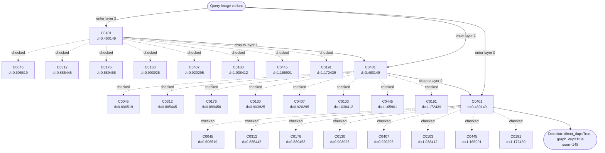

#### ERNG Diagram

```mermaid
flowchart TD
  Q(["Query image variant"])
  Q -->|probe 1: C0036| E_P0_C0036_0
  E_P0_C0036_0["C0036\nd=20.32082"]
  E_P0_C0036_0_n0["C0130\nd=0.903925"]
  E_P0_C0036_0 -. checked .-> E_P0_C0036_0_n0
  E_P0_C0036_0_n1["C0392\nd=11.535014"]
  E_P0_C0036_0 -. checked .-> E_P0_C0036_0_n1
  E_P0_C0036_0_n2["C0391\nd=18.075655"]
  E_P0_C0036_0 -. checked .-> E_P0_C0036_0_n2
  E_P0_C0036_0_n3["C0012\nd=18.805933"]
  E_P0_C0036_0 -. checked .-> E_P0_C0036_0_n3
  E_P0_C0036_0_n4["C0272\nd=18.929203"]
  E_P0_C0036_0 -. checked .-> E_P0_C0036_0_n4
  E_P0_C0130_1["C0130\nd=0.903925"]
  E_P0_C0130_1_n0["C0401\nd=0.460149"]
  E_P0_C0130_1 -. checked .-> E_P0_C0130_1_n0
  E_P0_C0130_1_n1["C0045\nd=0.606519"]
  E_P0_C0130_1 -. checked .-> E_P0_C0130_1_n1
  E_P0_C0130_1_n2["C0176\nd=0.889458"]
  E_P0_C0130_1 -. checked .-> E_P0_C0130_1_n2
  E_P0_C0130_1_n3["C0103\nd=1.038412"]
  E_P0_C0130_1 -. checked .-> E_P0_C0130_1_n3
  E_P0_C0130_1_n4["C0445\nd=1.165901"]
  E_P0_C0130_1 -. checked .-> E_P0_C0130_1_n4
  E_P0_C0401_2["C0401\nd=0.460149"]
  E_P0_C0401_2_n0["C0045\nd=0.606519"]
  E_P0_C0401_2 -. checked .-> E_P0_C0401_2_n0
  E_P0_C0401_2_n1["C0312\nd=0.885445"]
  E_P0_C0401_2 -. checked .-> E_P0_C0401_2_n1
  E_P0_C0401_2_n2["C0176\nd=0.889458"]
  E_P0_C0401_2 -. checked .-> E_P0_C0401_2_n2
  E_P0_C0401_2_n3["C0130\nd=0.903925"]
  E_P0_C0401_2 -. checked .-> E_P0_C0401_2_n3
  E_P0_C0401_2_n4["C0407\nd=0.920295"]
  E_P0_C0401_2 -. checked .-> E_P0_C0401_2_n4
  E_P0_C0036_0 ==> E_P0_C0130_1
  E_P0_C0130_1 ==> E_P0_C0401_2
  E_P0_C0401_2 --> SEL(["selected final C0401\nseen=148"])
  Q -->|probe 2: C0130| E_P1_C0130_0
  E_P1_C0130_0["C0130\nd=0.903925"]
  E_P1_C0130_0_n0["C0401\nd=0.460149"]
  E_P1_C0130_0 -. checked .-> E_P1_C0130_0_n0
  E_P1_C0130_0_n1["C0045\nd=0.606519"]
  E_P1_C0130_0 -. checked .-> E_P1_C0130_0_n1
  E_P1_C0130_0_n2["C0176\nd=0.889458"]
  E_P1_C0130_0 -. checked .-> E_P1_C0130_0_n2
  E_P1_C0130_0_n3["C0103\nd=1.038412"]
  E_P1_C0130_0 -. checked .-> E_P1_C0130_0_n3
  E_P1_C0130_0_n4["C0445\nd=1.165901"]
  E_P1_C0130_0 -. checked .-> E_P1_C0130_0_n4
  E_P1_C0401_1["C0401\nd=0.460149"]
  E_P1_C0401_1_n0["C0045\nd=0.606519"]
  E_P1_C0401_1 -. checked .-> E_P1_C0401_1_n0
  E_P1_C0401_1_n1["C0312\nd=0.885445"]
  E_P1_C0401_1 -. checked .-> E_P1_C0401_1_n1
  E_P1_C0401_1_n2["C0176\nd=0.889458"]
  E_P1_C0401_1 -. checked .-> E_P1_C0401_1_n2
  E_P1_C0401_1_n3["C0130\nd=0.903925"]
  E_P1_C0401_1 -. checked .-> E_P1_C0401_1_n3
  E_P1_C0401_1_n4["C0407\nd=0.920295"]
  E_P1_C0401_1 -. checked .-> E_P1_C0401_1_n4
  E_P1_C0130_0 ==> E_P1_C0401_1
  E_P1_C0401_1 --> SEL(["selected final C0401\nseen=148"])
  Q -->|probe 3: C0191| E_P2_C0191_0
  E_P2_C0191_0["C0191\nd=1.172439"]
  E_P2_C0191_0_n0["C0401\nd=0.460149"]
  E_P2_C0191_0 -. checked .-> E_P2_C0191_0_n0
  E_P2_C0191_0_n1["C0045\nd=0.606519"]
  E_P2_C0191_0 -. checked .-> E_P2_C0191_0_n1
  E_P2_C0191_0_n2["C0312\nd=0.885445"]
  E_P2_C0191_0 -. checked .-> E_P2_C0191_0_n2
  E_P2_C0191_0_n3["C0130\nd=0.903925"]
  E_P2_C0191_0 -. checked .-> E_P2_C0191_0_n3
  E_P2_C0191_0_n4["C0103\nd=1.038412"]
  E_P2_C0191_0 -. checked .-> E_P2_C0191_0_n4
  E_P2_C0401_1["C0401\nd=0.460149"]
  E_P2_C0401_1_n0["C0045\nd=0.606519"]
  E_P2_C0401_1 -. checked .-> E_P2_C0401_1_n0
  E_P2_C0401_1_n1["C0312\nd=0.885445"]
  E_P2_C0401_1 -. checked .-> E_P2_C0401_1_n1
  E_P2_C0401_1_n2["C0176\nd=0.889458"]
  E_P2_C0401_1 -. checked .-> E_P2_C0401_1_n2
  E_P2_C0401_1_n3["C0130\nd=0.903925"]
  E_P2_C0401_1 -. checked .-> E_P2_C0401_1_n3
  E_P2_C0401_1_n4["C0407\nd=0.920295"]
  E_P2_C0401_1 -. checked .-> E_P2_C0401_1_n4
  E_P2_C0191_0 ==> E_P2_C0401_1
  E_P2_C0401_1 --> SEL(["selected final C0401\nseen=148"])
  Q -->|probe 4: C0280| E_P3_C0280_0
  E_P3_C0280_0["C0280\nd=17.193275"]
  E_P3_C0280_0_n0["C0340\nd=1.41489"]
  E_P3_C0280_0 -. checked .-> E_P3_C0280_0_n0
  E_P3_C0280_0_n1["C0243\nd=12.615195"]
  E_P3_C0280_0 -. checked .-> E_P3_C0280_0_n1
  E_P3_C0280_0_n2["C0382\nd=14.60812"]
  E_P3_C0280_0 -. checked .-> E_P3_C0280_0_n2
  E_P3_C0280_0_n3["C0187\nd=15.182985"]
  E_P3_C0280_0 -. checked .-> E_P3_C0280_0_n3
  E_P3_C0280_0_n4["C0408\nd=15.242299"]
  E_P3_C0280_0 -. checked .-> E_P3_C0280_0_n4
  E_P3_C0340_1["C0340\nd=1.41489"]
  E_P3_C0340_1_n0["C0401\nd=0.460149"]
  E_P3_C0340_1 -. checked .-> E_P3_C0340_1_n0
  E_P3_C0340_1_n1["C0130\nd=0.903925"]
  E_P3_C0340_1 -. checked .-> E_P3_C0340_1_n1
  E_P3_C0340_1_n2["C0103\nd=1.038412"]
  E_P3_C0340_1 -. checked .-> E_P3_C0340_1_n2
  E_P3_C0340_1_n3["C0445\nd=1.165901"]
  E_P3_C0340_1 -. checked .-> E_P3_C0340_1_n3
  E_P3_C0340_1_n4["C0191\nd=1.172439"]
  E_P3_C0340_1 -. checked .-> E_P3_C0340_1_n4
  E_P3_C0401_2["C0401\nd=0.460149"]
  E_P3_C0401_2_n0["C0045\nd=0.606519"]
  E_P3_C0401_2 -. checked .-> E_P3_C0401_2_n0
  E_P3_C0401_2_n1["C0312\nd=0.885445"]
  E_P3_C0401_2 -. checked .-> E_P3_C0401_2_n1
  E_P3_C0401_2_n2["C0176\nd=0.889458"]
  E_P3_C0401_2 -. checked .-> E_P3_C0401_2_n2
  E_P3_C0401_2_n3["C0130\nd=0.903925"]
  E_P3_C0401_2 -. checked .-> E_P3_C0401_2_n3
  E_P3_C0401_2_n4["C0407\nd=0.920295"]
  E_P3_C0401_2 -. checked .-> E_P3_C0401_2_n4
  E_P3_C0280_0 ==> E_P3_C0340_1
  E_P3_C0340_1 ==> E_P3_C0401_2
  E_P3_C0401_2 --> SEL(["selected final C0401\nseen=148"])
  Q -->|probe 5: C0297| E_P4_C0297_0
  E_P4_C0297_0["C0297\nd=2.283084"]
  E_P4_C0297_0_n0["C0312\nd=0.885445"]
  E_P4_C0297_0 -. checked .-> E_P4_C0297_0_n0
  E_P4_C0297_0_n1["C0136\nd=1.601581"]
  E_P4_C0297_0 -. checked .-> E_P4_C0297_0_n1
  E_P4_C0297_0_n2["C0440\nd=1.741525"]
  E_P4_C0297_0 -. checked .-> E_P4_C0297_0_n2
  E_P4_C0297_0_n3["C0068\nd=1.771654"]
  E_P4_C0297_0 -. checked .-> E_P4_C0297_0_n3
  E_P4_C0297_0_n4["C0150\nd=2.061462"]
  E_P4_C0297_0 -. checked .-> E_P4_C0297_0_n4
  E_P4_C0312_1["C0312\nd=0.885445"]
  E_P4_C0312_1_n0["C0401\nd=0.460149"]
  E_P4_C0312_1 -. checked .-> E_P4_C0312_1_n0
  E_P4_C0312_1_n1["C0045\nd=0.606519"]
  E_P4_C0312_1 -. checked .-> E_P4_C0312_1_n1
  E_P4_C0312_1_n2["C0176\nd=0.889458"]
  E_P4_C0312_1 -. checked .-> E_P4_C0312_1_n2
  E_P4_C0312_1_n3["C0407\nd=0.920295"]
  E_P4_C0312_1 -. checked .-> E_P4_C0312_1_n3
  E_P4_C0312_1_n4["C0103\nd=1.038412"]
  E_P4_C0312_1 -. checked .-> E_P4_C0312_1_n4
  E_P4_C0401_2["C0401\nd=0.460149"]
  E_P4_C0401_2_n0["C0045\nd=0.606519"]
  E_P4_C0401_2 -. checked .-> E_P4_C0401_2_n0
  E_P4_C0401_2_n1["C0312\nd=0.885445"]
  E_P4_C0401_2 -. checked .-> E_P4_C0401_2_n1
  E_P4_C0401_2_n2["C0176\nd=0.889458"]
  E_P4_C0401_2 -. checked .-> E_P4_C0401_2_n2
  E_P4_C0401_2_n3["C0130\nd=0.903925"]
  E_P4_C0401_2 -. checked .-> E_P4_C0401_2_n3
  E_P4_C0401_2_n4["C0407\nd=0.920295"]
  E_P4_C0401_2 -. checked .-> E_P4_C0401_2_n4
  E_P4_C0297_0 ==> E_P4_C0312_1
  E_P4_C0312_1 ==> E_P4_C0401_2
  E_P4_C0401_2 --> SEL(["selected final C0401\nseen=148"])
  Q -->|probe 6: C0310| E_P5_C0310_0
  E_P5_C0310_0["C0310\nd=14.220365"]
  E_P5_C0310_0_n0["C0450\nd=3.057226"]
  E_P5_C0310_0 -. checked .-> E_P5_C0310_0_n0
  E_P5_C0310_0_n1["C0338\nd=9.537297"]
  E_P5_C0310_0 -. checked .-> E_P5_C0310_0_n1
  E_P5_C0310_0_n2["C0123\nd=12.432078"]
  E_P5_C0310_0 -. checked .-> E_P5_C0310_0_n2
  E_P5_C0310_0_n3["C0290\nd=13.184285"]
  E_P5_C0310_0 -. checked .-> E_P5_C0310_0_n3
  E_P5_C0310_0_n4["C0470\nd=13.311103"]
  E_P5_C0310_0 -. checked .-> E_P5_C0310_0_n4
  E_P5_C0450_1["C0450\nd=3.057226"]
  E_P5_C0450_1_n0["C0103\nd=1.038412"]
  E_P5_C0450_1 -. checked .-> E_P5_C0450_1_n0
  E_P5_C0450_1_n1["C0136\nd=1.601581"]
  E_P5_C0450_1 -. checked .-> E_P5_C0450_1_n1
  E_P5_C0450_1_n2["C0068\nd=1.771654"]
  E_P5_C0450_1 -. checked .-> E_P5_C0450_1_n2
  E_P5_C0450_1_n3["C0109\nd=2.008238"]
  E_P5_C0450_1 -. checked .-> E_P5_C0450_1_n3
  E_P5_C0450_1_n4["C0370\nd=2.105633"]
  E_P5_C0450_1 -. checked .-> E_P5_C0450_1_n4
  E_P5_C0103_2["C0103\nd=1.038412"]
  E_P5_C0103_2_n0["C0401\nd=0.460149"]
  E_P5_C0103_2 -. checked .-> E_P5_C0103_2_n0
  E_P5_C0103_2_n1["C0045\nd=0.606519"]
  E_P5_C0103_2 -. checked .-> E_P5_C0103_2_n1
  E_P5_C0103_2_n2["C0312\nd=0.885445"]
  E_P5_C0103_2 -. checked .-> E_P5_C0103_2_n2
  E_P5_C0103_2_n3["C0130\nd=0.903925"]
  E_P5_C0103_2 -. checked .-> E_P5_C0103_2_n3
  E_P5_C0103_2_n4["C0445\nd=1.165901"]
  E_P5_C0103_2 -. checked .-> E_P5_C0103_2_n4
  E_P5_C0401_3["C0401\nd=0.460149"]
  E_P5_C0401_3_n0["C0045\nd=0.606519"]
  E_P5_C0401_3 -. checked .-> E_P5_C0401_3_n0
  E_P5_C0401_3_n1["C0312\nd=0.885445"]
  E_P5_C0401_3 -. checked .-> E_P5_C0401_3_n1
  E_P5_C0401_3_n2["C0176\nd=0.889458"]
  E_P5_C0401_3 -. checked .-> E_P5_C0401_3_n2
  E_P5_C0401_3_n3["C0130\nd=0.903925"]
  E_P5_C0401_3 -. checked .-> E_P5_C0401_3_n3
  E_P5_C0401_3_n4["C0407\nd=0.920295"]
  E_P5_C0401_3 -. checked .-> E_P5_C0401_3_n4
  E_P5_C0310_0 ==> E_P5_C0450_1
  E_P5_C0450_1 ==> E_P5_C0103_2
  E_P5_C0103_2 ==> E_P5_C0401_3
  E_P5_C0401_3 --> SEL(["selected final C0401\nseen=148"])
  Q -->|probe 7: C0401| E_P6_C0401_0
  E_P6_C0401_0["C0401\nd=0.460149"]
  E_P6_C0401_0_n0["C0045\nd=0.606519"]
  E_P6_C0401_0 -. checked .-> E_P6_C0401_0_n0
  E_P6_C0401_0_n1["C0312\nd=0.885445"]
  E_P6_C0401_0 -. checked .-> E_P6_C0401_0_n1
  E_P6_C0401_0_n2["C0176\nd=0.889458"]
  E_P6_C0401_0 -. checked .-> E_P6_C0401_0_n2
  E_P6_C0401_0_n3["C0130\nd=0.903925"]
  E_P6_C0401_0 -. checked .-> E_P6_C0401_0_n3
  E_P6_C0401_0_n4["C0407\nd=0.920295"]
  E_P6_C0401_0 -. checked .-> E_P6_C0401_0_n4
  E_P6_C0401_0 --> SEL(["selected final C0401\nseen=148"])
  Q -->|probe 8: C0445| E_P7_C0445_0
  E_P7_C0445_0["C0445\nd=1.165901"]
  E_P7_C0445_0_n0["C0401\nd=0.460149"]
  E_P7_C0445_0 -. checked .-> E_P7_C0445_0_n0
  E_P7_C0445_0_n1["C0130\nd=0.903925"]
  E_P7_C0445_0 -. checked .-> E_P7_C0445_0_n1
  E_P7_C0445_0_n2["C0407\nd=0.920295"]
  E_P7_C0445_0 -. checked .-> E_P7_C0445_0_n2
  E_P7_C0445_0_n3["C0103\nd=1.038412"]
  E_P7_C0445_0 -. checked .-> E_P7_C0445_0_n3
  E_P7_C0445_0_n4["C0191\nd=1.172439"]
  E_P7_C0445_0 -. checked .-> E_P7_C0445_0_n4
  E_P7_C0401_1["C0401\nd=0.460149"]
  E_P7_C0401_1_n0["C0045\nd=0.606519"]
  E_P7_C0401_1 -. checked .-> E_P7_C0401_1_n0
  E_P7_C0401_1_n1["C0312\nd=0.885445"]
  E_P7_C0401_1 -. checked .-> E_P7_C0401_1_n1
  E_P7_C0401_1_n2["C0176\nd=0.889458"]
  E_P7_C0401_1 -. checked .-> E_P7_C0401_1_n2
  E_P7_C0401_1_n3["C0130\nd=0.903925"]
  E_P7_C0401_1 -. checked .-> E_P7_C0401_1_n3
  E_P7_C0401_1_n4["C0407\nd=0.920295"]
  E_P7_C0401_1 -. checked .-> E_P7_C0401_1_n4
  E_P7_C0445_0 ==> E_P7_C0401_1
  E_P7_C0401_1 --> SEL(["selected final C0401\nseen=148"])
  DEC(["Decision: direct_dup=True, graph_dup=True"])
  SEL --> DEC
```

### Amazon Trace 2: `pump_dispensers_35_org.jpg` attack `rotate40`

- Path: `/home/saketh/Data Processed/cosmetics/pump_dispensers/pump_dispensers_35/pump_dispensers_35_org.jpg`
- Threshold: `0.847949`
- HNSW final centroid: `C0028`; duplicate decision: direct=`True`, graph=`True`
- ERNG final centroid: `C0028`; duplicate decision: direct=`True`, graph=`True`

#### HNSW Diagram

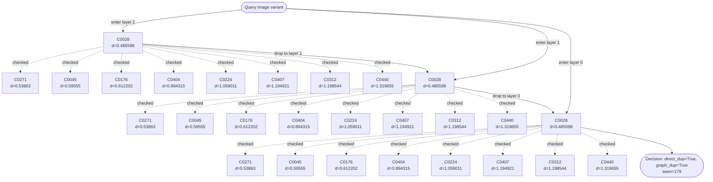

#### ERNG Diagram

```mermaid
flowchart TD
  Q(["Query image variant"])
  Q -->|probe 1: C0036| E_P0_C0036_0
  E_P0_C0036_0["C0036\nd=19.590818"]
  E_P0_C0036_0_n0["C0130\nd=1.484095"]
  E_P0_C0036_0 -. checked .-> E_P0_C0036_0_n0
  E_P0_C0036_0_n1["C0392\nd=10.682065"]
  E_P0_C0036_0 -. checked .-> E_P0_C0036_0_n1
  E_P0_C0036_0_n2["C0391\nd=17.245737"]
  E_P0_C0036_0 -. checked .-> E_P0_C0036_0_n2
  E_P0_C0036_0_n3["C0012\nd=18.09548"]
  E_P0_C0036_0 -. checked .-> E_P0_C0036_0_n3
  E_P0_C0036_0_n4["C0272\nd=18.165596"]
  E_P0_C0036_0 -. checked .-> E_P0_C0036_0_n4
  E_P0_C0130_1["C0130\nd=1.484095"]
  E_P0_C0130_1_n0["C0045\nd=0.59555"]
  E_P0_C0130_1 -. checked .-> E_P0_C0130_1_n0
  E_P0_C0130_1_n1["C0176\nd=0.612202"]
  E_P0_C0130_1 -. checked .-> E_P0_C0130_1_n1
  E_P0_C0130_1_n2["C0401\nd=1.334707"]
  E_P0_C0130_1 -. checked .-> E_P0_C0130_1_n2
  E_P0_C0130_1_n3["C0016\nd=1.415803"]
  E_P0_C0130_1 -. checked .-> E_P0_C0130_1_n3
  E_P0_C0130_1_n4["C0191\nd=1.636994"]
  E_P0_C0130_1 -. checked .-> E_P0_C0130_1_n4
  E_P0_C0045_2["C0045\nd=0.59555"]
  E_P0_C0045_2_n0["C0028\nd=0.485598"]
  E_P0_C0045_2 -. checked .-> E_P0_C0045_2_n0
  E_P0_C0045_2_n1["C0271\nd=0.53863"]
  E_P0_C0045_2 -. checked .-> E_P0_C0045_2_n1
  E_P0_C0045_2_n2["C0176\nd=0.612202"]
  E_P0_C0045_2 -. checked .-> E_P0_C0045_2_n2
  E_P0_C0045_2_n3["C0404\nd=0.894315"]
  E_P0_C0045_2 -. checked .-> E_P0_C0045_2_n3
  E_P0_C0045_2_n4["C0407\nd=1.194921"]
  E_P0_C0045_2 -. checked .-> E_P0_C0045_2_n4
  E_P0_C0028_3["C0028\nd=0.485598"]
  E_P0_C0028_3_n0["C0271\nd=0.53863"]
  E_P0_C0028_3 -. checked .-> E_P0_C0028_3_n0
  E_P0_C0028_3_n1["C0045\nd=0.59555"]
  E_P0_C0028_3 -. checked .-> E_P0_C0028_3_n1
  E_P0_C0028_3_n2["C0176\nd=0.612202"]
  E_P0_C0028_3 -. checked .-> E_P0_C0028_3_n2
  E_P0_C0028_3_n3["C0404\nd=0.894315"]
  E_P0_C0028_3 -. checked .-> E_P0_C0028_3_n3
  E_P0_C0028_3_n4["C0224\nd=1.059011"]
  E_P0_C0028_3 -. checked .-> E_P0_C0028_3_n4
  E_P0_C0036_0 ==> E_P0_C0130_1
  E_P0_C0130_1 ==> E_P0_C0045_2
  E_P0_C0045_2 ==> E_P0_C0028_3
  E_P0_C0028_3 --> SEL(["selected final C0028\nseen=179"])
  Q -->|probe 2: C0130| E_P1_C0130_0
  E_P1_C0130_0["C0130\nd=1.484095"]
  E_P1_C0130_0_n0["C0045\nd=0.59555"]
  E_P1_C0130_0 -. checked .-> E_P1_C0130_0_n0
  E_P1_C0130_0_n1["C0176\nd=0.612202"]
  E_P1_C0130_0 -. checked .-> E_P1_C0130_0_n1
  E_P1_C0130_0_n2["C0401\nd=1.334707"]
  E_P1_C0130_0 -. checked .-> E_P1_C0130_0_n2
  E_P1_C0130_0_n3["C0016\nd=1.415803"]
  E_P1_C0130_0 -. checked .-> E_P1_C0130_0_n3
  E_P1_C0130_0_n4["C0191\nd=1.636994"]
  E_P1_C0130_0 -. checked .-> E_P1_C0130_0_n4
  E_P1_C0045_1["C0045\nd=0.59555"]
  E_P1_C0045_1_n0["C0028\nd=0.485598"]
  E_P1_C0045_1 -. checked .-> E_P1_C0045_1_n0
  E_P1_C0045_1_n1["C0271\nd=0.53863"]
  E_P1_C0045_1 -. checked .-> E_P1_C0045_1_n1
  E_P1_C0045_1_n2["C0176\nd=0.612202"]
  E_P1_C0045_1 -. checked .-> E_P1_C0045_1_n2
  E_P1_C0045_1_n3["C0404\nd=0.894315"]
  E_P1_C0045_1 -. checked .-> E_P1_C0045_1_n3
  E_P1_C0045_1_n4["C0407\nd=1.194921"]
  E_P1_C0045_1 -. checked .-> E_P1_C0045_1_n4
  E_P1_C0028_2["C0028\nd=0.485598"]
  E_P1_C0028_2_n0["C0271\nd=0.53863"]
  E_P1_C0028_2 -. checked .-> E_P1_C0028_2_n0
  E_P1_C0028_2_n1["C0045\nd=0.59555"]
  E_P1_C0028_2 -. checked .-> E_P1_C0028_2_n1
  E_P1_C0028_2_n2["C0176\nd=0.612202"]
  E_P1_C0028_2 -. checked .-> E_P1_C0028_2_n2
  E_P1_C0028_2_n3["C0404\nd=0.894315"]
  E_P1_C0028_2 -. checked .-> E_P1_C0028_2_n3
  E_P1_C0028_2_n4["C0224\nd=1.059011"]
  E_P1_C0028_2 -. checked .-> E_P1_C0028_2_n4
  E_P1_C0130_0 ==> E_P1_C0045_1
  E_P1_C0045_1 ==> E_P1_C0028_2
  E_P1_C0028_2 --> SEL(["selected final C0028\nseen=179"])
  Q -->|probe 3: C0191| E_P2_C0191_0
  E_P2_C0191_0["C0191\nd=1.636994"]
  E_P2_C0191_0_n0["C0271\nd=0.53863"]
  E_P2_C0191_0 -. checked .-> E_P2_C0191_0_n0
  E_P2_C0191_0_n1["C0045\nd=0.59555"]
  E_P2_C0191_0 -. checked .-> E_P2_C0191_0_n1
  E_P2_C0191_0_n2["C0312\nd=1.198544"]
  E_P2_C0191_0 -. checked .-> E_P2_C0191_0_n2
  E_P2_C0191_0_n3["C0401\nd=1.334707"]
  E_P2_C0191_0 -. checked .-> E_P2_C0191_0_n3
  E_P2_C0191_0_n4["C0016\nd=1.415803"]
  E_P2_C0191_0 -. checked .-> E_P2_C0191_0_n4
  E_P2_C0271_1["C0271\nd=0.53863"]
  E_P2_C0271_1_n0["C0028\nd=0.485598"]
  E_P2_C0271_1 -. checked .-> E_P2_C0271_1_n0
  E_P2_C0271_1_n1["C0045\nd=0.59555"]
  E_P2_C0271_1 -. checked .-> E_P2_C0271_1_n1
  E_P2_C0271_1_n2["C0176\nd=0.612202"]
  E_P2_C0271_1 -. checked .-> E_P2_C0271_1_n2
  E_P2_C0271_1_n3["C0404\nd=0.894315"]
  E_P2_C0271_1 -. checked .-> E_P2_C0271_1_n3
  E_P2_C0271_1_n4["C0224\nd=1.059011"]
  E_P2_C0271_1 -. checked .-> E_P2_C0271_1_n4
  E_P2_C0028_2["C0028\nd=0.485598"]
  E_P2_C0028_2_n0["C0271\nd=0.53863"]
  E_P2_C0028_2 -. checked .-> E_P2_C0028_2_n0
  E_P2_C0028_2_n1["C0045\nd=0.59555"]
  E_P2_C0028_2 -. checked .-> E_P2_C0028_2_n1
  E_P2_C0028_2_n2["C0176\nd=0.612202"]
  E_P2_C0028_2 -. checked .-> E_P2_C0028_2_n2
  E_P2_C0028_2_n3["C0404\nd=0.894315"]
  E_P2_C0028_2 -. checked .-> E_P2_C0028_2_n3
  E_P2_C0028_2_n4["C0224\nd=1.059011"]
  E_P2_C0028_2 -. checked .-> E_P2_C0028_2_n4
  E_P2_C0191_0 ==> E_P2_C0271_1
  E_P2_C0271_1 ==> E_P2_C0028_2
  E_P2_C0028_2 --> SEL(["selected final C0028\nseen=179"])
  Q -->|probe 4: C0280| E_P3_C0280_0
  E_P3_C0280_0["C0280\nd=16.463186"]
  E_P3_C0280_0_n0["C0340\nd=2.357659"]
  E_P3_C0280_0 -. checked .-> E_P3_C0280_0_n0
  E_P3_C0280_0_n1["C0243\nd=11.785935"]
  E_P3_C0280_0 -. checked .-> E_P3_C0280_0_n1
  E_P3_C0280_0_n2["C0382\nd=13.962196"]
  E_P3_C0280_0 -. checked .-> E_P3_C0280_0_n2
  E_P3_C0280_0_n3["C0187\nd=14.424233"]
  E_P3_C0280_0 -. checked .-> E_P3_C0280_0_n3
  E_P3_C0280_0_n4["C0408\nd=14.530422"]
  E_P3_C0280_0 -. checked .-> E_P3_C0280_0_n4
  E_P3_C0340_1["C0340\nd=2.357659"]
  E_P3_C0340_1_n0["C0401\nd=1.334707"]
  E_P3_C0340_1 -. checked .-> E_P3_C0340_1_n0
  E_P3_C0340_1_n1["C0130\nd=1.484095"]
  E_P3_C0340_1 -. checked .-> E_P3_C0340_1_n1
  E_P3_C0340_1_n2["C0191\nd=1.636994"]
  E_P3_C0340_1 -. checked .-> E_P3_C0340_1_n2
  E_P3_C0340_1_n3["C0103\nd=1.856453"]
  E_P3_C0340_1 -. checked .-> E_P3_C0340_1_n3
  E_P3_C0340_1_n4["C0445\nd=2.00816"]
  E_P3_C0340_1 -. checked .-> E_P3_C0340_1_n4
  E_P3_C0401_2["C0401\nd=1.334707"]
  E_P3_C0401_2_n0["C0045\nd=0.59555"]
  E_P3_C0401_2 -. checked .-> E_P3_C0401_2_n0
  E_P3_C0401_2_n1["C0176\nd=0.612202"]
  E_P3_C0401_2 -. checked .-> E_P3_C0401_2_n1
  E_P3_C0401_2_n2["C0407\nd=1.194921"]
  E_P3_C0401_2 -. checked .-> E_P3_C0401_2_n2
  E_P3_C0401_2_n3["C0312\nd=1.198544"]
  E_P3_C0401_2 -. checked .-> E_P3_C0401_2_n3
  E_P3_C0401_2_n4["C0016\nd=1.415803"]
  E_P3_C0401_2 -. checked .-> E_P3_C0401_2_n4
  E_P3_C0045_3["C0045\nd=0.59555"]
  E_P3_C0045_3_n0["C0028\nd=0.485598"]
  E_P3_C0045_3 -. checked .-> E_P3_C0045_3_n0
  E_P3_C0045_3_n1["C0271\nd=0.53863"]
  E_P3_C0045_3 -. checked .-> E_P3_C0045_3_n1
  E_P3_C0045_3_n2["C0176\nd=0.612202"]
  E_P3_C0045_3 -. checked .-> E_P3_C0045_3_n2
  E_P3_C0045_3_n3["C0404\nd=0.894315"]
  E_P3_C0045_3 -. checked .-> E_P3_C0045_3_n3
  E_P3_C0045_3_n4["C0407\nd=1.194921"]
  E_P3_C0045_3 -. checked .-> E_P3_C0045_3_n4
  E_P3_C0028_4["C0028\nd=0.485598"]
  E_P3_C0028_4_n0["C0271\nd=0.53863"]
  E_P3_C0028_4 -. checked .-> E_P3_C0028_4_n0
  E_P3_C0028_4_n1["C0045\nd=0.59555"]
  E_P3_C0028_4 -. checked .-> E_P3_C0028_4_n1
  E_P3_C0028_4_n2["C0176\nd=0.612202"]
  E_P3_C0028_4 -. checked .-> E_P3_C0028_4_n2
  E_P3_C0028_4_n3["C0404\nd=0.894315"]
  E_P3_C0028_4 -. checked .-> E_P3_C0028_4_n3
  E_P3_C0028_4_n4["C0224\nd=1.059011"]
  E_P3_C0028_4 -. checked .-> E_P3_C0028_4_n4
  E_P3_C0280_0 ==> E_P3_C0340_1
  E_P3_C0340_1 ==> E_P3_C0401_2
  E_P3_C0401_2 ==> E_P3_C0045_3
  E_P3_C0045_3 ==> E_P3_C0028_4
  E_P3_C0028_4 --> SEL(["selected final C0028\nseen=179"])
  Q -->|probe 5: C0297| E_P4_C0297_0
  E_P4_C0297_0["C0297\nd=2.524129"]
  E_P4_C0297_0_n0["C0312\nd=1.198544"]
  E_P4_C0297_0 -. checked .-> E_P4_C0297_0_n0
  E_P4_C0297_0_n1["C0440\nd=1.319655"]
  E_P4_C0297_0 -. checked .-> E_P4_C0297_0_n1
  E_P4_C0297_0_n2["C0471\nd=1.798234"]
  E_P4_C0297_0 -. checked .-> E_P4_C0297_0_n2
  E_P4_C0297_0_n3["C0136\nd=2.004098"]
  E_P4_C0297_0 -. checked .-> E_P4_C0297_0_n3
  E_P4_C0297_0_n4["C0150\nd=2.015882"]
  E_P4_C0297_0 -. checked .-> E_P4_C0297_0_n4
  E_P4_C0312_1["C0312\nd=1.198544"]
  E_P4_C0312_1_n0["C0028\nd=0.485598"]
  E_P4_C0312_1 -. checked .-> E_P4_C0312_1_n0
  E_P4_C0312_1_n1["C0271\nd=0.53863"]
  E_P4_C0312_1 -. checked .-> E_P4_C0312_1_n1
  E_P4_C0312_1_n2["C0045\nd=0.59555"]
  E_P4_C0312_1 -. checked .-> E_P4_C0312_1_n2
  E_P4_C0312_1_n3["C0176\nd=0.612202"]
  E_P4_C0312_1 -. checked .-> E_P4_C0312_1_n3
  E_P4_C0312_1_n4["C0407\nd=1.194921"]
  E_P4_C0312_1 -. checked .-> E_P4_C0312_1_n4
  E_P4_C0028_2["C0028\nd=0.485598"]
  E_P4_C0028_2_n0["C0271\nd=0.53863"]
  E_P4_C0028_2 -. checked .-> E_P4_C0028_2_n0
  E_P4_C0028_2_n1["C0045\nd=0.59555"]
  E_P4_C0028_2 -. checked .-> E_P4_C0028_2_n1
  E_P4_C0028_2_n2["C0176\nd=0.612202"]
  E_P4_C0028_2 -. checked .-> E_P4_C0028_2_n2
  E_P4_C0028_2_n3["C0404\nd=0.894315"]
  E_P4_C0028_2 -. checked .-> E_P4_C0028_2_n3
  E_P4_C0028_2_n4["C0224\nd=1.059011"]
  E_P4_C0028_2 -. checked .-> E_P4_C0028_2_n4
  E_P4_C0297_0 ==> E_P4_C0312_1
  E_P4_C0312_1 ==> E_P4_C0028_2
  E_P4_C0028_2 --> SEL(["selected final C0028\nseen=179"])
  Q -->|probe 6: C0310| E_P5_C0310_0
  E_P5_C0310_0["C0310\nd=15.028286"]
  E_P5_C0310_0_n0["C0450\nd=3.713689"]
  E_P5_C0310_0 -. checked .-> E_P5_C0310_0_n0
  E_P5_C0310_0_n1["C0338\nd=10.255254"]
  E_P5_C0310_0 -. checked .-> E_P5_C0310_0_n1
  E_P5_C0310_0_n2["C0123\nd=13.268622"]
  E_P5_C0310_0 -. checked .-> E_P5_C0310_0_n2
  E_P5_C0310_0_n3["C0290\nd=14.006198"]
  E_P5_C0310_0 -. checked .-> E_P5_C0310_0_n3
  E_P5_C0310_0_n4["C0470\nd=14.09521"]
  E_P5_C0310_0 -. checked .-> E_P5_C0310_0_n4
  E_P5_C0450_1["C0450\nd=3.713689"]
  E_P5_C0450_1_n0["C0103\nd=1.856453"]
  E_P5_C0450_1 -. checked .-> E_P5_C0450_1_n0
  E_P5_C0450_1_n1["C0136\nd=2.004098"]
  E_P5_C0450_1 -. checked .-> E_P5_C0450_1_n1
  E_P5_C0450_1_n2["C0370\nd=2.148922"]
  E_P5_C0450_1 -. checked .-> E_P5_C0450_1_n2
  E_P5_C0450_1_n3["C0068\nd=2.419712"]
  E_P5_C0450_1 -. checked .-> E_P5_C0450_1_n3
  E_P5_C0450_1_n4["C0297\nd=2.524129"]
  E_P5_C0450_1 -. checked .-> E_P5_C0450_1_n4
  E_P5_C0103_2["C0103\nd=1.856453"]
  E_P5_C0103_2_n0["C0045\nd=0.59555"]
  E_P5_C0103_2 -. checked .-> E_P5_C0103_2_n0
  E_P5_C0103_2_n1["C0312\nd=1.198544"]
  E_P5_C0103_2 -. checked .-> E_P5_C0103_2_n1
  E_P5_C0103_2_n2["C0440\nd=1.319655"]
  E_P5_C0103_2 -. checked .-> E_P5_C0103_2_n2
  E_P5_C0103_2_n3["C0401\nd=1.334707"]
  E_P5_C0103_2 -. checked .-> E_P5_C0103_2_n3
  E_P5_C0103_2_n4["C0130\nd=1.484095"]
  E_P5_C0103_2 -. checked .-> E_P5_C0103_2_n4
  E_P5_C0045_3["C0045\nd=0.59555"]
  E_P5_C0045_3_n0["C0028\nd=0.485598"]
  E_P5_C0045_3 -. checked .-> E_P5_C0045_3_n0
  E_P5_C0045_3_n1["C0271\nd=0.53863"]
  E_P5_C0045_3 -. checked .-> E_P5_C0045_3_n1
  E_P5_C0045_3_n2["C0176\nd=0.612202"]
  E_P5_C0045_3 -. checked .-> E_P5_C0045_3_n2
  E_P5_C0045_3_n3["C0404\nd=0.894315"]
  E_P5_C0045_3 -. checked .-> E_P5_C0045_3_n3
  E_P5_C0045_3_n4["C0407\nd=1.194921"]
  E_P5_C0045_3 -. checked .-> E_P5_C0045_3_n4
  E_P5_C0028_4["C0028\nd=0.485598"]
  E_P5_C0028_4_n0["C0271\nd=0.53863"]
  E_P5_C0028_4 -. checked .-> E_P5_C0028_4_n0
  E_P5_C0028_4_n1["C0045\nd=0.59555"]
  E_P5_C0028_4 -. checked .-> E_P5_C0028_4_n1
  E_P5_C0028_4_n2["C0176\nd=0.612202"]
  E_P5_C0028_4 -. checked .-> E_P5_C0028_4_n2
  E_P5_C0028_4_n3["C0404\nd=0.894315"]
  E_P5_C0028_4 -. checked .-> E_P5_C0028_4_n3
  E_P5_C0028_4_n4["C0224\nd=1.059011"]
  E_P5_C0028_4 -. checked .-> E_P5_C0028_4_n4
  E_P5_C0310_0 ==> E_P5_C0450_1
  E_P5_C0450_1 ==> E_P5_C0103_2
  E_P5_C0103_2 ==> E_P5_C0045_3
  E_P5_C0045_3 ==> E_P5_C0028_4
  E_P5_C0028_4 --> SEL(["selected final C0028\nseen=179"])
  Q -->|probe 7: C0401| E_P6_C0401_0
  E_P6_C0401_0["C0401\nd=1.334707"]
  E_P6_C0401_0_n0["C0045\nd=0.59555"]
  E_P6_C0401_0 -. checked .-> E_P6_C0401_0_n0
  E_P6_C0401_0_n1["C0176\nd=0.612202"]
  E_P6_C0401_0 -. checked .-> E_P6_C0401_0_n1
  E_P6_C0401_0_n2["C0407\nd=1.194921"]
  E_P6_C0401_0 -. checked .-> E_P6_C0401_0_n2
  E_P6_C0401_0_n3["C0312\nd=1.198544"]
  E_P6_C0401_0 -. checked .-> E_P6_C0401_0_n3
  E_P6_C0401_0_n4["C0016\nd=1.415803"]
  E_P6_C0401_0 -. checked .-> E_P6_C0401_0_n4
  E_P6_C0045_1["C0045\nd=0.59555"]
  E_P6_C0045_1_n0["C0028\nd=0.485598"]
  E_P6_C0045_1 -. checked .-> E_P6_C0045_1_n0
  E_P6_C0045_1_n1["C0271\nd=0.53863"]
  E_P6_C0045_1 -. checked .-> E_P6_C0045_1_n1
  E_P6_C0045_1_n2["C0176\nd=0.612202"]
  E_P6_C0045_1 -. checked .-> E_P6_C0045_1_n2
  E_P6_C0045_1_n3["C0404\nd=0.894315"]
  E_P6_C0045_1 -. checked .-> E_P6_C0045_1_n3
  E_P6_C0045_1_n4["C0407\nd=1.194921"]
  E_P6_C0045_1 -. checked .-> E_P6_C0045_1_n4
  E_P6_C0028_2["C0028\nd=0.485598"]
  E_P6_C0028_2_n0["C0271\nd=0.53863"]
  E_P6_C0028_2 -. checked .-> E_P6_C0028_2_n0
  E_P6_C0028_2_n1["C0045\nd=0.59555"]
  E_P6_C0028_2 -. checked .-> E_P6_C0028_2_n1
  E_P6_C0028_2_n2["C0176\nd=0.612202"]
  E_P6_C0028_2 -. checked .-> E_P6_C0028_2_n2
  E_P6_C0028_2_n3["C0404\nd=0.894315"]
  E_P6_C0028_2 -. checked .-> E_P6_C0028_2_n3
  E_P6_C0028_2_n4["C0224\nd=1.059011"]
  E_P6_C0028_2 -. checked .-> E_P6_C0028_2_n4
  E_P6_C0401_0 ==> E_P6_C0045_1
  E_P6_C0045_1 ==> E_P6_C0028_2
  E_P6_C0028_2 --> SEL(["selected final C0028\nseen=179"])
  Q -->|probe 8: C0445| E_P7_C0445_0
  E_P7_C0445_0["C0445\nd=2.00816"]
  E_P7_C0445_0_n0["C0407\nd=1.194921"]
  E_P7_C0445_0 -. checked .-> E_P7_C0445_0_n0
  E_P7_C0445_0_n1["C0401\nd=1.334707"]
  E_P7_C0445_0 -. checked .-> E_P7_C0445_0_n1
  E_P7_C0445_0_n2["C0016\nd=1.415803"]
  E_P7_C0445_0 -. checked .-> E_P7_C0445_0_n2
  E_P7_C0445_0_n3["C0130\nd=1.484095"]
  E_P7_C0445_0 -. checked .-> E_P7_C0445_0_n3
  E_P7_C0445_0_n4["C0191\nd=1.636994"]
  E_P7_C0445_0 -. checked .-> E_P7_C0445_0_n4
  E_P7_C0407_1["C0407\nd=1.194921"]
  E_P7_C0407_1_n0["C0028\nd=0.485598"]
  E_P7_C0407_1 -. checked .-> E_P7_C0407_1_n0
  E_P7_C0407_1_n1["C0271\nd=0.53863"]
  E_P7_C0407_1 -. checked .-> E_P7_C0407_1_n1
  E_P7_C0407_1_n2["C0045\nd=0.59555"]
  E_P7_C0407_1 -. checked .-> E_P7_C0407_1_n2
  E_P7_C0407_1_n3["C0176\nd=0.612202"]
  E_P7_C0407_1 -. checked .-> E_P7_C0407_1_n3
  E_P7_C0407_1_n4["C0312\nd=1.198544"]
  E_P7_C0407_1 -. checked .-> E_P7_C0407_1_n4
  E_P7_C0028_2["C0028\nd=0.485598"]
  E_P7_C0028_2_n0["C0271\nd=0.53863"]
  E_P7_C0028_2 -. checked .-> E_P7_C0028_2_n0
  E_P7_C0028_2_n1["C0045\nd=0.59555"]
  E_P7_C0028_2 -. checked .-> E_P7_C0028_2_n1
  E_P7_C0028_2_n2["C0176\nd=0.612202"]
  E_P7_C0028_2 -. checked .-> E_P7_C0028_2_n2
  E_P7_C0028_2_n3["C0404\nd=0.894315"]
  E_P7_C0028_2 -. checked .-> E_P7_C0028_2_n3
  E_P7_C0028_2_n4["C0224\nd=1.059011"]
  E_P7_C0028_2 -. checked .-> E_P7_C0028_2_n4
  E_P7_C0445_0 ==> E_P7_C0407_1
  E_P7_C0407_1 ==> E_P7_C0028_2
  E_P7_C0028_2 --> SEL(["selected final C0028\nseen=179"])
  DEC(["Decision: direct_dup=True, graph_dup=True"])
  SEL --> DEC
```

### Amazon Trace 3: `souffl_dishes_92_org.jpg` attack `crop40`

- Path: `/home/saketh/Data Processed/home/souffl_dishes/souffl_dishes_92/souffl_dishes_92_org.jpg`
- Threshold: `1.003517`
- HNSW final centroid: `C0088`; duplicate decision: direct=`True`, graph=`True`
- ERNG final centroid: `C0088`; duplicate decision: direct=`True`, graph=`True`

#### HNSW Diagram

```mermaid
flowchart TD
  Q(["Query image variant"])
  Q -->|enter layer 2| H_L2_C0388_0
  H_L2_C0388_0["C0388\nd=0.853825"]
  H_L2_C0388_0_n0["C0224\nd=1.450654"]
  H_L2_C0388_0 -. checked .-> H_L2_C0388_0_n0
  H_L2_C0388_0_n1["C0457\nd=1.608762"]
  H_L2_C0388_0 -. checked .-> H_L2_C0388_0_n1
  H_L2_C0388_0_n2["C0214\nd=1.899513"]
  H_L2_C0388_0 -. checked .-> H_L2_C0388_0_n2
  H_L2_C0388_0_n3["C0028\nd=2.03055"]
  H_L2_C0388_0 -. checked .-> H_L2_C0388_0_n3
  H_L2_C0388_0_n4["C0440\nd=2.115108"]
  H_L2_C0388_0 -. checked .-> H_L2_C0388_0_n4
  H_L2_C0388_0_n5["C0195\nd=2.119112"]
  H_L2_C0388_0 -. checked .-> H_L2_C0388_0_n5
  H_L2_C0388_0_n6["C0471\nd=2.334185"]
  H_L2_C0388_0 -. checked .-> H_L2_C0388_0_n6
  H_L2_C0388_0_n7["C0271\nd=2.344323"]
  H_L2_C0388_0 -. checked .-> H_L2_C0388_0_n7
  Q -->|enter layer 1| H_L1_C0388_0
  H_L1_C0388_0["C0388\nd=0.853825"]
  H_L1_C0388_0_n0["C0088\nd=0.791208"]
  H_L1_C0388_0 -. checked .-> H_L1_C0388_0_n0
  H_L1_C0388_0_n1["C0085\nd=1.005037"]
  H_L1_C0388_0 -. checked .-> H_L1_C0388_0_n1
  H_L1_C0388_0_n2["C0014\nd=1.02987"]
  H_L1_C0388_0 -. checked .-> H_L1_C0388_0_n2
  H_L1_C0388_0_n3["C0234\nd=1.184545"]
  H_L1_C0388_0 -. checked .-> H_L1_C0388_0_n3
  H_L1_C0388_0_n4["C0167\nd=1.239243"]
  H_L1_C0388_0 -. checked .-> H_L1_C0388_0_n4
  H_L1_C0388_0_n5["C0127\nd=1.254525"]
  H_L1_C0388_0 -. checked .-> H_L1_C0388_0_n5
  H_L1_C0388_0_n6["C0224\nd=1.450654"]
  H_L1_C0388_0 -. checked .-> H_L1_C0388_0_n6
  H_L1_C0388_0_n7["C0457\nd=1.608762"]
  H_L1_C0388_0 -. checked .-> H_L1_C0388_0_n7
  H_L1_C0088_1["C0088\nd=0.791208"]
  H_L1_C0088_1_n0["C0388\nd=0.853825"]
  H_L1_C0088_1 -. checked .-> H_L1_C0088_1_n0
  H_L1_C0088_1_n1["C0085\nd=1.005037"]
  H_L1_C0088_1 -. checked .-> H_L1_C0088_1_n1
  H_L1_C0088_1_n2["C0014\nd=1.02987"]
  H_L1_C0088_1 -. checked .-> H_L1_C0088_1_n2
  H_L1_C0088_1_n3["C0234\nd=1.184545"]
  H_L1_C0088_1 -. checked .-> H_L1_C0088_1_n3
  H_L1_C0088_1_n4["C0167\nd=1.239243"]
  H_L1_C0088_1 -. checked .-> H_L1_C0088_1_n4
  H_L1_C0088_1_n5["C0127\nd=1.254525"]
  H_L1_C0088_1 -. checked .-> H_L1_C0088_1_n5
  H_L1_C0088_1_n6["C0457\nd=1.608762"]
  H_L1_C0088_1 -. checked .-> H_L1_C0088_1_n6
  H_L1_C0088_1_n7["C0251\nd=1.87301"]
  H_L1_C0088_1 -. checked .-> H_L1_C0088_1_n7
  H_L1_C0388_0 ==> H_L1_C0088_1
  H_L2_C0388_0 -->|drop to layer 1| H_L1_C0388_0
  Q -->|enter layer 0| H_L0_C0088_0
  H_L0_C0088_0["C0088\nd=0.791208"]
  H_L0_C0088_0_n0["C0388\nd=0.853825"]
  H_L0_C0088_0 -. checked .-> H_L0_C0088_0_n0
  H_L0_C0088_0_n1["C0085\nd=1.005037"]
  H_L0_C0088_0 -. checked .-> H_L0_C0088_0_n1
  H_L0_C0088_0_n2["C0014\nd=1.02987"]
  H_L0_C0088_0 -. checked .-> H_L0_C0088_0_n2
  H_L0_C0088_0_n3["C0234\nd=1.184545"]
  H_L0_C0088_0 -. checked .-> H_L0_C0088_0_n3
  H_L0_C0088_0_n4["C0167\nd=1.239243"]
  H_L0_C0088_0 -. checked .-> H_L0_C0088_0_n4
  H_L0_C0088_0_n5["C0127\nd=1.254525"]
  H_L0_C0088_0 -. checked .-> H_L0_C0088_0_n5
  H_L0_C0088_0_n6["C0457\nd=1.608762"]
  H_L0_C0088_0 -. checked .-> H_L0_C0088_0_n6
  H_L0_C0088_0_n7["C0251\nd=1.87301"]
  H_L0_C0088_0 -. checked .-> H_L0_C0088_0_n7
  H_L1_C0088_1 -->|drop to layer 0| H_L0_C0088_0
  ORIG(["Decision: direct_dup=True, graph_dup=True\nseen=46"])
  H_L0_C0088_0 --> ORIG
```

#### ERNG Diagram

```mermaid
flowchart TD
  Q(["Query image variant"])
  Q -->|probe 1: C0036| E_P0_C0036_0
  E_P0_C0036_0["C0036\nd=17.431097"]
  E_P0_C0036_0_n0["C0130\nd=3.836931"]
  E_P0_C0036_0 -. checked .-> E_P0_C0036_0_n0
  E_P0_C0036_0_n1["C0392\nd=8.479162"]
  E_P0_C0036_0 -. checked .-> E_P0_C0036_0_n1
  E_P0_C0036_0_n2["C0391\nd=15.031279"]
  E_P0_C0036_0 -. checked .-> E_P0_C0036_0_n2
  E_P0_C0036_0_n3["C0272\nd=15.962173"]
  E_P0_C0036_0 -. checked .-> E_P0_C0036_0_n3
  E_P0_C0036_0_n4["C0012\nd=15.97206"]
  E_P0_C0036_0 -. checked .-> E_P0_C0036_0_n4
  E_P0_C0130_1["C0130\nd=3.836931"]
  E_P0_C0130_1_n0["C0267\nd=2.217963"]
  E_P0_C0130_1 -. checked .-> E_P0_C0130_1_n0
  E_P0_C0130_1_n1["C0176\nd=2.588764"]
  E_P0_C0130_1 -. checked .-> E_P0_C0130_1_n1
  E_P0_C0130_1_n2["C0329\nd=2.844765"]
  E_P0_C0130_1 -. checked .-> E_P0_C0130_1_n2
  E_P0_C0130_1_n3["C0045\nd=2.952057"]
  E_P0_C0130_1 -. checked .-> E_P0_C0130_1_n3
  E_P0_C0130_1_n4["C0016\nd=3.578049"]
  E_P0_C0130_1 -. checked .-> E_P0_C0130_1_n4
  E_P0_C0267_2["C0267\nd=2.217963"]
  E_P0_C0267_2_n0["C0088\nd=0.791208"]
  E_P0_C0267_2 -. checked .-> E_P0_C0267_2_n0
  E_P0_C0267_2_n1["C0167\nd=1.239243"]
  E_P0_C0267_2 -. checked .-> E_P0_C0267_2_n1
  E_P0_C0267_2_n2["C0127\nd=1.254525"]
  E_P0_C0267_2 -. checked .-> E_P0_C0267_2_n2
  E_P0_C0267_2_n3["C0457\nd=1.608762"]
  E_P0_C0267_2 -. checked .-> E_P0_C0267_2_n3
  E_P0_C0267_2_n4["C0251\nd=1.87301"]
  E_P0_C0267_2 -. checked .-> E_P0_C0267_2_n4
  E_P0_C0088_3["C0088\nd=0.791208"]
  E_P0_C0088_3_n0["C0388\nd=0.853825"]
  E_P0_C0088_3 -. checked .-> E_P0_C0088_3_n0
  E_P0_C0088_3_n1["C0085\nd=1.005037"]
  E_P0_C0088_3 -. checked .-> E_P0_C0088_3_n1
  E_P0_C0088_3_n2["C0014\nd=1.02987"]
  E_P0_C0088_3 -. checked .-> E_P0_C0088_3_n2
  E_P0_C0088_3_n3["C0234\nd=1.184545"]
  E_P0_C0088_3 -. checked .-> E_P0_C0088_3_n3
  E_P0_C0088_3_n4["C0167\nd=1.239243"]
  E_P0_C0088_3 -. checked .-> E_P0_C0088_3_n4
  E_P0_C0036_0 ==> E_P0_C0130_1
  E_P0_C0130_1 ==> E_P0_C0267_2
  E_P0_C0267_2 ==> E_P0_C0088_3
  E_P0_C0088_3 --> SEL(["selected final C0088\nseen=46"])
  Q -->|probe 2: C0130| E_P1_C0130_0
  E_P1_C0130_0["C0130\nd=3.836931"]
  E_P1_C0130_0_n0["C0267\nd=2.217963"]
  E_P1_C0130_0 -. checked .-> E_P1_C0130_0_n0
  E_P1_C0130_0_n1["C0176\nd=2.588764"]
  E_P1_C0130_0 -. checked .-> E_P1_C0130_0_n1
  E_P1_C0130_0_n2["C0329\nd=2.844765"]
  E_P1_C0130_0 -. checked .-> E_P1_C0130_0_n2
  E_P1_C0130_0_n3["C0045\nd=2.952057"]
  E_P1_C0130_0 -. checked .-> E_P1_C0130_0_n3
  E_P1_C0130_0_n4["C0016\nd=3.578049"]
  E_P1_C0130_0 -. checked .-> E_P1_C0130_0_n4
  E_P1_C0267_1["C0267\nd=2.217963"]
  E_P1_C0267_1_n0["C0088\nd=0.791208"]
  E_P1_C0267_1 -. checked .-> E_P1_C0267_1_n0
  E_P1_C0267_1_n1["C0167\nd=1.239243"]
  E_P1_C0267_1 -. checked .-> E_P1_C0267_1_n1
  E_P1_C0267_1_n2["C0127\nd=1.254525"]
  E_P1_C0267_1 -. checked .-> E_P1_C0267_1_n2
  E_P1_C0267_1_n3["C0457\nd=1.608762"]
  E_P1_C0267_1 -. checked .-> E_P1_C0267_1_n3
  E_P1_C0267_1_n4["C0251\nd=1.87301"]
  E_P1_C0267_1 -. checked .-> E_P1_C0267_1_n4
  E_P1_C0088_2["C0088\nd=0.791208"]
  E_P1_C0088_2_n0["C0388\nd=0.853825"]
  E_P1_C0088_2 -. checked .-> E_P1_C0088_2_n0
  E_P1_C0088_2_n1["C0085\nd=1.005037"]
  E_P1_C0088_2 -. checked .-> E_P1_C0088_2_n1
  E_P1_C0088_2_n2["C0014\nd=1.02987"]
  E_P1_C0088_2 -. checked .-> E_P1_C0088_2_n2
  E_P1_C0088_2_n3["C0234\nd=1.184545"]
  E_P1_C0088_2 -. checked .-> E_P1_C0088_2_n3
  E_P1_C0088_2_n4["C0167\nd=1.239243"]
  E_P1_C0088_2 -. checked .-> E_P1_C0088_2_n4
  E_P1_C0130_0 ==> E_P1_C0267_1
  E_P1_C0267_1 ==> E_P1_C0088_2
  E_P1_C0088_2 --> SEL(["selected final C0088\nseen=46"])
  Q -->|probe 3: C0191| E_P2_C0191_0
  E_P2_C0191_0["C0191\nd=3.827283"]
  E_P2_C0191_0_n0["C0003\nd=1.945789"]
  E_P2_C0191_0 -. checked .-> E_P2_C0191_0_n0
  E_P2_C0191_0_n1["C0271\nd=2.344323"]
  E_P2_C0191_0 -. checked .-> E_P2_C0191_0_n1
  E_P2_C0191_0_n2["C0150\nd=2.940651"]
  E_P2_C0191_0 -. checked .-> E_P2_C0191_0_n2
  E_P2_C0191_0_n3["C0045\nd=2.952057"]
  E_P2_C0191_0 -. checked .-> E_P2_C0191_0_n3
  E_P2_C0191_0_n4["C0312\nd=3.088029"]
  E_P2_C0191_0 -. checked .-> E_P2_C0191_0_n4
  E_P2_C0003_1["C0003\nd=1.945789"]
  E_P2_C0003_1_n0["C0388\nd=0.853825"]
  E_P2_C0003_1 -. checked .-> E_P2_C0003_1_n0
  E_P2_C0003_1_n1["C0085\nd=1.005037"]
  E_P2_C0003_1 -. checked .-> E_P2_C0003_1_n1
  E_P2_C0003_1_n2["C0014\nd=1.02987"]
  E_P2_C0003_1 -. checked .-> E_P2_C0003_1_n2
  E_P2_C0003_1_n3["C0234\nd=1.184545"]
  E_P2_C0003_1 -. checked .-> E_P2_C0003_1_n3
  E_P2_C0003_1_n4["C0127\nd=1.254525"]
  E_P2_C0003_1 -. checked .-> E_P2_C0003_1_n4
  E_P2_C0388_2["C0388\nd=0.853825"]
  E_P2_C0388_2_n0["C0088\nd=0.791208"]
  E_P2_C0388_2 -. checked .-> E_P2_C0388_2_n0
  E_P2_C0388_2_n1["C0085\nd=1.005037"]
  E_P2_C0388_2 -. checked .-> E_P2_C0388_2_n1
  E_P2_C0388_2_n2["C0014\nd=1.02987"]
  E_P2_C0388_2 -. checked .-> E_P2_C0388_2_n2
  E_P2_C0388_2_n3["C0234\nd=1.184545"]
  E_P2_C0388_2 -. checked .-> E_P2_C0388_2_n3
  E_P2_C0388_2_n4["C0167\nd=1.239243"]
  E_P2_C0388_2 -. checked .-> E_P2_C0388_2_n4
  E_P2_C0088_3["C0088\nd=0.791208"]
  E_P2_C0088_3_n0["C0388\nd=0.853825"]
  E_P2_C0088_3 -. checked .-> E_P2_C0088_3_n0
  E_P2_C0088_3_n1["C0085\nd=1.005037"]
  E_P2_C0088_3 -. checked .-> E_P2_C0088_3_n1
  E_P2_C0088_3_n2["C0014\nd=1.02987"]
  E_P2_C0088_3 -. checked .-> E_P2_C0088_3_n2
  E_P2_C0088_3_n3["C0234\nd=1.184545"]
  E_P2_C0088_3 -. checked .-> E_P2_C0088_3_n3
  E_P2_C0088_3_n4["C0167\nd=1.239243"]
  E_P2_C0088_3 -. checked .-> E_P2_C0088_3_n4
  E_P2_C0191_0 ==> E_P2_C0003_1
  E_P2_C0003_1 ==> E_P2_C0388_2
  E_P2_C0388_2 ==> E_P2_C0088_3
  E_P2_C0088_3 --> SEL(["selected final C0088\nseen=46"])
  Q -->|probe 4: C0280| E_P3_C0280_0
  E_P3_C0280_0["C0280\nd=14.304646"]
  E_P3_C0280_0_n0["C0340\nd=4.587611"]
  E_P3_C0280_0 -. checked .-> E_P3_C0280_0_n0
  E_P3_C0280_0_n1["C0243\nd=9.566188"]
  E_P3_C0280_0 -. checked .-> E_P3_C0280_0_n1
  E_P3_C0280_0_n2["C0382\nd=11.965674"]
  E_P3_C0280_0 -. checked .-> E_P3_C0280_0_n2
  E_P3_C0280_0_n3["C0187\nd=12.225233"]
  E_P3_C0280_0 -. checked .-> E_P3_C0280_0_n3
  E_P3_C0280_0_n4["C0408\nd=12.431739"]
  E_P3_C0280_0 -. checked .-> E_P3_C0280_0_n4
  E_P3_C0340_1["C0340\nd=4.587611"]
  E_P3_C0340_1_n0["C0214\nd=1.899513"]
  E_P3_C0340_1 -. checked .-> E_P3_C0340_1_n0
  E_P3_C0340_1_n1["C0401\nd=3.622033"]
  E_P3_C0340_1 -. checked .-> E_P3_C0340_1_n1
  E_P3_C0340_1_n2["C0191\nd=3.827283"]
  E_P3_C0340_1 -. checked .-> E_P3_C0340_1_n2
  E_P3_C0340_1_n3["C0130\nd=3.836931"]
  E_P3_C0340_1 -. checked .-> E_P3_C0340_1_n3
  E_P3_C0340_1_n4["C0103\nd=4.071444"]
  E_P3_C0340_1 -. checked .-> E_P3_C0340_1_n4
  E_P3_C0214_2["C0214\nd=1.899513"]
  E_P3_C0214_2_n0["C0085\nd=1.005037"]
  E_P3_C0214_2 -. checked .-> E_P3_C0214_2_n0
  E_P3_C0214_2_n1["C0014\nd=1.02987"]
  E_P3_C0214_2 -. checked .-> E_P3_C0214_2_n1
  E_P3_C0214_2_n2["C0224\nd=1.450654"]
  E_P3_C0214_2 -. checked .-> E_P3_C0214_2_n2
  E_P3_C0214_2_n3["C0457\nd=1.608762"]
  E_P3_C0214_2 -. checked .-> E_P3_C0214_2_n3
  E_P3_C0214_2_n4["C0251\nd=1.87301"]
  E_P3_C0214_2 -. checked .-> E_P3_C0214_2_n4
  E_P3_C0085_3["C0085\nd=1.005037"]
  E_P3_C0085_3_n0["C0088\nd=0.791208"]
  E_P3_C0085_3 -. checked .-> E_P3_C0085_3_n0
  E_P3_C0085_3_n1["C0388\nd=0.853825"]
  E_P3_C0085_3 -. checked .-> E_P3_C0085_3_n1
  E_P3_C0085_3_n2["C0014\nd=1.02987"]
  E_P3_C0085_3 -. checked .-> E_P3_C0085_3_n2
  E_P3_C0085_3_n3["C0234\nd=1.184545"]
  E_P3_C0085_3 -. checked .-> E_P3_C0085_3_n3
  E_P3_C0085_3_n4["C0167\nd=1.239243"]
  E_P3_C0085_3 -. checked .-> E_P3_C0085_3_n4
  E_P3_C0088_4["C0088\nd=0.791208"]
  E_P3_C0088_4_n0["C0388\nd=0.853825"]
  E_P3_C0088_4 -. checked .-> E_P3_C0088_4_n0
  E_P3_C0088_4_n1["C0085\nd=1.005037"]
  E_P3_C0088_4 -. checked .-> E_P3_C0088_4_n1
  E_P3_C0088_4_n2["C0014\nd=1.02987"]
  E_P3_C0088_4 -. checked .-> E_P3_C0088_4_n2
  E_P3_C0088_4_n3["C0234\nd=1.184545"]
  E_P3_C0088_4 -. checked .-> E_P3_C0088_4_n3
  E_P3_C0088_4_n4["C0167\nd=1.239243"]
  E_P3_C0088_4 -. checked .-> E_P3_C0088_4_n4
  E_P3_C0280_0 ==> E_P3_C0340_1
  E_P3_C0340_1 ==> E_P3_C0214_2
  E_P3_C0214_2 ==> E_P3_C0085_3
  E_P3_C0085_3 ==> E_P3_C0088_4
  E_P3_C0088_4 --> SEL(["selected final C0088\nseen=46"])
  Q -->|probe 5: C0297| E_P4_C0297_0
  E_P4_C0297_0["C0297\nd=3.603245"]
  E_P4_C0297_0_n0["C0214\nd=1.899513"]
  E_P4_C0297_0 -. checked .-> E_P4_C0297_0_n0
  E_P4_C0297_0_n1["C0440\nd=2.115108"]
  E_P4_C0297_0 -. checked .-> E_P4_C0297_0_n1
  E_P4_C0297_0_n2["C0471\nd=2.334185"]
  E_P4_C0297_0 -. checked .-> E_P4_C0297_0_n2
  E_P4_C0297_0_n3["C0263\nd=2.533347"]
  E_P4_C0297_0 -. checked .-> E_P4_C0297_0_n3
  E_P4_C0297_0_n4["C0150\nd=2.940651"]
  E_P4_C0297_0 -. checked .-> E_P4_C0297_0_n4
  E_P4_C0214_1["C0214\nd=1.899513"]
  E_P4_C0214_1_n0["C0085\nd=1.005037"]
  E_P4_C0214_1 -. checked .-> E_P4_C0214_1_n0
  E_P4_C0214_1_n1["C0014\nd=1.02987"]
  E_P4_C0214_1 -. checked .-> E_P4_C0214_1_n1
  E_P4_C0214_1_n2["C0224\nd=1.450654"]
  E_P4_C0214_1 -. checked .-> E_P4_C0214_1_n2
  E_P4_C0214_1_n3["C0457\nd=1.608762"]
  E_P4_C0214_1 -. checked .-> E_P4_C0214_1_n3
  E_P4_C0214_1_n4["C0251\nd=1.87301"]
  E_P4_C0214_1 -. checked .-> E_P4_C0214_1_n4
  E_P4_C0085_2["C0085\nd=1.005037"]
  E_P4_C0085_2_n0["C0088\nd=0.791208"]
  E_P4_C0085_2 -. checked .-> E_P4_C0085_2_n0
  E_P4_C0085_2_n1["C0388\nd=0.853825"]
  E_P4_C0085_2 -. checked .-> E_P4_C0085_2_n1
  E_P4_C0085_2_n2["C0014\nd=1.02987"]
  E_P4_C0085_2 -. checked .-> E_P4_C0085_2_n2
  E_P4_C0085_2_n3["C0234\nd=1.184545"]
  E_P4_C0085_2 -. checked .-> E_P4_C0085_2_n3
  E_P4_C0085_2_n4["C0167\nd=1.239243"]
  E_P4_C0085_2 -. checked .-> E_P4_C0085_2_n4
  E_P4_C0088_3["C0088\nd=0.791208"]
  E_P4_C0088_3_n0["C0388\nd=0.853825"]
  E_P4_C0088_3 -. checked .-> E_P4_C0088_3_n0
  E_P4_C0088_3_n1["C0085\nd=1.005037"]
  E_P4_C0088_3 -. checked .-> E_P4_C0088_3_n1
  E_P4_C0088_3_n2["C0014\nd=1.02987"]
  E_P4_C0088_3 -. checked .-> E_P4_C0088_3_n2
  E_P4_C0088_3_n3["C0234\nd=1.184545"]
  E_P4_C0088_3 -. checked .-> E_P4_C0088_3_n3
  E_P4_C0088_3_n4["C0167\nd=1.239243"]
  E_P4_C0088_3 -. checked .-> E_P4_C0088_3_n4
  E_P4_C0297_0 ==> E_P4_C0214_1
  E_P4_C0214_1 ==> E_P4_C0085_2
  E_P4_C0085_2 ==> E_P4_C0088_3
  E_P4_C0088_3 --> SEL(["selected final C0088\nseen=46"])
  Q -->|probe 6: C0310| E_P5_C0310_0
  E_P5_C0310_0["C0310\nd=17.336914"]
  E_P5_C0310_0_n0["C0450\nd=5.379582"]
  E_P5_C0310_0 -. checked .-> E_P5_C0310_0_n0
  E_P5_C0310_0_n1["C0338\nd=12.512292"]
  E_P5_C0310_0 -. checked .-> E_P5_C0310_0_n1
  E_P5_C0310_0_n2["C0123\nd=15.597441"]
  E_P5_C0310_0 -. checked .-> E_P5_C0310_0_n2
  E_P5_C0310_0_n3["C0290\nd=16.325214"]
  E_P5_C0310_0 -. checked .-> E_P5_C0310_0_n3
  E_P5_C0310_0_n4["C0470\nd=16.391165"]
  E_P5_C0310_0 -. checked .-> E_P5_C0310_0_n4
  E_P5_C0450_1["C0450\nd=5.379582"]
  E_P5_C0450_1_n0["C0297\nd=3.603245"]
  E_P5_C0450_1 -. checked .-> E_P5_C0450_1_n0
  E_P5_C0450_1_n1["C0136\nd=3.662315"]
  E_P5_C0450_1 -. checked .-> E_P5_C0450_1_n1
  E_P5_C0450_1_n2["C0103\nd=4.071444"]
  E_P5_C0450_1 -. checked .-> E_P5_C0450_1_n2
  E_P5_C0450_1_n3["C0370\nd=4.078853"]
  E_P5_C0450_1 -. checked .-> E_P5_C0450_1_n3
  E_P5_C0450_1_n4["C0384\nd=4.100702"]
  E_P5_C0450_1 -. checked .-> E_P5_C0450_1_n4
  E_P5_C0297_2["C0297\nd=3.603245"]
  E_P5_C0297_2_n0["C0214\nd=1.899513"]
  E_P5_C0297_2 -. checked .-> E_P5_C0297_2_n0
  E_P5_C0297_2_n1["C0440\nd=2.115108"]
  E_P5_C0297_2 -. checked .-> E_P5_C0297_2_n1
  E_P5_C0297_2_n2["C0471\nd=2.334185"]
  E_P5_C0297_2 -. checked .-> E_P5_C0297_2_n2
  E_P5_C0297_2_n3["C0263\nd=2.533347"]
  E_P5_C0297_2 -. checked .-> E_P5_C0297_2_n3
  E_P5_C0297_2_n4["C0150\nd=2.940651"]
  E_P5_C0297_2 -. checked .-> E_P5_C0297_2_n4
  E_P5_C0214_3["C0214\nd=1.899513"]
  E_P5_C0214_3_n0["C0085\nd=1.005037"]
  E_P5_C0214_3 -. checked .-> E_P5_C0214_3_n0
  E_P5_C0214_3_n1["C0014\nd=1.02987"]
  E_P5_C0214_3 -. checked .-> E_P5_C0214_3_n1
  E_P5_C0214_3_n2["C0224\nd=1.450654"]
  E_P5_C0214_3 -. checked .-> E_P5_C0214_3_n2
  E_P5_C0214_3_n3["C0457\nd=1.608762"]
  E_P5_C0214_3 -. checked .-> E_P5_C0214_3_n3
  E_P5_C0214_3_n4["C0251\nd=1.87301"]
  E_P5_C0214_3 -. checked .-> E_P5_C0214_3_n4
  E_P5_C0085_4["C0085\nd=1.005037"]
  E_P5_C0085_4_n0["C0088\nd=0.791208"]
  E_P5_C0085_4 -. checked .-> E_P5_C0085_4_n0
  E_P5_C0085_4_n1["C0388\nd=0.853825"]
  E_P5_C0085_4 -. checked .-> E_P5_C0085_4_n1
  E_P5_C0085_4_n2["C0014\nd=1.02987"]
  E_P5_C0085_4 -. checked .-> E_P5_C0085_4_n2
  E_P5_C0085_4_n3["C0234\nd=1.184545"]
  E_P5_C0085_4 -. checked .-> E_P5_C0085_4_n3
  E_P5_C0085_4_n4["C0167\nd=1.239243"]
  E_P5_C0085_4 -. checked .-> E_P5_C0085_4_n4
  E_P5_C0088_5["C0088\nd=0.791208"]
  E_P5_C0088_5_n0["C0388\nd=0.853825"]
  E_P5_C0088_5 -. checked .-> E_P5_C0088_5_n0
  E_P5_C0088_5_n1["C0085\nd=1.005037"]
  E_P5_C0088_5 -. checked .-> E_P5_C0088_5_n1
  E_P5_C0088_5_n2["C0014\nd=1.02987"]
  E_P5_C0088_5 -. checked .-> E_P5_C0088_5_n2
  E_P5_C0088_5_n3["C0234\nd=1.184545"]
  E_P5_C0088_5 -. checked .-> E_P5_C0088_5_n3
  E_P5_C0088_5_n4["C0167\nd=1.239243"]
  E_P5_C0088_5 -. checked .-> E_P5_C0088_5_n4
  E_P5_C0310_0 ==> E_P5_C0450_1
  E_P5_C0450_1 ==> E_P5_C0297_2
  E_P5_C0297_2 ==> E_P5_C0214_3
  E_P5_C0214_3 ==> E_P5_C0085_4
  E_P5_C0085_4 ==> E_P5_C0088_5
  E_P5_C0088_5 --> SEL(["selected final C0088\nseen=46"])
  Q -->|probe 7: C0401| E_P6_C0401_0
  E_P6_C0401_0["C0401\nd=3.622033"]
  E_P6_C0401_0_n0["C0014\nd=1.02987"]
  E_P6_C0401_0 -. checked .-> E_P6_C0401_0_n0
  E_P6_C0401_0_n1["C0176\nd=2.588764"]
  E_P6_C0401_0 -. checked .-> E_P6_C0401_0_n1
  E_P6_C0401_0_n2["C0045\nd=2.952057"]
  E_P6_C0401_0 -. checked .-> E_P6_C0401_0_n2
  E_P6_C0401_0_n3["C0312\nd=3.088029"]
  E_P6_C0401_0 -. checked .-> E_P6_C0401_0_n3
  E_P6_C0401_0_n4["C0420\nd=3.187143"]
  E_P6_C0401_0 -. checked .-> E_P6_C0401_0_n4
  E_P6_C0014_1["C0014\nd=1.02987"]
  E_P6_C0014_1_n0["C0088\nd=0.791208"]
  E_P6_C0014_1 -. checked .-> E_P6_C0014_1_n0
  E_P6_C0014_1_n1["C0388\nd=0.853825"]
  E_P6_C0014_1 -. checked .-> E_P6_C0014_1_n1
  E_P6_C0014_1_n2["C0085\nd=1.005037"]
  E_P6_C0014_1 -. checked .-> E_P6_C0014_1_n2
  E_P6_C0014_1_n3["C0234\nd=1.184545"]
  E_P6_C0014_1 -. checked .-> E_P6_C0014_1_n3
  E_P6_C0014_1_n4["C0167\nd=1.239243"]
  E_P6_C0014_1 -. checked .-> E_P6_C0014_1_n4
  E_P6_C0088_2["C0088\nd=0.791208"]
  E_P6_C0088_2_n0["C0388\nd=0.853825"]
  E_P6_C0088_2 -. checked .-> E_P6_C0088_2_n0
  E_P6_C0088_2_n1["C0085\nd=1.005037"]
  E_P6_C0088_2 -. checked .-> E_P6_C0088_2_n1
  E_P6_C0088_2_n2["C0014\nd=1.02987"]
  E_P6_C0088_2 -. checked .-> E_P6_C0088_2_n2
  E_P6_C0088_2_n3["C0234\nd=1.184545"]
  E_P6_C0088_2 -. checked .-> E_P6_C0088_2_n3
  E_P6_C0088_2_n4["C0167\nd=1.239243"]
  E_P6_C0088_2 -. checked .-> E_P6_C0088_2_n4
  E_P6_C0401_0 ==> E_P6_C0014_1
  E_P6_C0014_1 ==> E_P6_C0088_2
  E_P6_C0088_2 --> SEL(["selected final C0088\nseen=46"])
  Q -->|probe 8: C0445| E_P7_C0445_0
  E_P7_C0445_0["C0445\nd=4.375252"]
  E_P7_C0445_0_n0["C0156\nd=2.287704"]
  E_P7_C0445_0 -. checked .-> E_P7_C0445_0_n0
  E_P7_C0445_0_n1["C0420\nd=3.187143"]
  E_P7_C0445_0 -. checked .-> E_P7_C0445_0_n1
  E_P7_C0445_0_n2["C0407\nd=3.250081"]
  E_P7_C0445_0 -. checked .-> E_P7_C0445_0_n2
  E_P7_C0445_0_n3["C0016\nd=3.578049"]
  E_P7_C0445_0 -. checked .-> E_P7_C0445_0_n3
  E_P7_C0445_0_n4["C0401\nd=3.622033"]
  E_P7_C0445_0 -. checked .-> E_P7_C0445_0_n4
  E_P7_C0156_1["C0156\nd=2.287704"]
  E_P7_C0156_1_n0["C0088\nd=0.791208"]
  E_P7_C0156_1 -. checked .-> E_P7_C0156_1_n0
  E_P7_C0156_1_n1["C0388\nd=0.853825"]
  E_P7_C0156_1 -. checked .-> E_P7_C0156_1_n1
  E_P7_C0156_1_n2["C0234\nd=1.184545"]
  E_P7_C0156_1 -. checked .-> E_P7_C0156_1_n2
  E_P7_C0156_1_n3["C0167\nd=1.239243"]
  E_P7_C0156_1 -. checked .-> E_P7_C0156_1_n3
  E_P7_C0156_1_n4["C0127\nd=1.254525"]
  E_P7_C0156_1 -. checked .-> E_P7_C0156_1_n4
  E_P7_C0088_2["C0088\nd=0.791208"]
  E_P7_C0088_2_n0["C0388\nd=0.853825"]
  E_P7_C0088_2 -. checked .-> E_P7_C0088_2_n0
  E_P7_C0088_2_n1["C0085\nd=1.005037"]
  E_P7_C0088_2 -. checked .-> E_P7_C0088_2_n1
  E_P7_C0088_2_n2["C0014\nd=1.02987"]
  E_P7_C0088_2 -. checked .-> E_P7_C0088_2_n2
  E_P7_C0088_2_n3["C0234\nd=1.184545"]
  E_P7_C0088_2 -. checked .-> E_P7_C0088_2_n3
  E_P7_C0088_2_n4["C0167\nd=1.239243"]
  E_P7_C0088_2 -. checked .-> E_P7_C0088_2_n4
  E_P7_C0445_0 ==> E_P7_C0156_1
  E_P7_C0156_1 ==> E_P7_C0088_2
  E_P7_C0088_2 --> SEL(["selected final C0088\nseen=46"])
  DEC(["Decision: direct_dup=True, graph_dup=True"])
  SEL --> DEC
```

